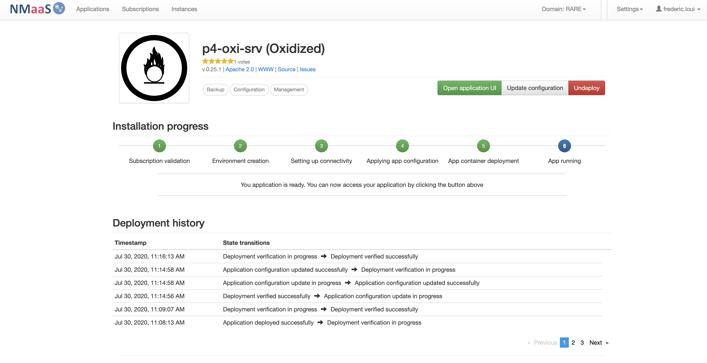
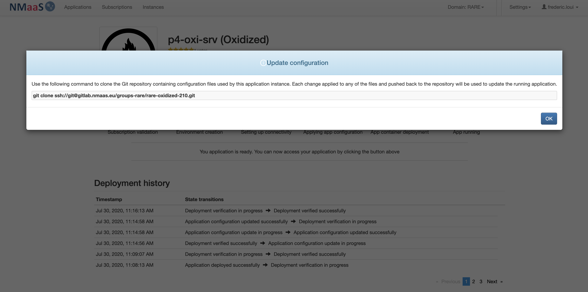
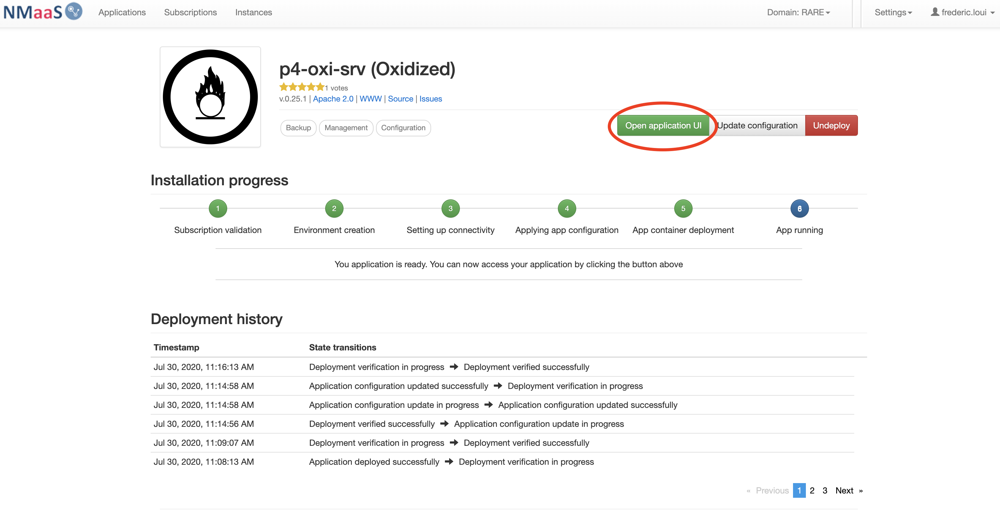
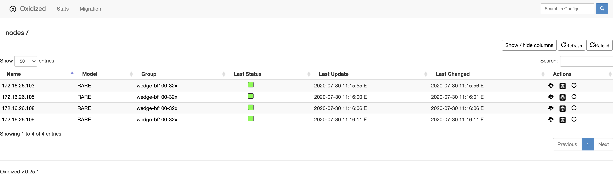

# [ #003 ] NMaaS-101 - "My name is Oxidized and I'm a nifty configuration management tool"

In article [#001](https://docs.nmaas.eu/blog/blog1/nmaas-101-1/#overview) and [#002](https://docs.nmaas.eu/blog/blog2/nmaas-101-2/#overview) you essentially created a NMaaS domain and enabled connectivity between your dedicated and isolated domain to your out of band management equipment network.

<div style="border: 3px solid gray; border-radius: 5px; padding-left: 20px;">

<h3 style="margin: 0.6em 0 0.4em;">Requirements</h3>
<li>Completed #001</li> 
<li>Completed #002</li>
<li>Basic knowledge related to configuration management</li>

</div>

## Overview

We are going to deploy our first NMaaS service for your organisation: Oxidized

## Article objective

This is done in 2 steps:

- Oxidized application deployment via the NMaaS portal
- Oxidized configuration specific to RARE domain

## Diagram

NMaaS portal: Oxidized


## [#003] - Cookbook

??? note "Pré-requisites"

    - Having completed [#001](https://docs.nmaas.eu/blog/blog1/nmaas-101-1/#overview)
    - Having completed [#002](https://docs.nmaas.eu/blog/blog2/nmaas-101-2/#overview)


??? note "Oxidized application deployment"

    - Once your domain is created and associated to your account, log into [https://nmaas.eu](https://nmaas.eu) as in [#001](https://docs.nmaas.eu/blog/blog1/nmaas-101-1/#overview)
    - select Oxidized application 

    

    - select "Deploy" 

    

    - choose a name for your service instance, in our case we chose: "p4-oxi-srv"

    


    !!! warning ""

        The name has a particular importance as it will dynamically create a FQDN for the NMaaS service in the form: **<service_name>.<domain>.nmaas.eu** In my example it is: **oxidized.rare.nmaas.eu**

    - fill in the mandatory basic configuration information

    

    !!! warning ""

        - Oxidized access username

            we chose: oxidized

        - Oxidized access password

            we chose: oxidized

        - Device access username (login used by Oxidized to access the equipment via SSH)
        
            we chose: rare

        - Device access password (password used to access the equipment via SSH)

            we chose: rare

        - Device (IP address)

            we chose: 172.16.26.103,172.16.26.105,172.16.26.108,172.16.26.109 

    !!! error "VPN Connectivity Warning"

        It is important to note that you'll be connected inside a dedicated VPN so you'll be isolated from the outside world as if you were running your own Out of band management network. So we can assume that your domain is secured.

    - Congratulation. You should have completed Oxidized deployment

    


??? note "Oxidized application specific configuration"

    In the RARE domain we had a specific requirement that requires a specific profiles for the RARE network equipment.

    We are using then NMaaS configuration feature (also refer to NMaaS configuration process), which actually will provide us the way to alter Oxidized configuration software.

    - From the NMaaS portal service instance page select "Update configuration" button </li>

    

    - you should be provided a git command that will let you clone your Oxidized NMaaS configuration repository

    

    ``` terminal title="Oxidized base configuration"
    cd base
    ls -l
    total 16
    -rw-r--r--  1 loui  staff  734 Jul 30 11:12 config
    -rw-r--r--  1 loui  staff  141 Jul 30 11:12 router.db
    ```

    ``` terminal title="Oxidized config file sample"
    ---
    username: rare
    password: rare
    model: rare
    interval: 600
    use_syslog: false
    debug: false
    threads: 30
    timeout: 20
    retries: 3
    prompt: !ruby/regexp /([\w.@-]+[#>]\s?)$/
    rest: 0.0.0.0:8888
    vars: {}
    groups:
        wedge-bf100-32x:
            vars:
                ssh_port: 2001
    pid: "/storage/pid"
    input:
        default: ssh
        debug: false
        ssh:
            secure: false
    output:
        default: git
        file:
        directory: "/storage/configs"
    git:
        single_repo: true
        user: oxidized
        email: oxidized@man.poznan.pl
        repo: "/storage/oxidized.git"
    source:
        default: csv
        csv:
            file: "/root/.config/oxidized/router.db"
            delimiter: !ruby/regexp /:/
            map:
                name: 0
                model: 1
                group: 2
    model_map:
        rare: rare
        cisco: ios
        juniper: junos
    ```

    ``` terminal title="Oxidized rare.rb file sample"
    class RARE < Oxidized::Model
        prompt /([\w.@()-]+[#>]\s?)$/
        #prompt /^([\w.@()-]+[#>]\s?)$/
        comment '! '
        cmd :all do |cfg|
            # cfg.gsub! /\cH+\s{8}/, '' # example how to handle pager cfg.gsub! /\cH+/, '' # example how to handle pager get rid of errors for commands that don't work on some devices
            cfg.gsub! /^% Invalid input detected at '\^' marker\.$|^\s+\^$/, ''
            cfg.cut_both
    end
    cmd :secret do |cfg|
        cfg.gsub! /^(snmp-server community).*/, '\\1 <configuration removed>'
        cfg.gsub! /^(snmp-server host \S+( vrf \S+)?( version (1|2c|3))?)\s+\S+((\s+\S*)*)\s*/, '\\1 <secret hidden> \\5'
        cfg.gsub! /^(username .+ (password|secret) \d) .+/, '\\1 <secret hidden>'
        cfg.gsub! /^(enable (password|secret)( level \d+)? \d) .+/, '\\1 <secret hidden>'
        cfg.gsub! /^(\s+(?:password|secret)) (?:\d )?\S+/, '\\1 <secret hidden>'
        cfg.gsub! /^(.*wpa-psk ascii \d) (\S+)/, '\\1 <secret hidden>'
        cfg.gsub! /^(.*key 7) (\d.+)/, '\\1 <secret hidden>'
        cfg.gsub! /^(tacacs-server (.+ )?key) .+/, '\\1 <secret hidden>'
        cfg.gsub! /^(crypto isakmp key) (\S+) (.*)/, '\\1 <secret hidden> \\3'
        cfg.gsub! /^(\s+ip ospf message-digest-key \d+ md5) .+/, '\\1 <secret hidden>'
        cfg.gsub! /^(\s+ip ospf authentication-key) .+/, '\\1 <secret hidden>'
        cfg.gsub! /^(\s+neighbor \S+ password) .+/, '\\1 <secret hidden>'
        cfg.gsub! /^(\s+vrrp \d+ authentication text) .+/, '\\1 <secret hidden>'
        cfg.gsub! /^(\s+standby \d+ authentication) .{1,8}$/, '\\1 <secret hidden>'
        cfg.gsub! /^(\s+standby \d+ authentication md5 key-string) .+?( timeout \d+)?$/, '\\1 <secret hidden> \\2'
        cfg.gsub! /^(\s+key-string) .+/, '\\1 <secret hidden>'
        cfg.gsub! /^((tacacs|radius) server [^\n]+\n(\s+[^\n]+\n)*\s+key) [^\n]+$/m, '\1 <secret hidden>'
        cfg
    end
    cmd 'show platform' do |cfg|
        comment "TEST: show platform"
        comments = []
        comments << cfg.lines.first
        lines = cfg.lines
        lines.each_with_index do |line, i|
            if line !~ /^mem:|^uptime:/
                comments << line.strip!
            end
        end
        comments << "\n"
        comment comments.join "\n"
    end
    cmd 'show interfaces description' do |cfg|
        comment cfg
    end
    cmd 'show running-config' do |cfg|
        cfg = cfg.each_line.to_a[3..-1]
        cfg = cfg.reject { |line| line.match /^ntp clock-period / }.join
        cfg.gsub! /^Current configuration : [^\n]*\n/, ''
        cfg.gsub! /^ tunnel mpls traffic-eng bandwidth[^\n]*\n*(
                  (?: [^\n]*\n*)*
                  tunnel mpls traffic-eng auto-bw)/mx, '\1'
        cfg
    end
    cfg :telnet do
        username /^Username:/i
        password /^Password:/i
    end
    cfg :telnet, :ssh do
        # preferred way to handle additional passwords
        post_login do
          if vars(:enable) == true
             cmd "enable"
          elsif vars(:enable)
            cmd "enable", /^[pP]assword:/
            cmd vars(:enable)
            end
        end
        post_login 'terminal length 0'
        post_login 'terminal width 0'
        pre_logout 'exit'
        end
    end
    ```

    !!! error "Oxidized router.db file sampl"
        
        172.16.26.103:rare:wedge-bf100-32x

        172.16.26.105:rare:wedge-bf100-32x

        172.16.26.108:rare:wedge-bf100-32x

        172.16.26.109:rare:wedge-bf100-32x 

    ``` terminal title="Oxidized model files"
    cd model
    ls -l
    total 16
    -rw-r--r--  1 loui  staff  2977 Jul 30 11:13 rare.rb
    -rw-r--r--  1 loui  staff    69 Jul 30 11:10 readme.txt
    ```

    !!! warning "Oxidized model configuration"

        Oxidized has the property to associate a model file specific to your equipment. In RARE context we needed to define a specific profile specifying the prompt used and also the command of interest during configuration versioning process.


## Verification

??? note "Check that you can access Oxidized using: <svc-name>.<domain>.nmaas.eu"

    

    

    Congratulations! You have deployed your first NMaaS service specifically for your domain !

## Conclusion

In this article you:

- You have deployed a powerful CMDB software for your organisation
- You have learned how to apply specific configurations to it in order to match your requirements

!!! success "[ #003 ] NMaaS-101 - key take-away"
    
    - Deploying a NMaaS service is as easy as deploying an application on your mobile phone, you just have to log into the NMaaS portal and of course have the sufficient privileges to deploy application for your domain
    - Deploying an application is a 2 steps process
        - deploy the application via the portal
        - configure the application via git tool
    - Even if Oxidized deployment by NMaaS is made easy, it is mandatory to have a strong knowledge of the tool implemented. In this case, it is of course essential to read documentation from [Oxidized GitHub](https://github.com/ytti/oxidized).


