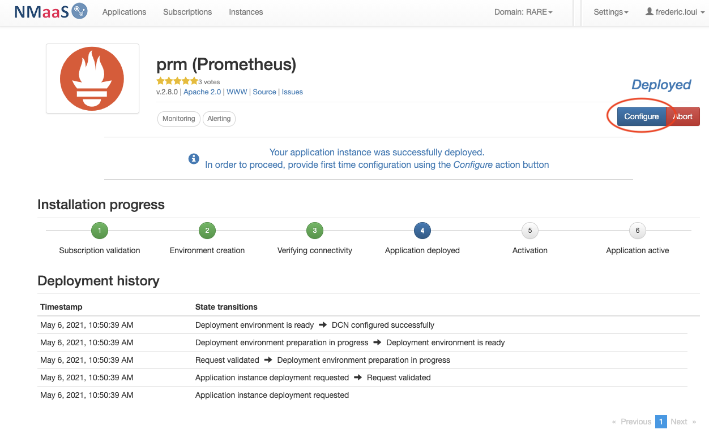
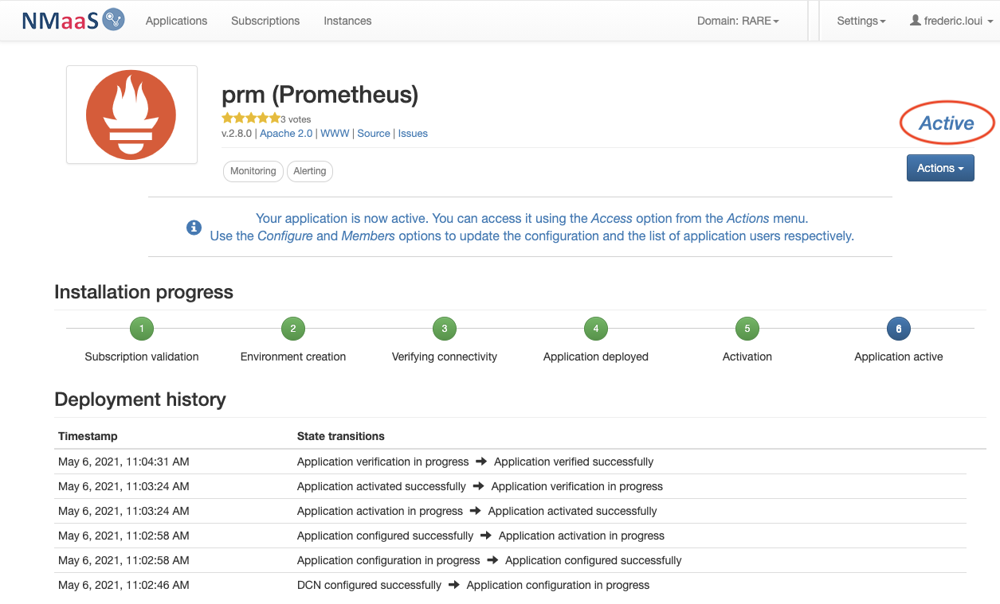
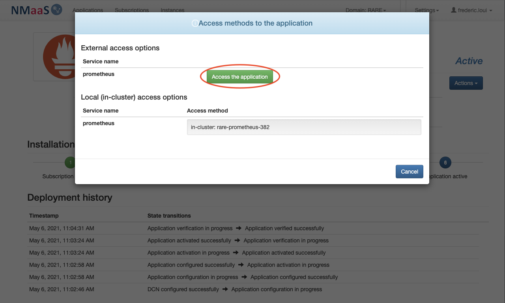
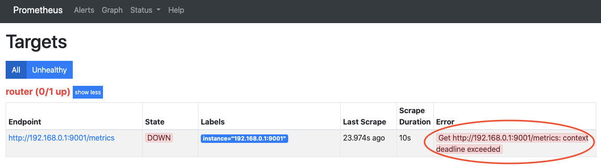

# [ #004 ] NMaaS-101 - "Prometheus"

In article [#001](https://docs.nmaas.eu/blog/blog1/nmaas-101-1/#overview) and [#002](https://docs.nmaas.eu/blog/blog2/nmaas-101-2/#overview) you essentially created a NMaaS domain and enabled connectivity between your dedicated and isolated domain to your out of band management equipment network.

<div style="border: 3px solid gray; border-radius: 5px; padding-left: 20px;">

<h3 style="margin: 0.6em 0 0.4em;">Requirements</h3>
<li>Completed #001</li> 
<li>Completed #002</li>
<li>Basic knowledge related to configuration management</li>

</div>

## Overview

In this post, we are going to deploy an interesting and popular Metric collector in the micro-service world: Prometheus. For those who would like an introduction to Prometheus, please refer to this [post](https://wiki.geant.org/pages/viewpage.action?pageId=154995651) from the [RARE project blog](https://wiki.geant.org/pages/viewrecentblogposts.action?key=RARE).

## Article objective

This is done in 2 steps:

- Prometheus application deployment via the NMaaS portal
- Prometheus configuration specific to RARE domain  

## Diagram

NMaaS portal: Oxidized


## [#003] - Cookbook

??? note "Pré-requisites"

    - Having completed [#001](https://docs.nmaas.eu/blog/blog1/nmaas-101-1/#overview)
    - Having completed [#002](https://docs.nmaas.eu/blog/blog2/nmaas-101-2/#overview)

??? note "Prometheus application deployment"

    - Once your domain is created and associated to your account, log into [https://nmaas.eu](https://nmaas.eu) as in [#001](https://docs.nmaas.eu/blog/blog1/nmaas-101-1/#overview)
    - select Prometheus application 

    

    - select "Deploy"

    

    - choose a name for your service instance, in our case we chose: "prm"

    !!! warning ""

        The name has a particular importance as it will dynamically create a FQDN for the NMaaS service in the form: **`<service_name>`.`<domain>`.nmaas.eu** In my example it is: **prm.rare.nmaas.eu**

    - Click on configure (blue bottom on the lefthand side) information

    

    

    !!! warning ""
        
        - Prometheus access username

            we chose: **prometheus**

        - Prometheus access password

            we chose: **prometheus**

        - Global scrape
        
            As per [RARE blog article](https://wiki.geant.org/pages/viewpage.action?pageId=154995651): **15s**

        - Global evaluation

            As per [RARE blog article](https://wiki.geant.org/pages/viewpage.action?pageId=154995651): **30s**

        - Jobs

            Job name: **router**

        - Device (IP address)

            we chose:  **192.168.0.1:9001**

    - Apply configuration

    

    !!! error "VPN Connectivity Warning"

        It is important to note that you'll be connected inside a dedicated VPN so you'll be isolated from the outside world as if you were running your own Out of band management network. So we can assume that your domain is secured.

    - Prometheus micro-service status will be update to "**Activation in progress**"

    

    - After few minutes the deployment status will be set to "**Active**"

    

    **Congratulation. You should have completed Prometheus deployment**

??? note "Prometheus application specific configuration"

    In the RARE domain we have specifically configured a Prometheus agent on each P4 switch. In the configuration above we have only configured a dummy IP address.

    Subsequent configuration will be done through the usual NMaaS micro-service-configuration workflow using **git**. (Similar to [Oxidized post](https://wiki.geant.org/pages/viewpage.action?pageId=148088057))

    We are using then NMaaS configuration feature (also refer to [NMaaS configuration process](https://wiki.geant.org/display/NMAAS/NMaaS+Tools#NMaaSTools-NMaaSToolconfigurationprocess)), which actually will provide us the way to alter Prometheus configuration software.

    - From the NMaaS portal service instance page select "configuration" entry from the drop-down list

    

    - you should be provided a git command that will let you clone your Prometheus NMaaS configuration repository
    
    

    ``` terminal title="From a terminal, clone oxidized configuration repository"
    git clone ssh://git@gitlab.nmaas.eu/groups-rare/rare-prometheus-382.git
    < enter my SSH credientials ... >
    cd rare-prometheus-382
    ╭─[05/6/21|11:18:47]loui@MacBook-Pro-de-Frederic.local ~/rare-prometheus-382  ‹master›
    ╰─➤  ls -l
    total 8
    -rw-r--r--  1 loui  staff  297 May  6 11:17 prometheus.yml
    ```

    - You can now configure prometheus with your target config and adjust it as you see fit

    For more information please refer to [Prometheus official documentation](https://prometheus.io/docs/introduction/overview/).

    In our case we will use prometheus configuration from the [RARE blog post](https://wiki.geant.org/pages/viewpage.action?pageId=154995651).

    ``` terminal title="From a terminal, clone oxidized configuration repository"
    global:
        scrape_interval: 15s
        evaluation_interval: 30s
    alerting:
        alertmanagers:
            - static_configs:
                - targets:
    rule_files:
    scrape_configs:
        - job_name: 'router'
        metrics_path: /metrics
        scrape_interval: 15s
        static_configs:
        - targets: ['192.168.0.1:9001','192.168.0.2:9001']
            labels:
    ```

## Verification

??? note "Check that you can access Prometheus using: <svc-name>.<domain>.nmaas.eu"

    - Access the application 
    
    

    - "Access the application" button shortcut

     

    it will lead you to a dynamic FQDN: [https://prm.rare.nmaas.eu](https://prm.rare.nmaas.eu)

    You have now access to Prometheus console

    

    - You can check if the configured agent is reachable
    
    

    - In this case you have a problem to reach the Prometheus agent. (Check connectivity to the configured Agent 192.168.0.1:9001 in prometheus.yml)

    

    Congratulations! You have deployed and configured your Prometheus NMaaS service specifically for your domain !

## Conclusion

In this article you:

- You have deployed a powerful and flexible metric collector for your organisation
- Prometheus uses PUSH model similar to SNMP so every scrape minutes it will interrogate all the configured agents.
- You have learned how to apply specific configurations to it in order to match your requirements
- In this example, we used RARE/freeRtr prometheus agent whose configuration is described [here](https://wiki.geant.org/pages/viewpage.action?pageId=154995651). In your case, you agent will have its own different configuration (different IP, port, job name and metrics )

!!! success "[ #004 ] NMaaS-101 - key take-away"
    
    - Deploying a NMaaS service is as easy as deploying an application on your mobile phone, you just have to log into the NMaaS portal and of course have the sufficient privileges to deploy application for your domain
    - Deploying an application is a 2 steps process
        - deploy the application via the portal
        - configure the application via git tool
    - Even if Prometheus deployment by NMaaS is made easy, it is mandatory to have a strong knowledge of the tool implemented. In this case, it is of course essential to read documentation from [Prometheus](https://prometheus.io/) web site.
