# How to use keycloak as an external IdP for your own nmaas instance

<h4 style="margin: 0.6em 0 0.4em;">Requirements</h4>
<li>Keycloack version 25.0+</li>

## Overview

nmaas allows users to log in not only via a local account, but also using external identity providers that comply with the OpenID Connect (OIDC) standard. This allows administrators to integrate existing authentication systems, such as Keycloak, without having to change the authorization logic on the platform itself.

## Article objective

This is done in 2 steps:

- Keycloak realm and client configuration
- Filling in the required environmental variables in nmmas-platform

## Keycloak configuration

### Create Realm
- Log in to the administrator panel in Keycloak and select `Manage realms`. 
If your realm is ready, you can proceed to creating a client. 
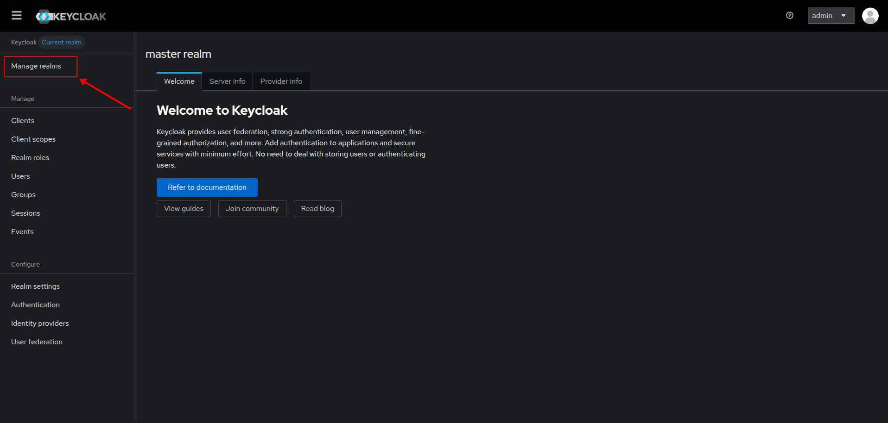
- Create a new realm for nmaas. 
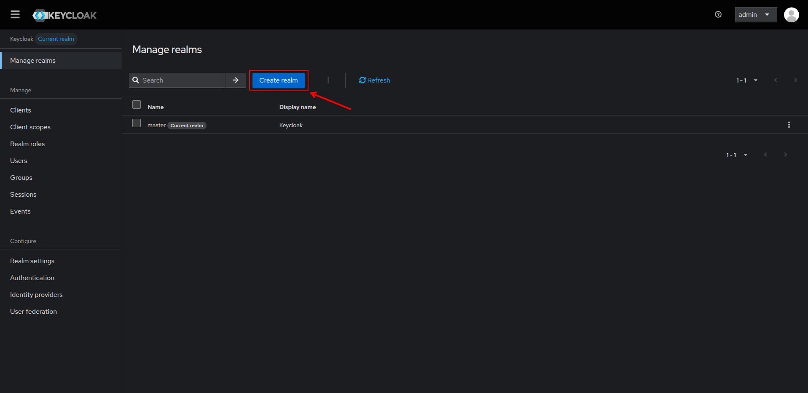
- Fill in the name for the new realm, remember to check enable realm  
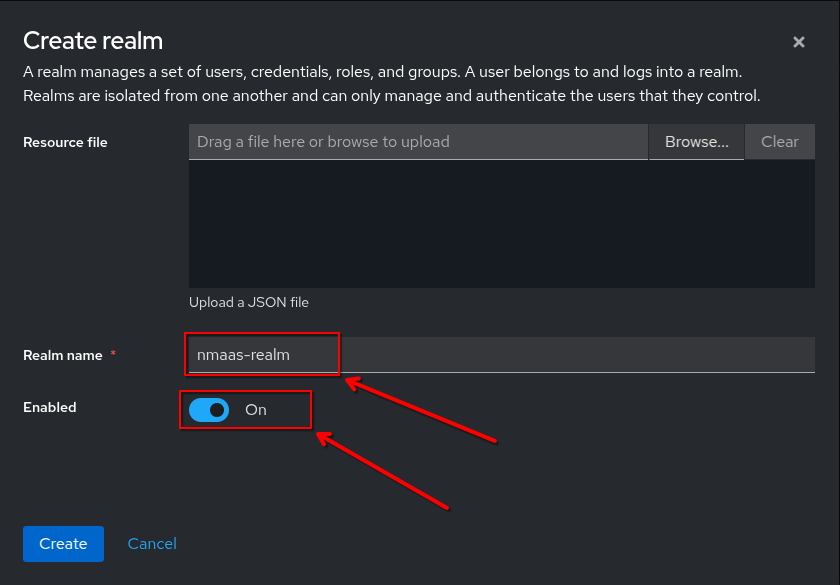

### Create client
- Select clients list  
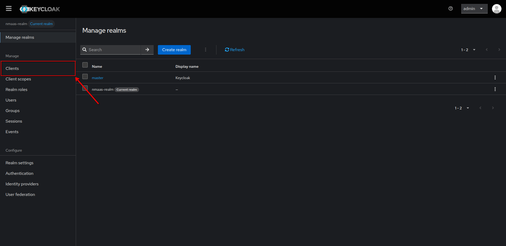
- Create new client  
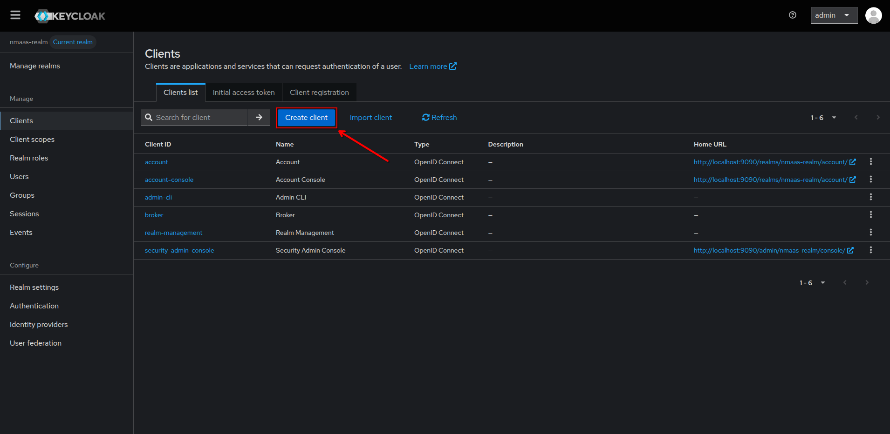
- The required information in the form will be the `ClientId`, which will be in nmaas-platform as the environment variable `OIDC_CLIENT_ID`.  
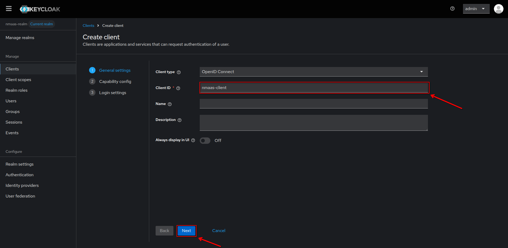
- In the next step, select `Standard flow` to give the client access to OpenID Connect and `Client authentication` to set the access type as confidential access.  
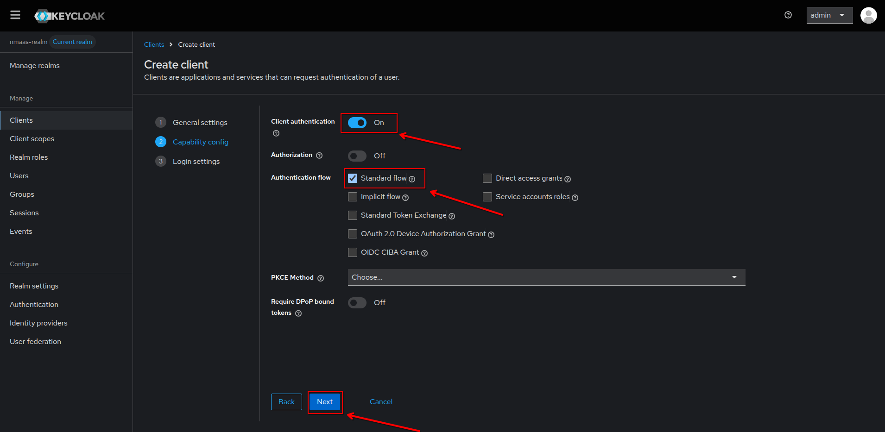
- In the last step of creating a client to enable nmaas-platform to log in via keycloak, specify `Valid redirect URIs` relative to the nmaas-platform service.  
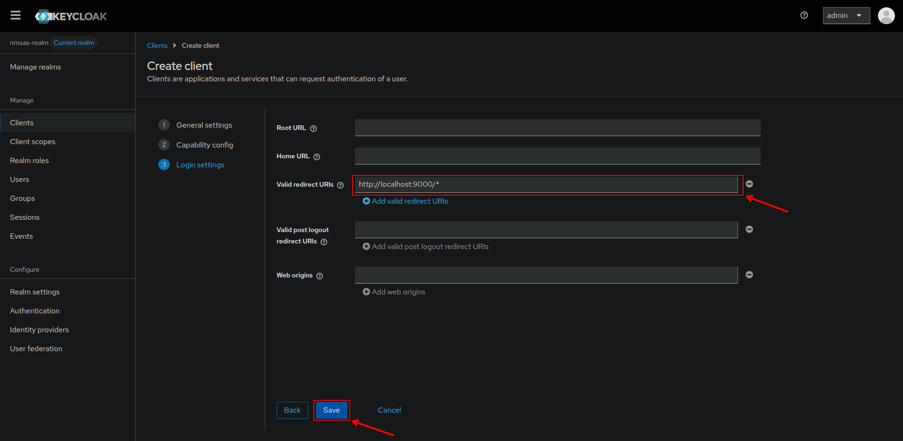
- After creating the client, go to the `Credentials` tab to copy the `Client secret`. It will be needed for the `OIDC_CLIENT_SECRET` environment variable.  
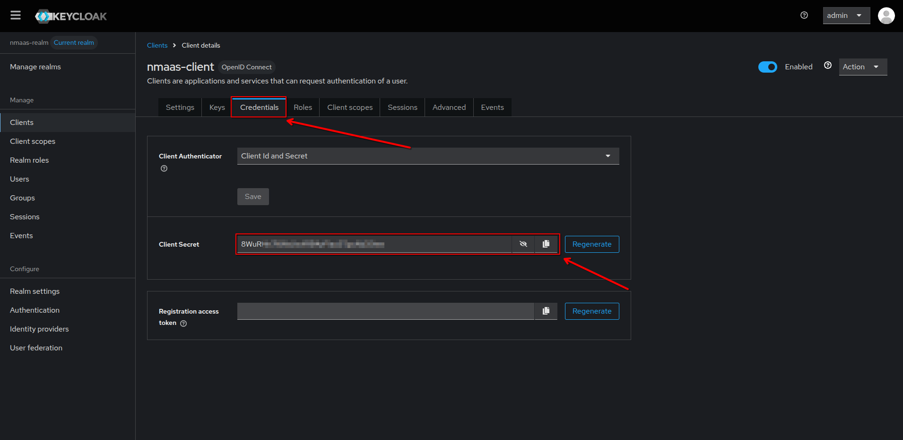
- The last environment variable from Keycloak is `OIDC_ISSUER_URI`. It can be accessed in the `Realm settings` tab in the `Endpoints` section under the `OpenID Endpoint Configuration` link. 
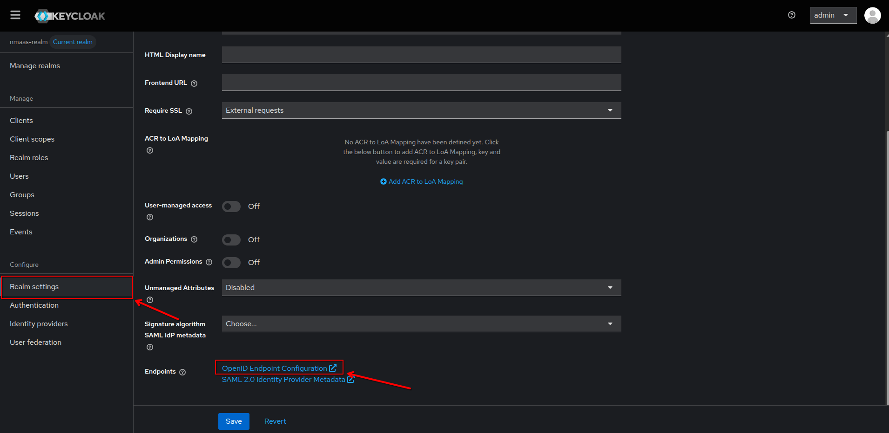
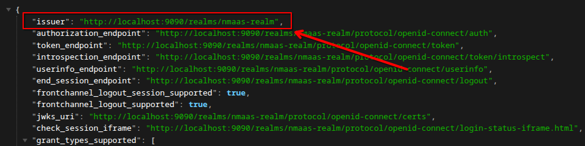

## nmaas-platform environmental variables

If you already have a working Keycloak instance with a configured realm and client, you need to specify the following environment variables when building nmaas-platform:

| ENV                       | Value                              |
|---------------------------|------------------------------------|
| `PORTAL_SSO_ALLOWED_FLAG` | Must be set to `true`              |
| `OIDC_CLIENT_ID`          | Client ID from Keycloak            |
| `OIDC_CLIENT_SECRET`      | Secret from the client credentials |
| `OIDC_ISSUER_URI`         | Issuer URI from realm metadata     |

When installing nmaas using Helm ([nmaas-chart](https://gitlab.software.geant.org/nmaas/nmaas-chart)) alter the values file with proper parameters.

## Other providers

To integrate a different OIDC provider, you must identify equivalent parameters:
- `clientID`
- `client secret`
- `issuer URI`

nmaas requires the provider to supply the following claims:
- `preferred_username`
- `email`
- `family_name`
- `given_name`
- `sub`

If the provider does not expose these claims, integration may require custom mapping on their side.