# Simple and Robust PostgreSQL Backups using PgBackWeb on nmaas

[PgBackWeb](https://github.com/eduardolat/pgbackweb) is an open-source web application which can perform backups and restores on PostgreSQL databases. Backup files can be stored either locally (on the same host where PgBackWeb is running) or remotely, on any S3 compatible cloud storage.

PgBackWeb is available in the nmaas application catalogue and can be deployed on the [central vNOC nmaas instance](https://vnoc.nmaas.eu) or on any self-hosted nmaas deployment.

In this tutorial we will go over the steps of deploying and configuring PgBackWeb on nmaas so that it can perform scheduled database backups of remote PostgreSQL databases. We will also see how a different tool from the application catalogue - [Healthchecks](https://github.com/healthchecks/healthchecks) can be used in tandem with PgBackWeb so that notifications can be sent if a backup hasn't been completed in the regular timeframe. Finally, we will perform a test restore of the database backup on an nmaas hosted instance of PostgreSQL, which can help you quickly recover your data and resume operations in case of a failure of the remote PostgreSQL cluster.

## Deploying PgBackWeb on nmaas

To deploy PgBackWeb on nmaas the following steps need to be performed:

1. Choose PgBackWeb from the application catalogue
2. Subscribe to the application
3. Deploy the application using the application deployment wizard.
4. Create an admin account directly on PgBackWeb using the initial setup screen.

During the deployment, the nmaas deployment wizard asks only for the desired storage space to be allocated. The default value of 5Gi is enough in most cases, except when backing up very large remote databases.

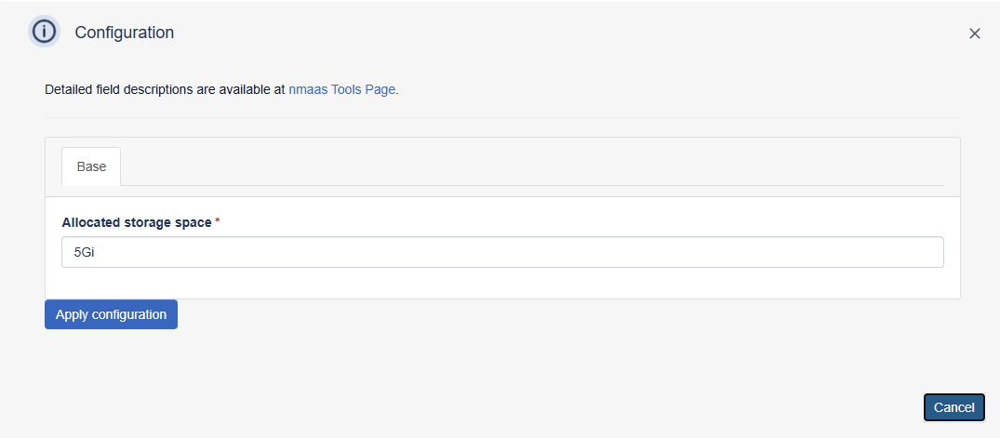

By clicking on the `Apply configuration` button, the deployment will proceed and PgBackWeb will be available for access in a couple of moments via the `Actions -> Access` button.

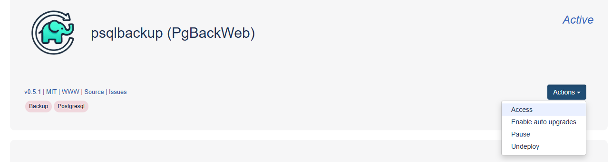

As this is the first time PgBackWeb is being accessed, a new user form will appear.

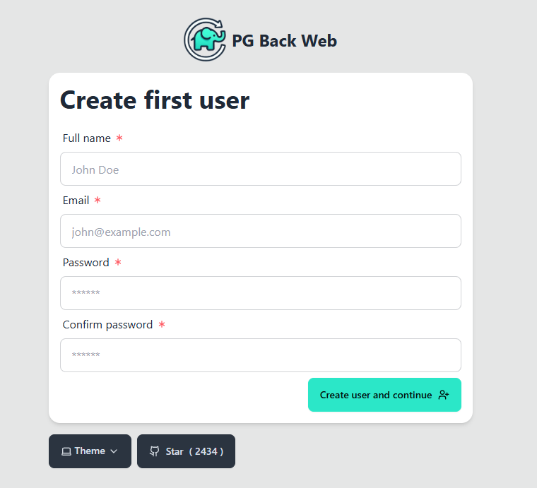

Once logged in, we can start adding the PostgreSQL servers and databases that we would like to backup.

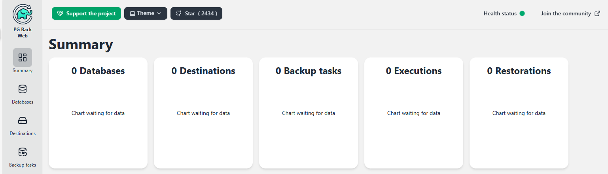

## Configuring PgBackWeb for Backups of Remote PostgreSQL Databases

The steps that need to be performed in this part are:

1. Add the database using the `Databases` page.
2. Optionally add an S3 destination for backups storage using the `Destinations` page. If no destination is added, backups will be stored locally (on the same host where PgBackWeb) is deployed.
3. Configure scheduled backup tasks using `Backup tasks` page.
4. Performing the backup for the first time.

### Adding Databases to PgBackWeb

To backup a remote database using PgBackWeb, the first step is to add it in the `Databases` section which can be accessed using the left-hand menu. 

The `Add database` button opens a pop-up dialog, asking for the connection string to the database.

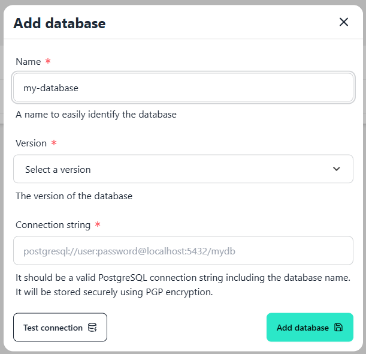

After filling out the connection details, the connection can be tested using the `Test connection` button. In case no issues are detected, the configuration can be saved using `Add database`. PgBackWeb does periodic health checks (every 10 minutes) on the database and will mark the database as down in case of any issues.

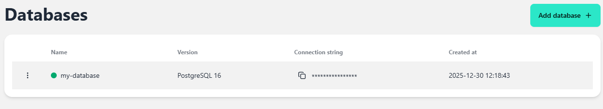

### Configuring a Backup Schedule

Scheduled backups can be configured in the `Backup tasks` section from the left-hand menu.

The following information needs to be provided:

- Name = arbitrary name for the backup task
- Database = what database to backup. The database must first be added to PgBackWeb, as described in the previous subsection.
- Local backup = whether to do a local backup or upload the dump files to a remote storage.
- Cron expression = cron expression specifying the backup schedule.
- Time zone = time zone to use for the cron expression.
- Destination directory = in case a local backup is selected, where to store the backups. On nmaas, the `/backups` directory is available for backups storage.
- Retention days = how many days backups are kept before deleting them.

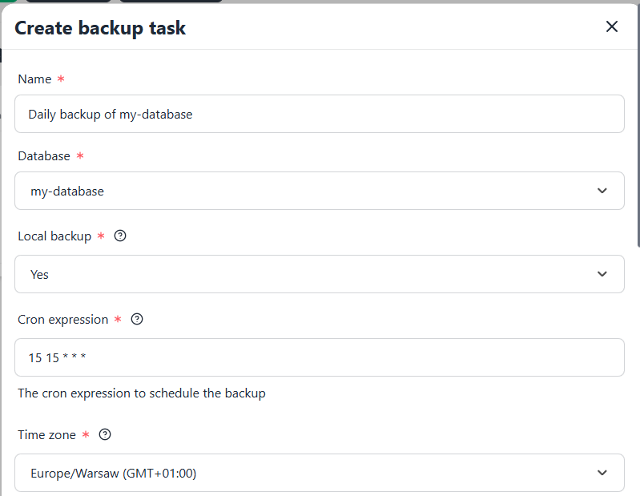

### Performing the Backup for the First Time

From the `Backup tasks` overview page, the configured backup task can be executed in an ad-hoc fashion using the `Run backup now` option.

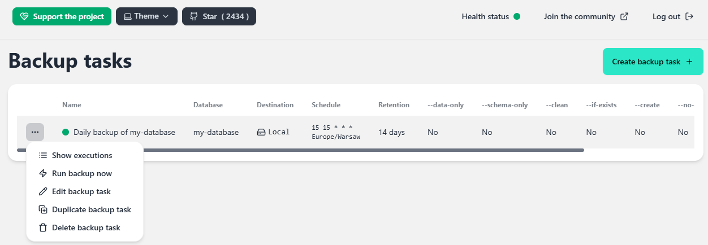

The `Executions` section from the left-hand menu shows details about each backup execution, either ad-hoc or as part of a scheduled run.

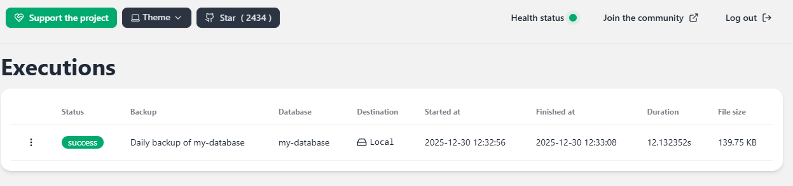

## Monitoring for Backup Failures using Healthchecks

PgBackWeb does not have a built-in way to send notifications in case of backup failures. However, it can send webhooks to remote systems. We can leverage Healthchecks, another application from the nmaas catalogue, to build a notification system for PgBackWeb. The scenario is as follows:

1. Healthchecks generates a unique URL where it expects that a request will be sent every X minutes (the same schedule as configured in PgBackWeb previously).
2. PgBackWeb sends a webhook for each successful backup run to the Healthchecks URL.
2. Healthchecks sends a notification if no request is received on the configured URL (meaning that the backup either was not executed or was not successful).

### Deploying Healthchecks on nmaas

Healthchecks can be deployed in a similar manner to any other application on nmaas - first a subscribe to the application is needed, and then further configuration can be done using the deployment wizard.

The deployment wizard for Healthchecks expects the following information:

- Email address for the initial admin user account
- Password for the initial admin user account
- Open registration = whether the sign-up feature will be enabled so that anyone can register a new account.
- Access options = whether the Healthchecks interface will be publicly accessible via the Internet or it will be constrained to the client-access VPN. As we will be using Healthchecks only in tandem with PgBackWeb, in this case it is recommended to simply select `VPN`.
- Allocated storage space = storage space to allocate to the application, the default `1Gi` is sufficient in most cases.

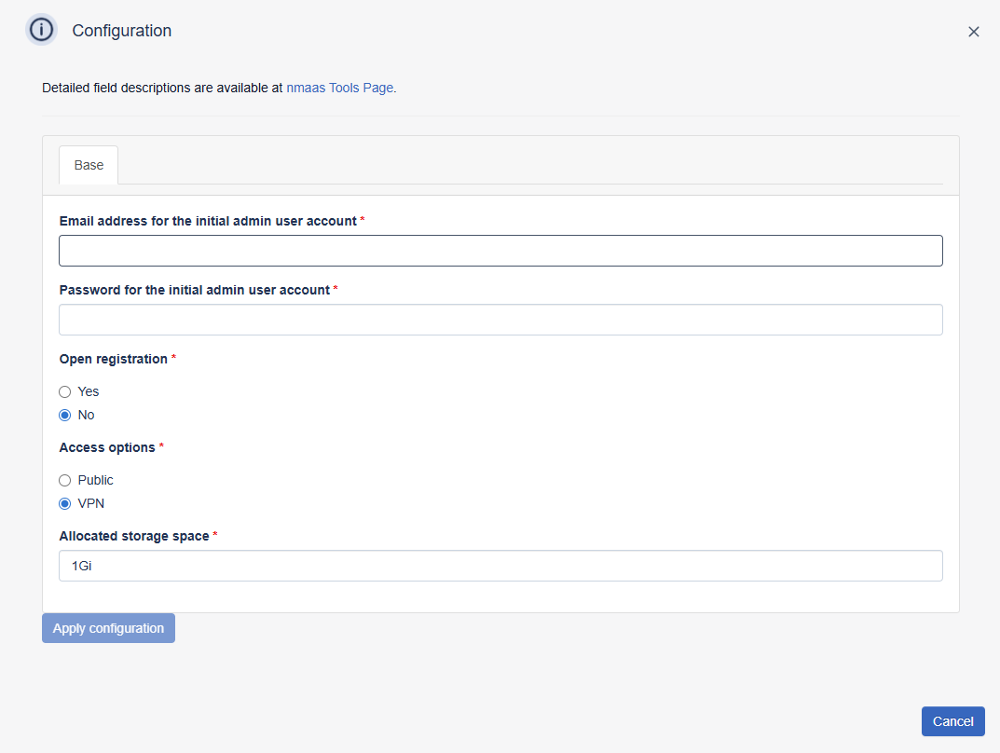

Healthchecks has the concept of Projects in which you can organize similar checks. After deployment, by default, Healthchecks will create a new project named after your username. 

Notification channels can be configured using the `Integrations` section, and by default email notifications are already setup for the default project but will need to be manually setup for all subsequent ones. 

We will create a new project named `PgBackWeb Backups` by using the `New Project...` button on the homepage. As no integrations are configured in new projects by default, there will be a red exclamation mark next to the `Integrations` button in the navbar. We can configure email notifications simply by entering the recipient's email address. SMTP settings are configured by default for all Healthchecks instances deployed on nmaas.

Finally, we can add a new check from the `Checks` section. 

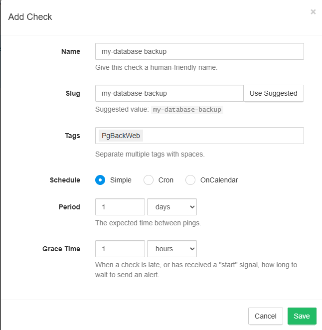

Once the check is created, the unique URL will be shown and can be copied directly just by clicking it.

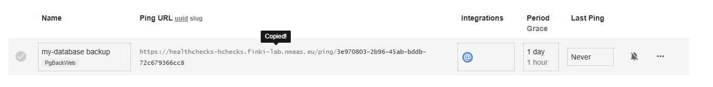

We are now ready to configure the webhook in PgBackWeb.

### Webhook Configuration in PgBackWeb

In PgBackWeb, in the `Webhooks` section a new webhook can be added using the `Create webhook` button.

The following information needs to be provided:

- Name = an arbitrary name to identify the webhook entry.
- Event type = select `Execution success`.
- Backup targets = select the backup targets for which the webhook will fire. It is recommended to configure one webhook per backup target.
- Activate webhook = `Yes`.
- URL = the URL copied from Healthchecks.
- Method = `GET`, as this is supported by Healthchecks.
- Headers = can be left empty.
- Body = can be left empty.

You can perform a test run of the webhook using the three dots next to its name and choosing `Run webhook now`.

A corresponding entry should immediately become visible in the webhook execution history page in Healthchecks. 

## Performing Restores on a PostgreSQL Instance Deployed on nmaas

In case of a data corruption any backup can be restored to the same database server from which the initial backup was obtained using the `Executions` section and choosing `Restore execution`.

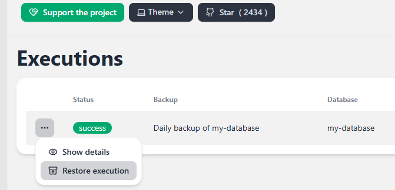

However, in case the remote PostgreSQL server becomes completely inaccessible, a quick way to restore the data is to create a PostgreSQL instance on nmaas and restore the backup there. As this instance can also be accessed by any service hosted remotely via the site-to-site tunnel, such an approach can be seen as an effective way to continue operations while the original server is recovered.

PostgreSQL can be deployed as any other application on top of nmaas. During the deployment process, the following parameters need to be provided:

- Root password = the password for the `postgres` user.
- Database user = the username for the default user.
- Database password = the password for the default user.
- Database name = the database name of the initial database.

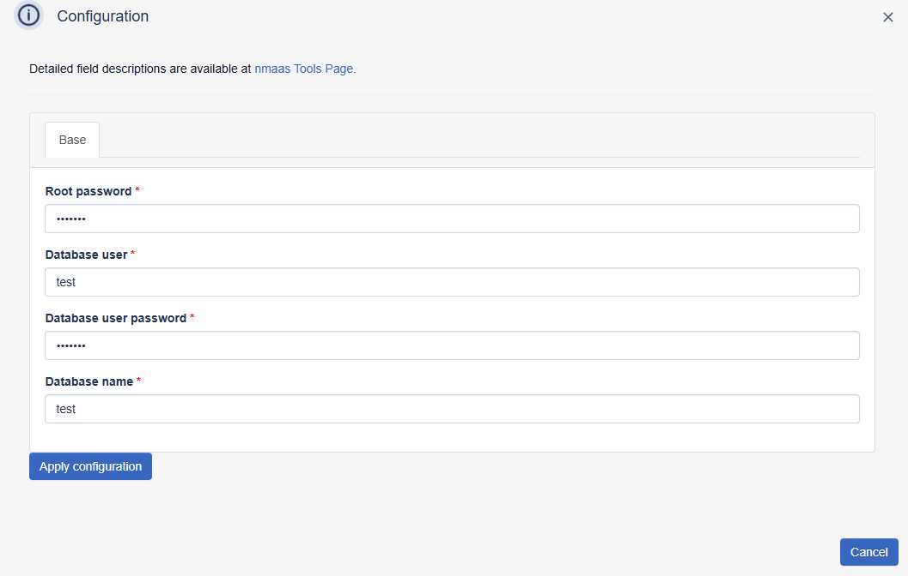

Once deployed, access details are available from the `Actions -> Access` pop-up. For remote access, the `External access options` parameters should be used, while for accessing PostgreSQL from other applications deployed on nmaas, the `Local (in-cluster) access options` are relevant.

Back in PgBackWeb, in the `Restore backup execution` pop-up we can choose as `Backup to` the `Other database` option and provide the connection string to the newly deployed PostgreSQL instance.

The restore progress can be checked from the `Restorations` section.

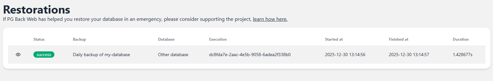

The contents of the restored database can be checked with another application already available on nmaas - Adminer. Adminer is a web-based application which can be used to manage PostgreSQL and various other databases.

## Conclusion

In this tutorial we have performed the following steps:

1. Deployed PgBackWeb.
2. Configured PgBackWeb to perform scheduled backups of a remote database.
3. Deployed Healthchecks.
4. Configured Healthchecks with a new unique monitoring URL and an email notifications channel.
5. Configured PgBackWeb to execute a webhook upon each successful backup execution.
6. Deployed PostgreSQL on nmaas.
7. Restored the initial backup performed by PgBackWeb of the remote database to the PostgreSQL instance on nmaas.
