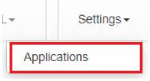
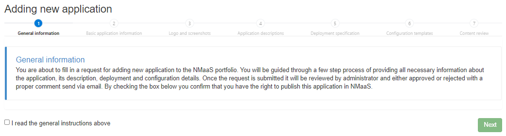
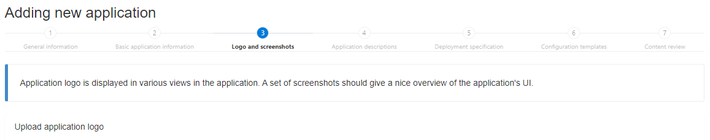
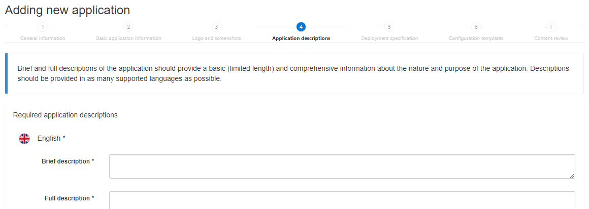
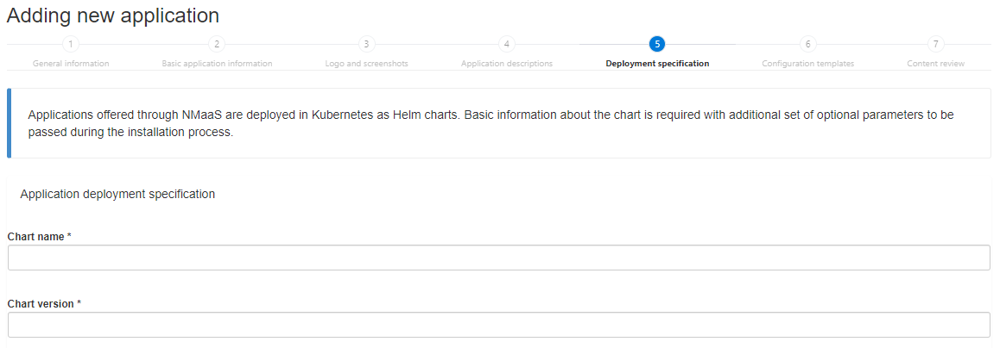
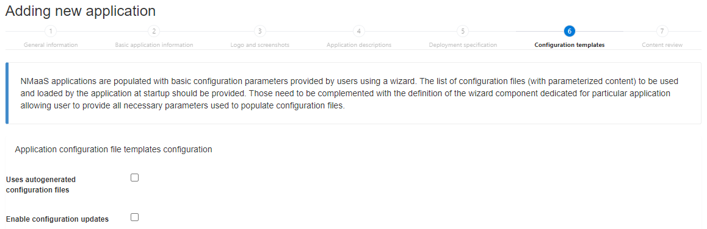

# Application Manager Guide

!!! warning Work in Progress
    This guide is currently a work in progress. Some sections might be missing or contain incomplete information.

## Introduction

The information about applications supported by a given nmaas instance is managed from the nmaas Portal of the given installatio.

A dedicated wizard composed of several forms was developed to ease this management operation and guide the user (with appropriate role assigned) through the process of adding new or updating existing application information. 

In order to access the applications management area user should open the `Settings` drop down menu available on the top navigation bar and click the Applications button.

The main view lists all the applications available in this particular NMaaS installation or a filtered list of applications to which a given user has management access. For each application its `Name` and `Owner` user is provided. When an application entry is clicked subsequent information about available versions of particular application and their status is displayed.

The application version statuses are the following:

- `New` - status assigned automatically after new version is submitted (application not yet visible for Portal users)
- `Active` - version displayed in the Portal and available for subscription and deployment
- `Disabled` - version displayed in the Portal but not available for deployment
- `Deleted` - version hidden in the Portal (including the Administrator panel)

!!! info
    Only applications with at least one `Active` or `Disabled` version are visible in the Portal

    Transitions between application version statuses can be performed only by the `System administrator`

    When a version is marked as `Disabled` its deployed instances are not affected, but no new deployments can be triggered

From this view an `Application manager` can perform the following actions:

- initiate the process of adding new application to the portfolio by clicking on the `Add` button located above the list of applications
- edit general information about an application by selecting `Edit` option from the application context menu (gearwheel icon next to the application name)
- add new version of given application by selecting `Add new version` option from the application context menu
- edit information about particular application version by selecting the Edit option from the application version context menu (gearwheel icon next to the application version identifier)

!!! info

    The applications from the NMaaS portfolio are being deployed on Kubernetes. To this end each application has to be containerized and described in the form of a Helm chart.

!!! info
    The application administration option is available only for users with System administrator or Application manager roles assigned.

    The Application manager has the possibility to add new applications to the portfolio as well as to manage applications user owns (meaning applications added by the user or for which the System administrator assigned the user as an owner.

## Adding a New Application

Once granted the `Application manager` role, the user is able to submit new applications to the system.

A complete application definition in the system comprises on one side a general set of information about the application (e.g. its name and logo) and on the other side data specific to particular version of the application (e.g. its deployment details). It is assumed that the general part is common for all the versions of the applications however the specific details may vary for different versions.

The required data will need to be provided on a number of forms.

First, the user is requested to confirm that they have the right to publish particular application on nmaas (for example by verifying its license conditions).

In order to proceed the user should check the checkbox and click on the `Next` button.

!!! warning
    If the users leaves the new application wizard before submitting the information on the last form all the entered data will be lost.

!!! info
    A newly pushed application needs to be reviewed and approved by the `System administrator`. Only then is becomes `Active` and available in the portfolio.

### Providing Application Basic Information

The first basic information form comprises the following fields:

- `Name` *(mandatory)* - name of the Application (max 30 characters)
- `Version` *(mandatory)* - version of the Application
- `License` - license applied to the original Application (e.g. Apache 2.0)
- `License URL` - link to the respective license text 
- `Project website` - link to the original website with additional information about the Application
- `Link to source code` - link to the repository with source code of the Application (e.g. on GitHub)
- `Link to project issues` - link to the website for publishing and tracking issues related with Application (e.g. on GitHub)
- `nmaas Documentation URL` - link to a custom nmaas provider website containing additional documentation about the Application (e.g. deployment options and consideration)
- `Select tags for application` *(mandatory)* - selection of tags that best describe the Application from an existing list
- A`dd new tags for your application` - names of new (not found on the drop down selector) tags to be assigned to the Application (multiple tags can be provided, each tag needs to be confirmed with `Enter`)

!!! info

    Throughout the wizard filling in some fields is mandatory and entering data in in the rest is optional. The mandatory fields are marked with a star (*) next to the field name.

In order to proceed, the user should click on the `Next` button.

### Providing Application Logo and Screenshots

The second form allows the user to upload a `Logo` and a number of `Screenshots` or example images suitable for given Application (for presentation in the Portal).

Once `Choose` button is clicked a file selection window is displayed allowing the user to browse and select a file or multiple files from his local machine.

!!! info 
    Multiple graphical file formats are supported including `svg`, `png` and `jpg`.

In order to proceed user should click on the `Next` button.

### Providing Application Descriptions

Using the third form user is requested to enter two types of description of the Application to be used and displayed in different areas in the Portal:

- `Brief description` - few words long description of the Application presented on the main Portal view with all the applications under the Application logo (max 60 characters)
- `Full description` - complete description of the Application (e.g. purpose and main features)

By default only input fields for texts in English are displayed. Dedicated fields for other languages can be displayed by checking given language on the drop down selector `Select optional languages`.

!!! info
    It is mandatory to provide descriptions for the English language. Optionally appropriate texts can be provided for other supported languages

### Providing Application Deployment Specification

The fourth form enables the `Application manager` to enter all the necessary information to allow for a fully automated deployment of new instances of particular Application.

nmaas applications are deployed using Helm thus is it mandatory to provide the respective Helm chart details and all the custom parameters to be passed as values during Helm chart installation.

#### General information fields

- `Chart name` *(mandatory)* - name of the Helm chart (e.g. `nmaas-zabbix`) prefixed with the name of appropriate Helm chart repository if one different from the default is used (e.g. `netbox/netbox`)
- `Chart version` *(mandatory)* - version of the Helm chart (e.g. `4.0.1`)
- `Helm Chart repository name` - name of a custom repository to be added that hosts Application Helm chart (e.g. `netbox`)
- `Helm Chart repository URL address` - URL of the respective custom Helm chart repository (e.g. `https://charts.boo.tc`)
- `Main component name` - if Application installation comprises multiple deployment or statefulset objects its necessary to indicate which object should be considered as the main one (one that is used to verify if the whole Application is up and - running). An example would be server used to point to the proper deployment of the these two examples `pllab-zabbix-624-server` and `pllab-zabbix-624-web` (this functionality assumes that names of all objects created for given Helm chart installation contain the release name string)
- `Expose web user interface` *(checkbox)* - if checked indicates that given Application exposes a web user interface 
- `Allow SSH Access` *(checkbox)* - if checked indicates that for given Application a direct shell access to running container should be enabled

!!! info
    In general, enabling direct user access to running containers of a given application is strongly discouraged. However, in order to allow such access and mitigate at least some of the risks, a built-in shell terminal was made available in the Portal.

#### Global Deploy Parameters

- `DOMAIN_CODENAME` = `zabbixServer.service.annotations."metallb\.universe\.tf/address-pool"=%VALUE%`

##### Static Global Deploy Parameters

- `image.tag` = `7.02`
- `properties.database.password` = `%RANDOM_STRING_12%`

##### Storage Volumes

##### Access Methods

### Providing Application Configuration Specification 

## Adding New Application Version