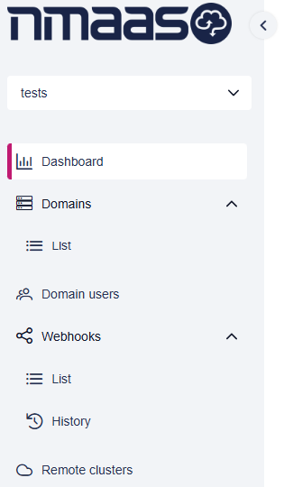
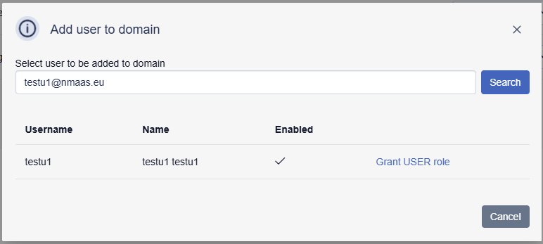
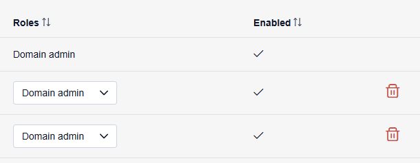
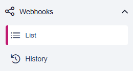
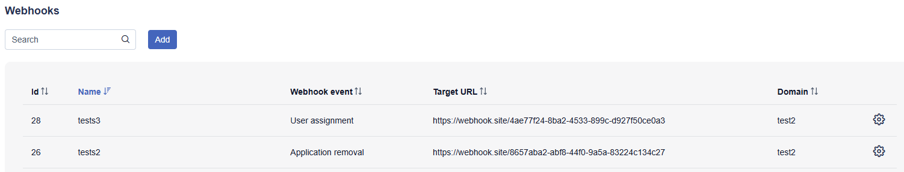
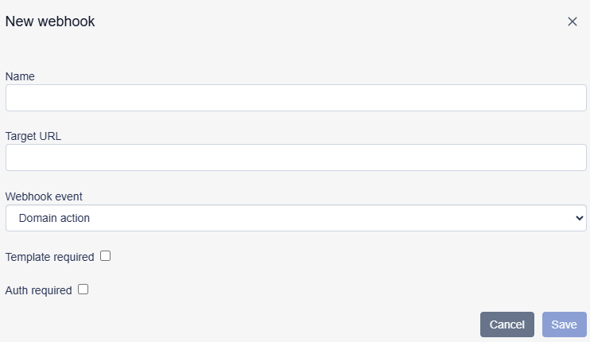
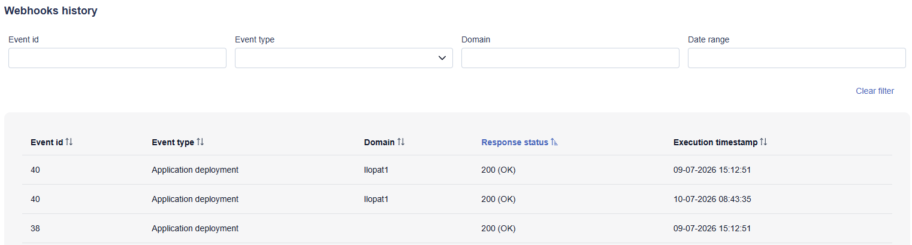
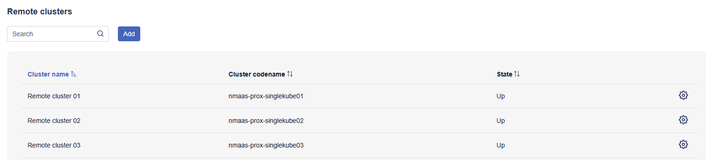
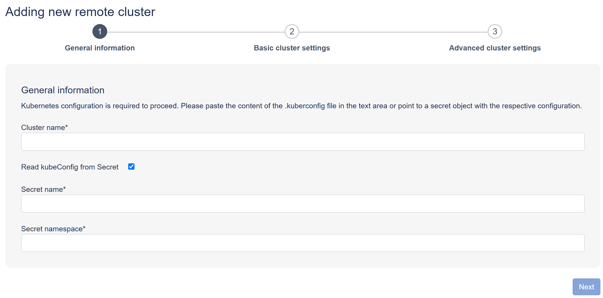

# Domain Admin Guide

## Domain Administrator Role

Before being able to deploy and/or access application instances via the nmaas Portal, a user needs to be assigned to a domain.

!!! info 
    To apply for a new domain creation, submit the [New domain request](https://vnoc.nmaas.eu/about?type=NEW_DOMAIN_REQUEST) form.

Within a given domain, a user can be granted one of three roles as described in the [nmaas User Guide](./user-guide.md).

Every domain needs to have at least one `Domain administrator`. The initial assignment of that role in a newly created domain is performed by administrators based on the received domain creation request.

Only a domain administrator can subscribe to applications for their domain and trigger the deployment of those applications.

Additionally, such a user has access to the `Admin panel` located on the bottom of the left menu bar.

{ width="300" }

## Domain Administrator Dashboard

The domain administrator dashboard provides a quick overview of user activity and application deployments in the currently selected domain.

The top part of the dashboard contains two tables:

- `Last login to the domain` lists domain users together with the timestamp of their last login to the selected domain;
- `Number of deployed applications per user` shows how many application instances were deployed by each user.

The lower part of the dashboard contains the `Application status` table, which lists deployed application instances in the domain. For each instance, the table shows the application icon and name, instance identifier, instance name, currently deployed version and whether the instance needs an upgrade. Selecting application instance row will open the instance details page.

## Viewing Domain Information

After selecting the `Domains` and `List` item from the menu, a user is directed to a view listing all the domains for which they are assigned the administrator role.

On this view only basic information about a given domain is displayed, including the domain `Codename`, `Name`,
`Limit` usage and `Active` state indication. The domain details view can be displayed by clicking on the respective entry on the list.

Domain details view includes several sections:

- domain name and technical details related to Kubernetes and VPN configuration;
- resource limit information for the domain;
- list of users assigned to a given domain and their respective roles;
- application properties indicating some custom application settings for this domain (comprising information if
  a particular application is enabled in this domain and what is the default limit of storage space that can be
  requested for given application instances deployed in this domain);
- list of domain groups to which a given domain is assigned;
- list of remote Kubernetes clusters assigned to this domain.

All the data is presented in read-only mode, and no data edits or actions can be triggered from this view by domain administrators.

## Editing Domain Information

WIP

## Managing Domain Users

After selecting the `Domain users` item from the menu, a user is directed to a view listing all the users added to the domain that is currently selected on the left navigation menu.

A domain administrator can see some basic information about each of the users added to the domain, including their
username, name, currently assigned role and whether the user account is currently active.

### Adding Users to a Domain

A domain administrator is able to add additional users to the managed domain and grant them an appropriate role.

On the `Domain users` view, a domain administrator needs to enter a dedicated view by clicking the `Add user to domain`
button located in the top part of the view. Next, an administrator is able to search for the desired user by providing their
complete email address and clicking `Search`. Once the user is found and listed below, clicking on the `Grant USER role`
button next to a given user will result in adding them with the `User` role to the domain.

{ width="600" }

### Changing User Role in a Domain

A user role within a given domain can be changed using the role selector present in the `Role` column.

{ width="400" }

!!! info
    A user is not allowed to update their own role in a domain.

### Removing User from a Domain

A given user can also be removed from the domain entirely using the trash bin icon next to them.

## Managing Webhooks

The `Webhooks` section allows domain administrators to configure HTTP callbacks triggered by selected events in nmaas. 
Webhooks can be used to integrate nmaas with external systems and automate follow-up actions after events such as 
application deployment and removal or user role assignments.

The section contains two views:

- `List` – displays the configured webhooks;
- `History` – provides information about webhook executions.

The List view shows all webhooks configured for domains managed by the administrator. Each entry includes the webhook `Id`, `Name`, selected `Webhook event`, destination `Target URL` and associated `Domain`.

The list can be filtered using the `Search` field and sorted using the controls available in the column headers. The 
settings icon at the end of each row provides access to management options for the selected webhook, such as viewing 
history of given webhook execution or removing it.

{ width="800" }

### Adding a Webhook

A new webhook can be created by clicking the `Add` button in the `Webhooks` list. This opens the `New webhook` dialog, where the administrator defines when the webhook should be triggered and where the notification should be sent.

The `Name` field provides a descriptive name for the webhook, while `Target URL` specifies the HTTP endpoint that will receive webhook requests. The `Webhook event` selector determines which nmaas event triggers the webhook, for example a domain-related action.

The dialog also provides two optional settings:

- `Template required` – enables the use of a custom request template for the webhook payload;
- `Auth required` – enables authentication settings for requests sent to the target endpoint.

Depending on the selected options, additional configuration fields may be displayed in the dialog. After completing the required settings, click `Save` to create the webhook or `Cancel` to discard the changes.

### Webhook History

The `History` view provides a record of webhook executions and can be used to verify whether configured webhooks were 
triggered successfully. Each entry shows the `Event id`, `Event type`, associated `Domain`, returned `Response status`, and `Execution timestamp`.

The view can be filtered using the controls at the top of the page. Administrators can narrow the results by `Event id`, `Event type`, `Domain`, or a selected `Date range`. The `Clear` filter action removes the active filters and restores the full history list.

The `Response status` column shows the HTTP response returned by the target endpoint, making it easier to identify successful executions and troubleshoot failed webhook calls. The `Execution timestamp` indicates when a particular webhook invocation was performed.

{ width="800" }

Clicking a row in the history table opens a detailed view of the selected webhook execution. The details include the 
`Request body` sent by nmaas to the target endpoint and the `Response body` returned by the external service.

## Managing Remote Clusters

After selecting the `Remote clusters` item from the menu, a domain administrator is directed to a view listing all remote Kubernetes clusters assigned to the currently selected domain.

The list view contains a search field and an `Add` button. For each remote cluster, the table displays the cluster name, cluster codename and current state. The table can be sorted by the available columns. The action icon located next to a cluster entry provides access to cluster-specific actions.

!!! info
    Status of all remote clusters is monitored using a built-in platform process

{ width="800" }

### Adding a Remote Cluster

A domain administrator can add a new remote cluster by clicking the `Add` button on the `Remote clusters` view.

Adding a remote cluster is performed using a three-step wizard:

- `General information` - defines the cluster name and provides the Kubernetes access configuration;
- `Basic cluster settings` - collects the basic settings required to use the cluster for deployments;
- `Advanced cluster settings` - contains additional cluster configuration options.

In the first step, Kubernetes configuration is required. The administrator can either paste the content of the `kubeconfig` file into the `Kubernetes config` field or select the `Read kubeConfig from Secret` option. When the secret option is selected, the form requires the `Secret name` and `Secret namespace` instead of the direct kubeconfig content.

{ width="800" }

In the `Basic cluster settings` step, the form displays the generated cluster codename and requires the 
administrator to provide a description, contact email address and domain assignment. The domain is selected from the `Domain` selector. The `Create namespace if missing` option controls whether nmaas should automatically create the required namespace on the remote cluster if it does not already exist.

In the `Advanced cluster settings` step, cluster ingress, deployment and storage properties are populated with 
default values and can be adjusted to match the remote cluster configuration. The visible ingress settings include the ingress class, ingress class for public services, external service domain, public service domain, TLS support option and TLS certificate configuration. When TLS is enabled, the administrator can select how the certificate should be configured and provide the Let's Encrypt issuer or wildcard certificate secret name. The deployment settings define the namespace used for application instances, the default storage class and whether services should be deployed on dedicated worker nodes. They also contain the SMTP configuration made available to deployed applications.

After completing the required fields in each step, the administrator can proceed through the wizard using the `Next` button.
