# User Guide

!!! warning Work in Progress
    This guide is currently a work in progress. Some sections might be missing or contain incomplete information.

## 1. nmaas Domains

A domain in nmaas corresponds to a dedicated and isolated tenant environment created within the system for an institution, project, team or in general any group of users.

!!! info "Domain Assignment"
    User can be assigned to multiple domains.

!!! info "Requesting a New Domain"
    To apply for a new domain creation on the vNOC managed instance, submit the [New domain request](https://vnoc.nmaas.eu/about?type=NEW_DOMAIN_REQUEST) form.

## 2. Introduction to nmaas User Roles

nmaas specifies user roles on two levels: global (system) level and domain level.

Roles on each level can be assigned independently. 

### 2.1. Global Level Roles

The *Guest* default global role assigned to each user after successful account registration or first federated login allows the user to browse the list of offered applications (even without being assigned to any of the domains).

The remaining roles on the global level are:

 - **Operator** – allows the user to view domain details and update the status of a particular DCN network upon its manual configuration or de-configuration
 - **Application manager** – allows the user to add new applications and/or application versions to the catalogue through a dedicated form built in the Portal as well as maintain applications for which the System administrator assigned the user as an owner
 - **Virtual lab manager** – grants user access to domain group management options, along with bulk user onboarding and bulk application deployment functions
 - **System administrator** – gives the user the complete system administration rights in the Portal (including user, domain and application management)

!!! info "Additional Information"
    For *Application manager* and *Domain administrator* user guides visit [nmaas Application Manager Guide](./application-manager-guide.md) and [nmaas Domain Admin Guide](./domain-admin-guide.md)

### 2.2 Domain Level Roles 

There are three user roles defined at the domain level:

 - **Guest** – a base role in a given domain that allows the user to view the list of subscribed applications and currently deployed application instances, however, the user is not allowed to view details any of running application
 - **User** – with this role user is allowed to view details of running application instances, including the access and configuration options
 - **Domain administrator** – gives full control over the application subscriptions and application instances (including deployment, configuration and access) within a given domain, also allows for adding new users to the domain

These roles are assigned per user domain. A single user may have different roles assigned in multiple domains.

!!! info "Permission Hierarchy"
    On the domain level, a higher role always includes all the permissions specified for all underlying lower level roles

!!! info "VPN Requirements"
    To access the applications running within a particular domain, the user needs to connect to a dedicated VPN that is being set up independently of the user account within the Portal

## 3. nmaas Portal

nmaas web-based graphical user interface can be accessed by browsing to address [https://vnoc.nmaas.eu](https://vnoc.nmaas.eu) (in case of the vNOC managed instance).

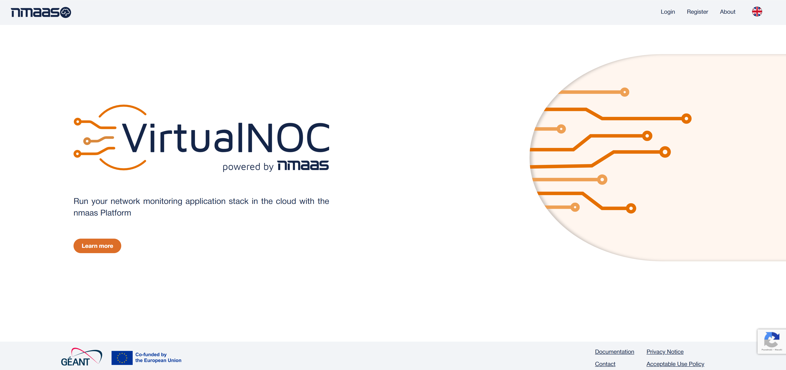

Users are required to log in to gain access to the actual application market.

The nmaas Portal is available in four languages including English, French, German and Polish (though still not all texts might be properly translated in languages apart from English).

### 3.1 About

The *About* page available from the top navigation bar contains information about current and past nmaas software versions and a contact form being the preferred way of reaching out to the nmaas team regarding any subject.

## 4. User Login

The user login form is available on the top navigation bar.

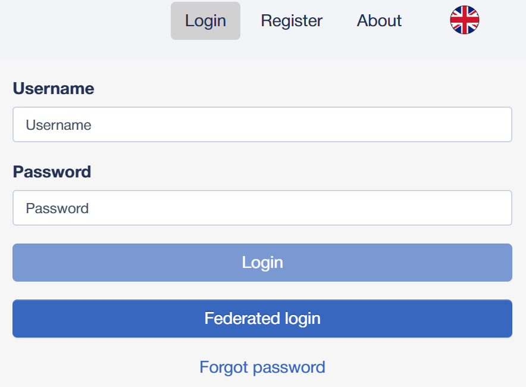

There are two login options to enter the Portal. The first option is to enter credentials of a local user account created in the system (username and password) and then click the `Login` button.

The second option is to use an existing account from one of the Identity Providers (IdPs) federated under eduGAIN. After clicking the `Federated login` button, user will be redirected to an OIDC-compliant IdP authorization page. If performed for the first time, the user is asked to provide additional information about their account, including mandatory and unique username and email address.

Users with accounts created directly in the system through the registration form are able to recover their password by clicking the `Forgot password` link. A new input field will be displayed to provide the email address used during the registration to which a reset password link will be sent.

!!! info "Federated Login"
    The federated login option is preferred on the nmaas managed instances and should be used whenever possible. Users are first redirected to a dedicated nmaas Keycloak instance, which in turn allows for accessing the eduGAIN login forms.

## 5. User Registration

To create a local account, user has to select `Register` from the top navigation bar.

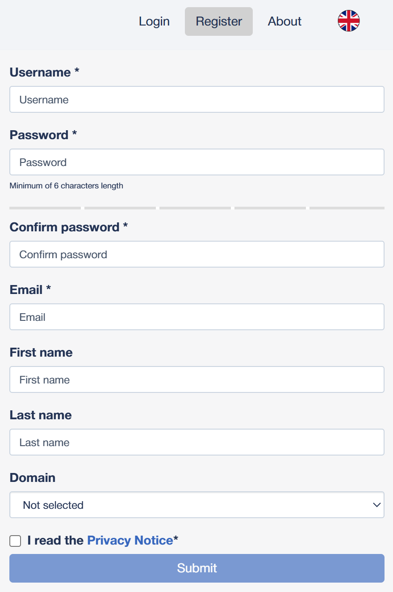

Registration form contains several mandatory fields, which are: `Username`, `Password`, `Confirm password` and `Email address`.

The provided `Username` has to be at least three letters long.

The user also has to confirm that they have read the respective nmaas Privacy Notice text.

There are also few optional fields, namely `First name`, `Last name` and a prefered `Domain` selector.

After submitting the registration form, the user has to wait for the account to be activated by the administrator. User will be notified via email that their account is active.

User needs to be assigned a role in a domain to be able to view and deploy application instances in it.

## 6. Application Catalogue

After the user account has been activated by the nmaas administrator (in the case when the user submitted the registration form), they are able to log in and are granted base access to the main nmaas applications view. The same access rights are automatically granted to users that log in using eduGAIN for the first time.

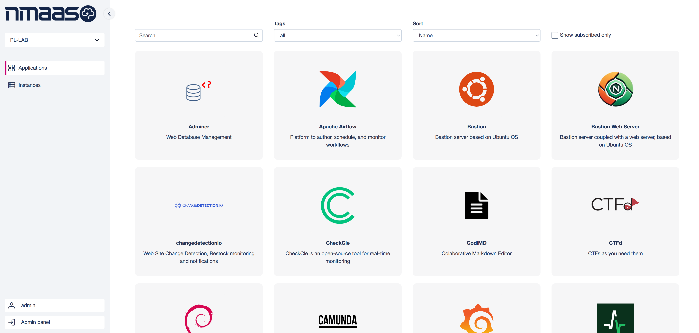

On the `Applications` view all the applications available on given nmaas instance are presented. Applications can be filtered by tags and sorted by a few criteria. Users can also search them by name.

A single application tile consists of the logo, name and brief description of the application. Clicking a tile opens the application’s details page.

!!! info "Domain Selection"
    User needs to verify or select a proper *Domain* from the selector located on the left menu bar

## 7. Application Instances 

The `Instances` view contains information about all the application instances deployed within user’s domain.

By default, the displayed list of application instances includes all instances but can be filetered to only instances deployed by given user by selecting the `Show only my` checkbox. In addition, it is possible to display all the instances that were already undeployed and which are hidden by default.

User can switch between the default card-based view and a table-based view that contains additional information about the application instances.

Application instances are described by custom `Name` assigned by user during deployment, name of the `Application` and current `State`. Detailed information include `Version` of the application, user being the `Owner` of this instance (user who initiated the deployment) and the `Deployment time`.

## 8. Application Instance Deployment

### 8.1 Application Details View

On the application details page users can view the basic description of the application, example screenshots of the user interface, references to external resources and the list of application versions currently available on nmaas.

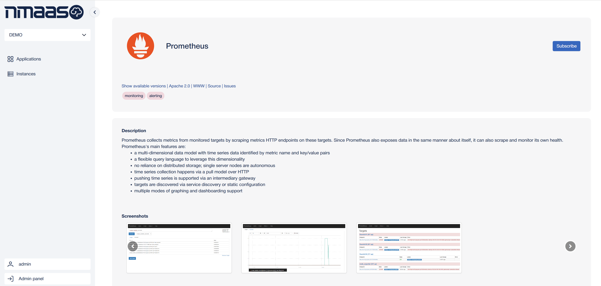

To subscribe to a given application, user needs to click the `Subscribe` button. Only subscribed applications can be further deployed in the nmaas cloud within the scope of a particular domain.

Users can deploy instances of an application by clicking the `Deploy` button.

!!! info "Application Subscription and Deployment"
    The `Subscribe` and `Deploy` buttons on the application details view are only available for users with the `Domain administrator` role

### 8.2 Initiating Application Instance Deployment

When deploying a new application instance, the user is requested to provide or select:
 - custom instance name (unique within the domain, up to 10 lowercase characters)
 - version of the application (from a selector)
 - confirm the domain (in which a given instance should be deployed)
 - chose to enable or not fully automatic application upgrades (triggered when new versions become available in the Portal)
 - select a remote cluster for the deployment (if available in the selected domain) 

The installation process comprises a few steps including subscription validation, environment creation, connectivity verification, application deployment, application first time configuration and activation.

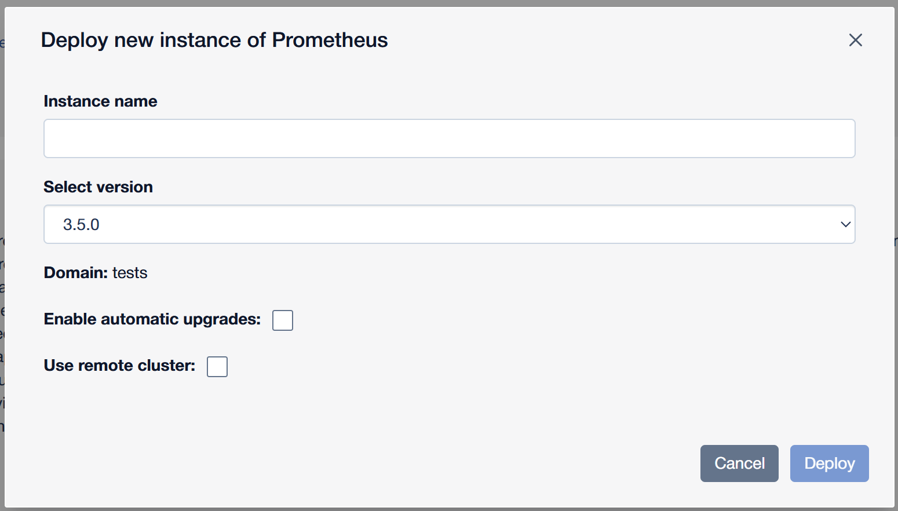

Once the installation process is completed, the user is provided with a way or multiple ways of accessing the deployed application instance depending on the application (in the majority of cases a link for accessing the web-based UI).

!!! info "Importance of the Provided Instance Name"
    Providing a suitable instance name is important since it is later on used to create a FQDN unique for this application instance following pattern: `<instance name>.<user domain name>.<nmaas base domain>` (e.g., *vminstance.pllab.nmaas.eu*)

!!! info "Application Deployment Notifications"
    User is notified with an email once the new application instance becomes available

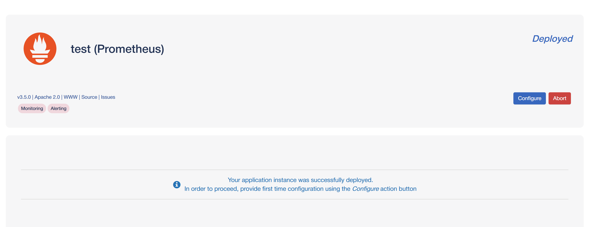

### 8.3 Application Instance Initial Configuration

During the installation process, once the application instance is initially deployed, the user is asked to provide an initial configuration for the application that is being installed. Thre required data is entered through a configuration wizard presented in a window after clicking the `Configure` button, which becomes visible on the application instance details page once the application transits to the `Deployed` state.

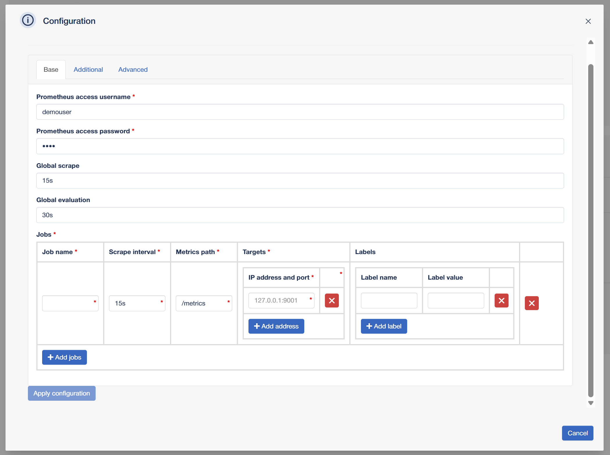

Different types of data may be required depending on the application. Typically, the user is requested to provide credentials for a default account to be created at application startup or basic set of information about the equipment to be monitored by this application instance. Configuration parameters to be filled in are distributed over two or three tabs depending on the application.

Once all required fields are populated user can click the `Apply configuration` button or `Proceed` if no configuration input is expected. Once the configuration is applied, the application instance is automatically activated.

### 8.4 Accessing Application Instance

Once the application instance reaches the `Active` state it can be accessed by the user.

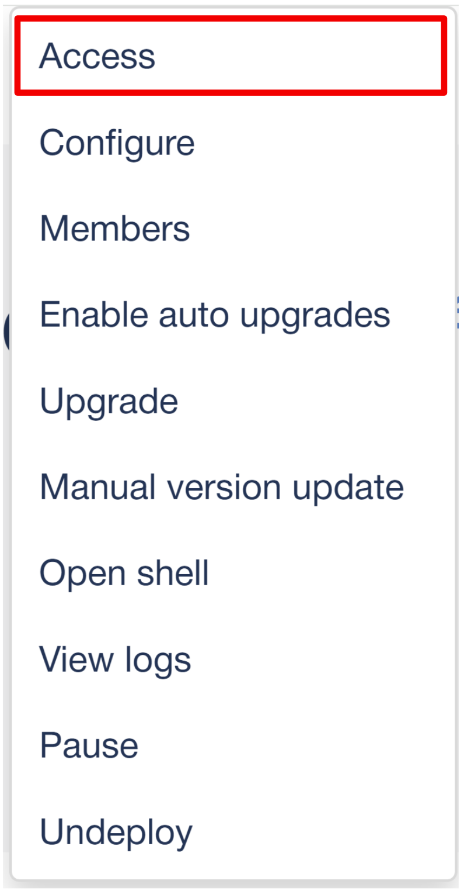{ width="300" }

Multiple access methods are supported by nmaas, and each of the applications supports one or more of them.

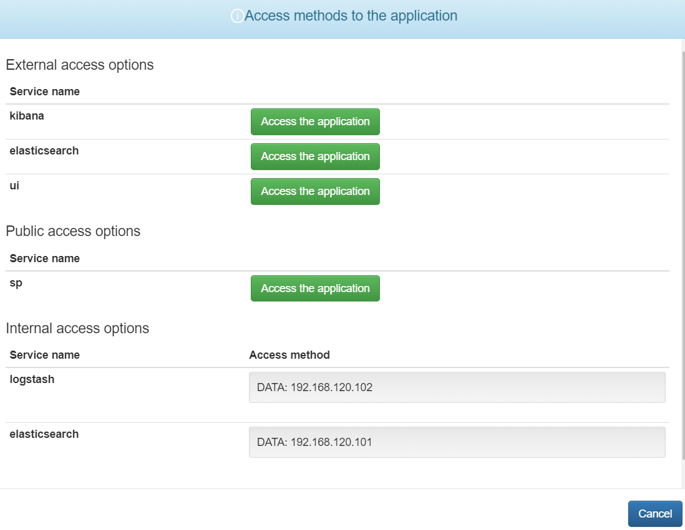

Four types of access are possible:

 - **public** – application web user interface is accessible directly from the public Internet
 - **external** – application web user interface is accessible over HTTPS from within a dedicated client VPN
 - **internal** – application is accessible over a different protocol than HTTP on a dedicated IP address (assigned by the system) and application-specific port
 - **local** – a Kubernetes service name that can be used to access this application instance from another application instance running within the same user domain (e.g., the service name for a Prometheus instance can be used to configure a data source in a Grafana instance deployed within the same domain)

!!! info "VPN Requirement for Accessing Deployed Applications"
    To access the applications running within a particular domain, the user needs to connect to a dedicated VPN

The application access window presents also information about deployment parameters used during the installation process. Those parameters might be useful for the user when working with the application instance.

### 8.5 Configuring Application Instance

Some applications support the option of updating their configuration during application instance runtime.

In such a case, when instance is in `Active` state, open the `Actions` menu on the application instance details page and select `Configure` to open a window presenting the configuration options.

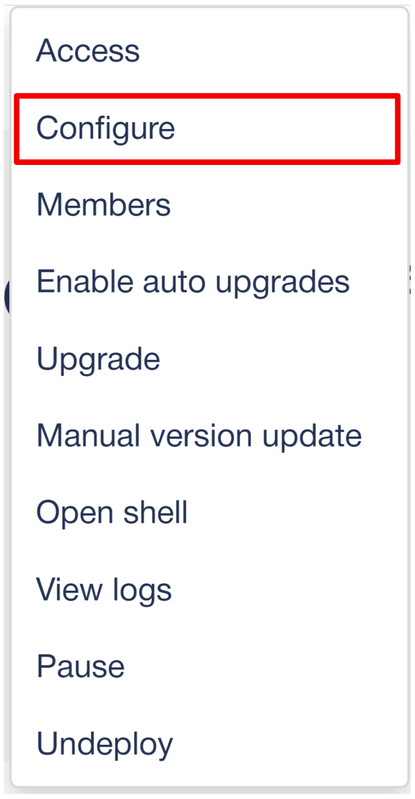{ width="300" }

Typically, a `git clone` link is provided that can be used by the user to locally clone the git repository created specifically for this application instance.

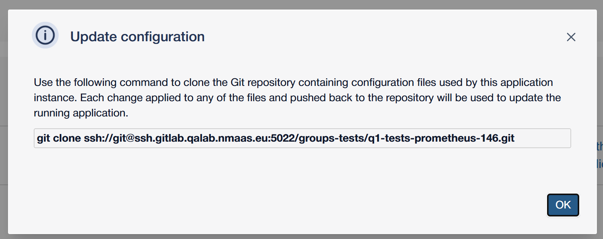

Then user can apply the desired changes to the pre-populated configuration files added to the repository by default or add new additional files.

After the files are committed and pushed back to the repository, the configuration of the respective application is automatically reloaded within a couple of minutes.

!!! info "Accessing the Configuration Repositories"
    When cloning, the user is authenticated using their private SSH key. Therefore, is it necessary to upload the public SSH key on the user's `Profile` page before accessing the repository

The user that initiates a given application instance deployment is automatically added to GitLab as a member of the newly created repository. Other domain users, to have the same SSH-based access to the repository, have to be added as members to particular application instance by selecting `Members` from the `Actions` menu. 

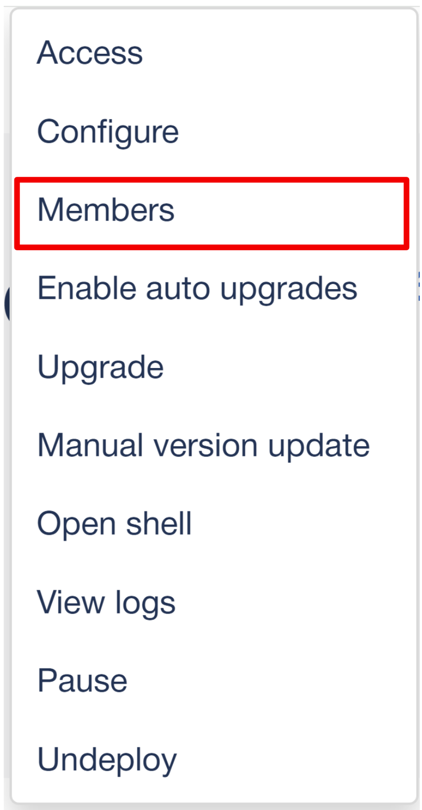{ width="300" }

This operation can be performed by a Domain administrator. A Domain administrator can only select users that are added to their domain and have previously uploaded their SSH keys (see [section 9.3](./user-guide.md#93-setting-user-ssh-keys)).

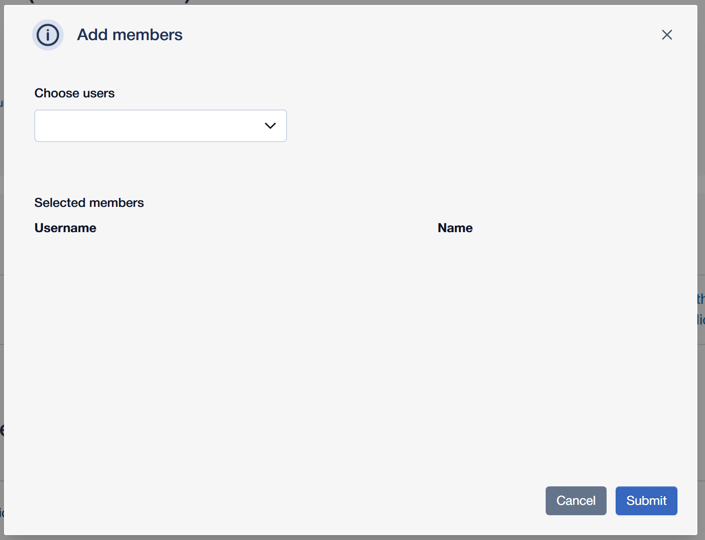

### 8.6 Managing Application Instance Upgrades

Once an application instance is already running, the user is able to alter their choice regarding enabling automatic application upgrades by selecting the appropriate item from the `Actions` menu. If during the initial deployment request user opted not to enable the upgrades, they are provided with the `Enable automatic upgrades` menu item and vice versa.

In case the automatic upgrades were not enabled, the user is still able to trigger application instance upgrades manually once a newer version of their deployed application is made available in the marketplace. To trigger the upgrade user should select `Upgrade` from the `Actions` menu. Once selected, a window is displayed presenting detailed information about the possible upgrade to be performed, including target application versions and corresponding target Helm chart version. Once confirmed, the upgrade process begins in the background.

The fact that a particular application instance can be upgraded is indicated on the `Instances` view by an up arrow icon displayed next to application instance.

!!! info "Upgrade Availability Notifications"
    User is notified with an email once a manual upgrade of their running application instances becomes possible

!!! info "Successful Update Notification"
    User is notified with an email once the upgraded application instance becomes again active

### 8.7 Accessing Application Instance Logs

**WIP**

!!! info "Access to Application Logs"
    Access to the application logs needs to be explicitly allowed for a given application either by the system administrator or the respective *Application Manager*.

### 8.8 Accessing Application Instance Shell

**WIP**

!!! info "Access to Application Shell"
    Access to the application shell needs to be explicitly allowed for a given application either by the system administrator or the respective *Application Manager*.

### 8.9 Application Pausing and Resuming

A running application instance can be temporarly paused to save resources by selecting the `Pause` option from the 
`Actions` menu. A previously paused application instance can be resumed by selecting the `Resume` option. Both 
configuration and data of a paused application instance are preserved.

### 8.9 Initiating Application Instance Removal

To shut down a particular application instance and free up resources that are no longer in use, user should select `Undeploy` from the `Actions` menu and confirm the action in window that pops up.

!!! warning "Removing Application Instances"
    Removing an application instance is a destructive operation and cannot be undone.

### 8.10 Managing Failed Application Instance Deployments

In unforeseen situations the deployment process may fail at some stage.

One of the following actions can be triggered by the user from the application instance view once a deployment process ends up in the `Failure` state:

 - **Check state** – verify if the application instance is already running 
 - **Redeploy** – attempt to re-run the deployment process
 - **Remove** – complete removal of the failed instance allowing a fresh deployment with the same custom instance name

!!! info "Requesting Support for Failed Deployments"
    Administrators are notified with an email automatically once an application deployment process fails. Users are encouraged to additionally inform administrators about the incident using the *Issue report* contact form available on the `About` page.

## 9. User Settings

### 9.1 User Profile

User can view their account details and other personal settings by selecting `Profile` from the drop-down menu displayed after hovering over the username field on the top navigation bar.

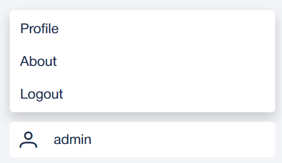

The Profile view contains user account information such as: `Username`, `First name`, `Last name` and `Email`.

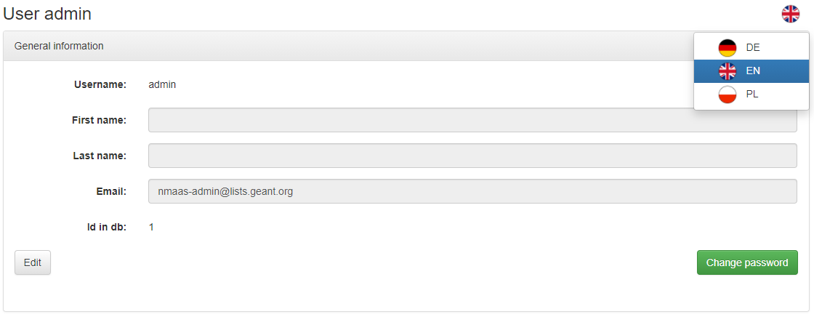

On the bottom of the page the user can also see their roles granted in particular domains.

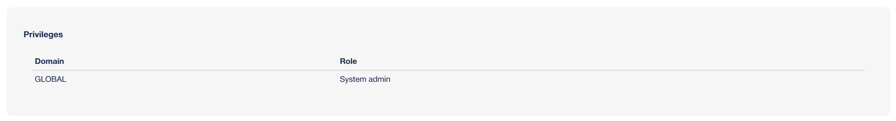

By clicking the flag icon located in the top right section of the view the user can select their preferred language in which the content of the Portal will be displayed.

### 9.2 Setting a User's Default Domain

One of the available options on the user's `Profile` view is specifying user's default domain.

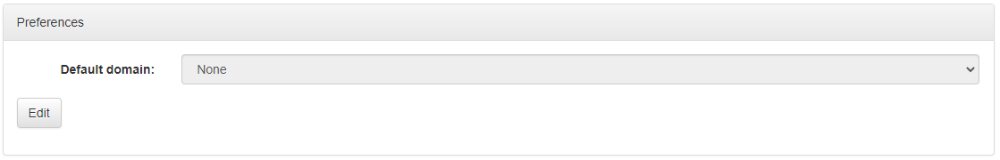

This setting is particularly useful if a given user belongs to multiple domains and would like a specific domain to be selected by default after login.

### 9.3 Setting User SSH Keys

For applications that support the Git-based configuration management model, meaning the possibility to update the application configuration during runtime by pushing updated configuration files to a dedicated Git repository, it is required that all users willing to use this option upload their public SSH keys using the form available on the `Profile` view.

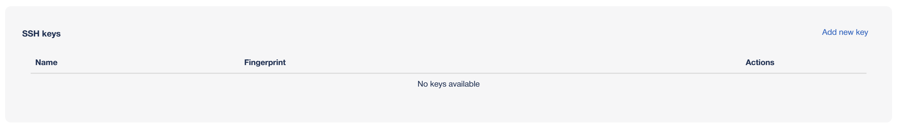

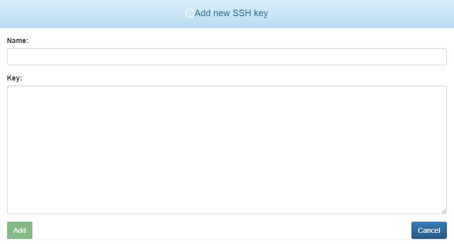

Upon key upload or update in the Portal, user information is synchronized with the user account created on the GitLab instance associated with given nmaas installation.

### 9.4 Password Change

After clicking the `Change password` button, a new window will be displayed where the user can change their own password.

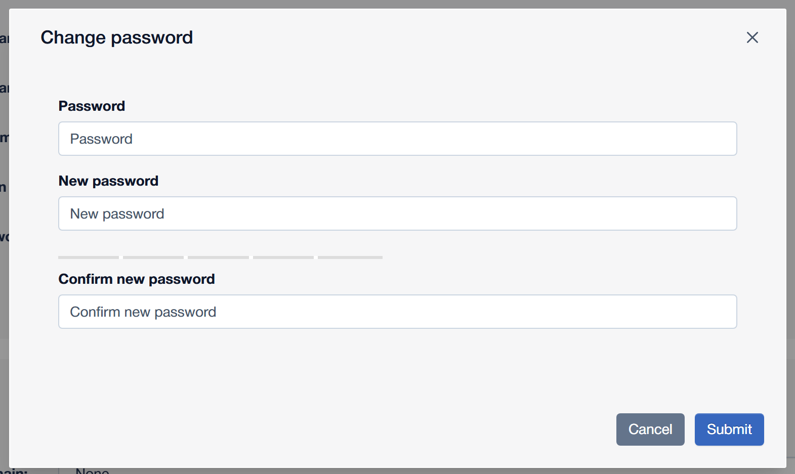

!!! info "Password Change Availability"
    This option is not available for users that log in using the Federated/SSO option

## 10. Contact Form

An easy and recommended way for contacting the nmaas Team is through the Contact Form.

The Contact Form is available on the About page along with the information about the versions of the nmaas software.

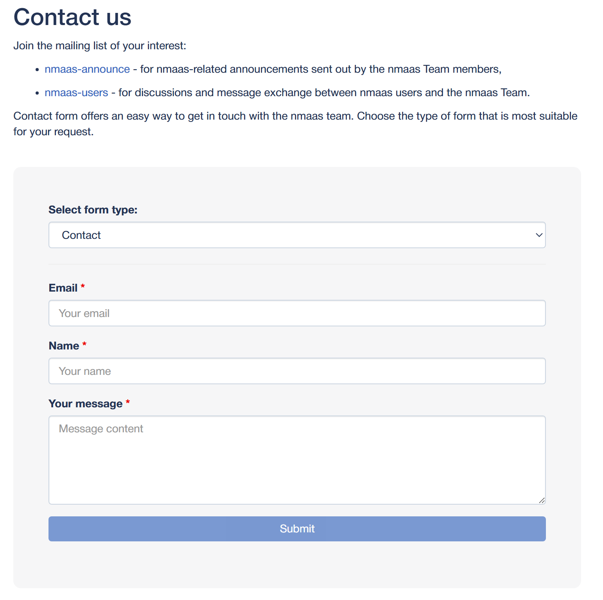

The user can select one of five form types that best matches the subject of his message:

 - **Contact** – generic request form
 - **Access request** – for requests related to new account creation or role assignment
 - **Issue report** – for reporting any encountered issues with the Portal or deployed application instances
 - **New domain request** – for requests related to new domain creation
 - **Enhancement or new application request** – for placing suggestions of enhancements, new features or integration of new applications 

!!! info "Form Fields"
    Each type of form contains a different set of mandatory fields to be populated to best describe the subject of the message
