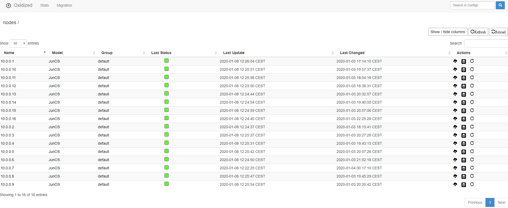
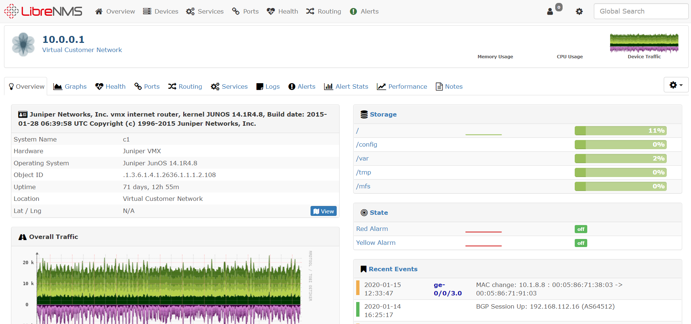
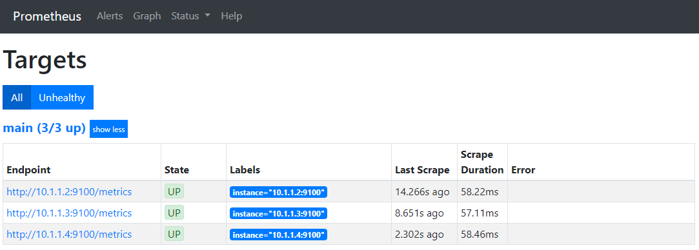
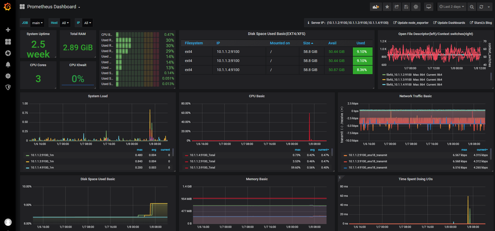
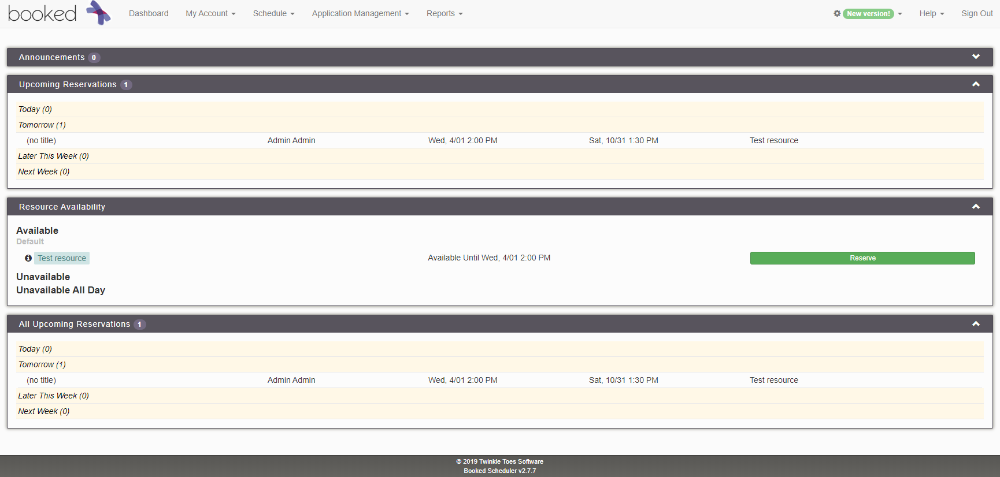
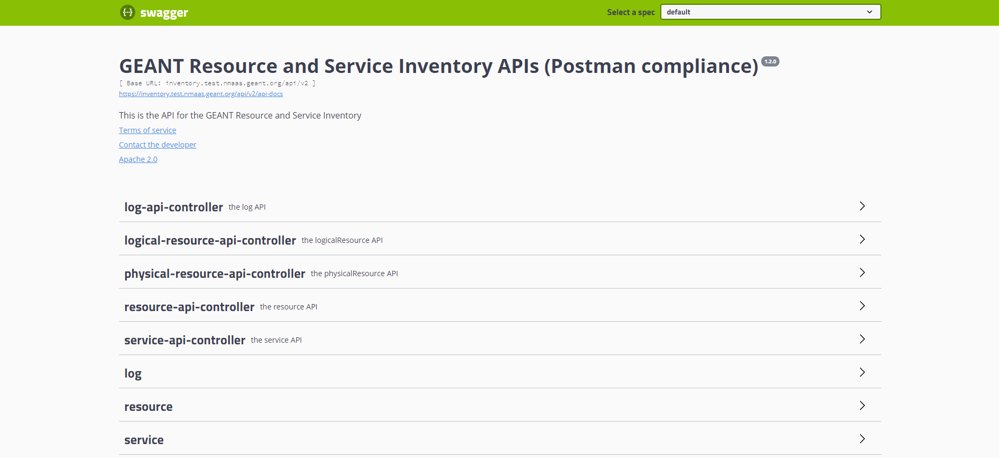

# nmaas Playground Instance

## Introduction

The nmaas Playground is a central installation that can be used by anyone interested in testing latest versions of the nmaas Platform.

It is available at [https://nmaas.geant.org](https://nmaas.geant.org). 

The nmaas Playground is deployed on GÉANT's infrastructure and is maintained by the nmaas Team.

Any questions or requests related with using the nmaas Playground should be directed to [nmaas@lists.geant.org](mailto:nmaas@lists.geant.org).

It is important to note that the nmaas Playground is tailored to enable users to browse and deploy nmaas tools right away without any unnecessary overhead. However, this implies that the user isolation, access and data security rules applied on this nmaas installation are not so strict as in the case of the official nmaas Virtual NOC production service (e.g. no dedicated VPNs are deployed).

!!! warning Usage Disclaimer
    The nmaas Playground should be used only for testing purposes and not for monitoring of actual user equipment.

For any information on how to use nmaas refer the official [nmaas User Guide](../guides/user-guide.md).

## Accessing the nmaas Playground

In order to use the nmaas Playground a new user should either fill in the registration form to create a local account in the system or use the Federated login option.

In both cases, the system administrator will have to manually add the new user to a Test domain that is pre-configured in the system.

An nmaas domain corresponds to an institution, team or project (e.g. NREN, end-institution, team within the GÉANT Project) whose users will be able to deploy instances of tools available in the nmaas portfolio in order to manage and/or monitor the equipment within that domain.

## Deploying nmaas Tools

The main purpose of using the nmaas Playground is to deploy and access test instances of nmaas Tools. From more information about the tools currently supported by nmaas refer to [the application list](../nmaas-applications/application-list.md).

Running a network management tool without any equipment that can be monitored would not present the full potential of nmaas. Therefore a virtual user network with various types of devices has been deployed and connected to the Test domain.

While deploying a tool in the nmaas Playground users can choose any subset of available devices to be monitored.

The following table presents all the equipment available in the virtual user network together with any relevant information that later on needs to be provided in the configuration wizard during deployment of particular tool.

For example when deploying new instance of the Oxidized application, the user will be asked to provide a list of IP addresses of devices to be interrogated and the SSH username and password to be used for accessing them. 

| Device Identifier | Device Type               | IP Address/URL | SSH Username/Password     | SNMP Version/Community |
|-------------------|---------------------------|----------------|---------------------------|------------------------|
| vmx-c1            | Virtual Juniper MX Router | 10.0.0.1       | `geant` / `geant123`      | v2c / `nmaas-public`   |
| vmx-c2            | Virtual Juniper MX Router | 10.0.0.2       | `geant` / `geant123`      | v2c / `nmaas-public`   |

## Demo Instances of nmaas Applications

A set of tools have been deployed by default in the Test domain and configured to monitor the resources of the virtual user network and servers.

Those tools are run for demo purposed and are reachable over the Internet. In the production setup, the user web interface of any deployed tool is only accessible from within a dedicated user VPN.

| Application | URL                                     | Login Credentials                        | Comments                                                                                                         | SNMP Version/Community |
|-------------|-----------------------------------------|------------------------------------------|------------------------------------------------------------------------------------------------------------------|------------------------|
| Oxidized    | https://oxi-virt-1.test.nmaas.geant.org | `admin`/`oxidized`                     | Configured 16 Juniper vMX routers which configuration is being backed up                                           | v2c / `nmaas-public`   |
| LibreNMS    | https://lib-virt-1.test.nmaas.geant.org | `admin`/`librenms`                     | Polling information from 16 routers                                                                                | v2c / `nmaas-public`   |
| Prometheus  | https://pro-virt-1.test.nmaas.geant.org | `admin`/`prometheus`                   | Added 3 target virtual machines with node exporter installed                                                       | v2c / `nmaas-public`   |
| Grafana     | https://gra-virt-1.test.nmaas.geant.org | `admin`/`grafana`                      | The `pro-virt-1` Prometheus instance is configured as data source. Default dashboard or node exporters is added.   |                        |
| Booked      | https://booked.test.nmaas.geant.org     | `admin`/`booked`                       |                                                                                                                    |                        |

## Gallery

{ width="350" }
{ width="350" }
{ width="350" }
{ width="350" }
{ width="350" }
{ width="350" }