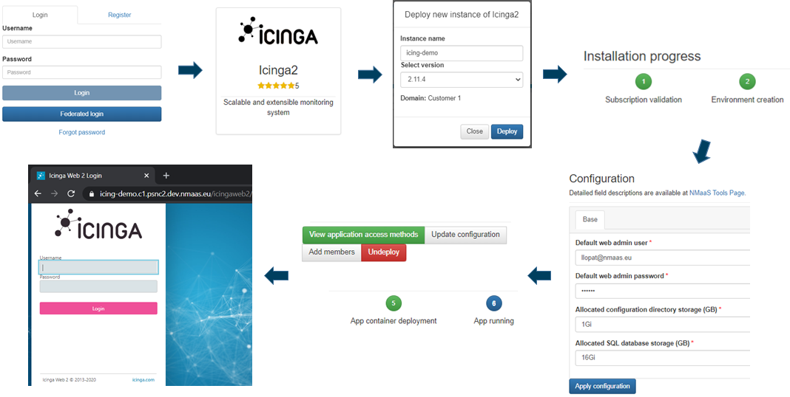

# General Application Deployment

This page explains the basic set of steps that need to be undertaken during application deployment on nmaas.

## nmaas Tool Deployment Process

A basic set of steps required to deploy an instance of an nmaas application is the following:

1. Log in to nmaas Portal
2. Choose application from the market
3. Request deployment and provide a custom name for the new instance
4. Follow the automated installation steps
5. Provide basic configuration for the new instance through a custom wizard
6. Wait for the application deployment and verification process to complete
7. Access the application UI following unique URL

The whole process shouldn't take more than several minutes. 

## nmaas Tool Configuration Process

During the tool deployment process user is asked to fill in a form and provide basic configuration data for the new tool instance. 

This data might comprise default user credentials, IP addresses of devices to be monitored and/or requested storage space to persist monitoring data.

For some of the tools this data provided by the user is used to populate tool specific configurations files that are later on uploaded to a dedicated Git repositories (a new repository is created for each tool instance).

From this point any change to the configuration of a running tool instance should be done following these steps:

1. Open the tool instance page and view the Git clone link displayed after clicking the Update configuration button,
2. Use the command to clone the repository locally using the SSH key provided beforehand.
3. Apply desired modifications, commit and push altered files back to the remote repository.
4. Wait for a couple of minutes in order for the new configuration to be loaded and applied by the tool instance.

Note: Git repositories containing application configuration files are hosted on a dedicated private GitLab instance operated by the nmaas Team.

Note: Users should upload their public SSH key using the Profile page before deploying a new instance of a tool in order to be able to clone the Git repository afterwards.

## Specific Application Tutorials

Tutorials for each of the supported applications currently in the nmaas catalog are available in the [Application Deployment Tutorials Section](./tutorials/librenms.md).