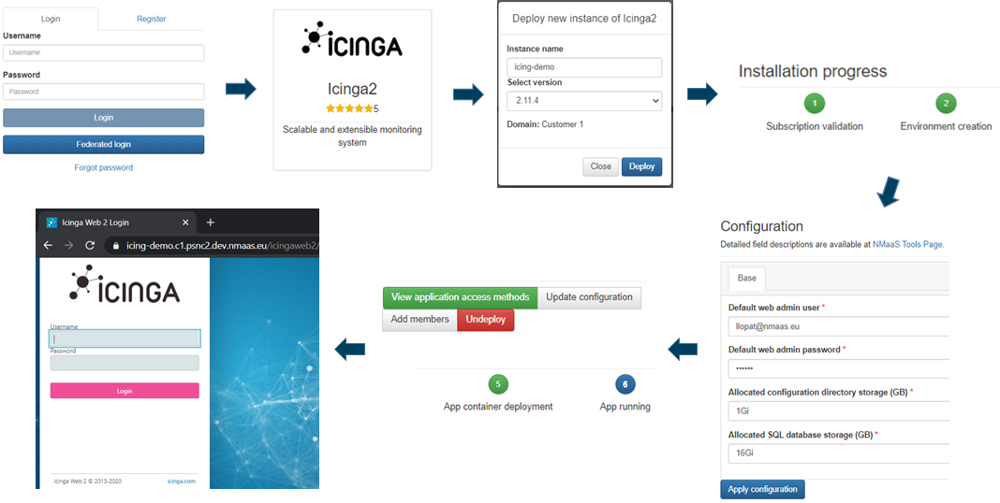

# General Application Deployment

This page explains the basic set of steps of application deployment on nmaas.

## Application Deployment Process

A basic set of steps required to deploy an instance of an application is the following:

1. Log in to nmaas Portal
2. Choose an application from the catalogue
3. Request deployment and provide a custom name for the new instance
4. Follow the automated installation steps
5. Provide basic configuration for the new instance through a custom wizard
6. Wait for the application activation process to complete
7. Access the application UI following unique URL

The whole process shouldn't take more than several minutes.

!!! "User Guide Reference"
    Refer to the [User Guide](../guides/user-guide.md#82-initiating-application-instance-deployment) for more details regarding the application deployment process.

## Application Configuration Process

During an application deployment process, the user is asked to fill in a custom form and provide basic configuration data for the new application instance. 

This data might comprise default user credentials, IP addresses of devices to be monitored and/or requested storage space for persisting monitoring data.

!!! "User Guide Reference"
Refer to the [User Guide](../guides/user-guide.md#83-application-instance-initial-configuration) for more details regarding the application initial configuration process.

For some applications this data provided by the user is used to populate application-specific configurations files that are later on uploaded to a dedicated Git repository (a new repository is created for each application instance).

From this point any change to the configuration of a running application instance should be done following these 
steps of a GitOps workflow:

1. Open the application instance page and view the Git clone link displayed after clicking the `Configure` button.
2. Use the command to clone the repository locally using the SSH key provided beforehand.
3. Apply desired modifications, commit and push altered files back to the remote repository.
4. Wait for a couple of minutes in order for the new configuration to be loaded and applied by the application instance.

!!! "Git Repositories"
    Git repositories containing application configuration files are hosted on a dedicated private GitLab instance operated by the nmaas Team.

!!! "Providing User SSH Key"
    Users should upload their public SSH key using the Profile page before deploying a new instance of an application to be able to clone the Git repository afterwards.

## Specific Application Tutorials

Tutorials for each of the supported applications currently in the nmaas catalog are available in the [Application Deployment Tutorials Section](./tutorials/adminer.md).
