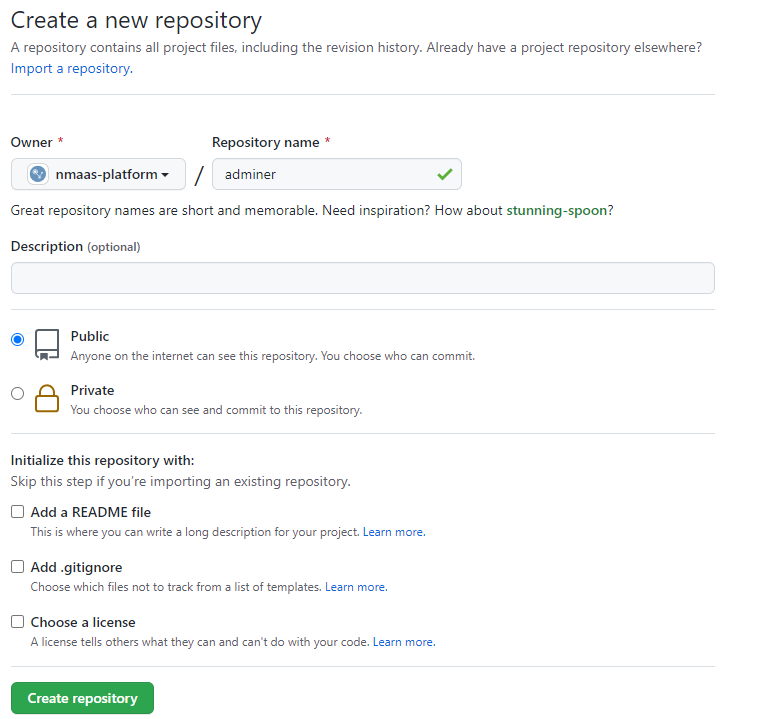
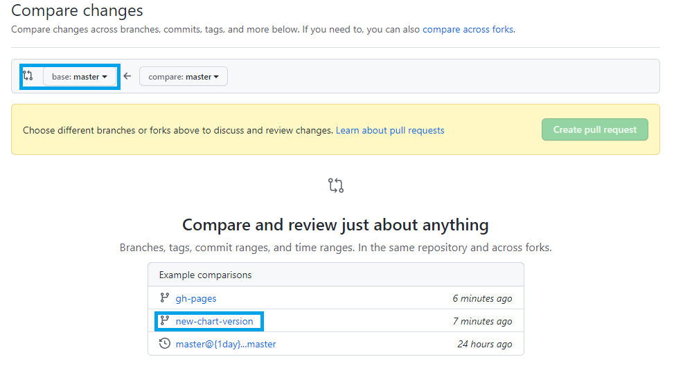
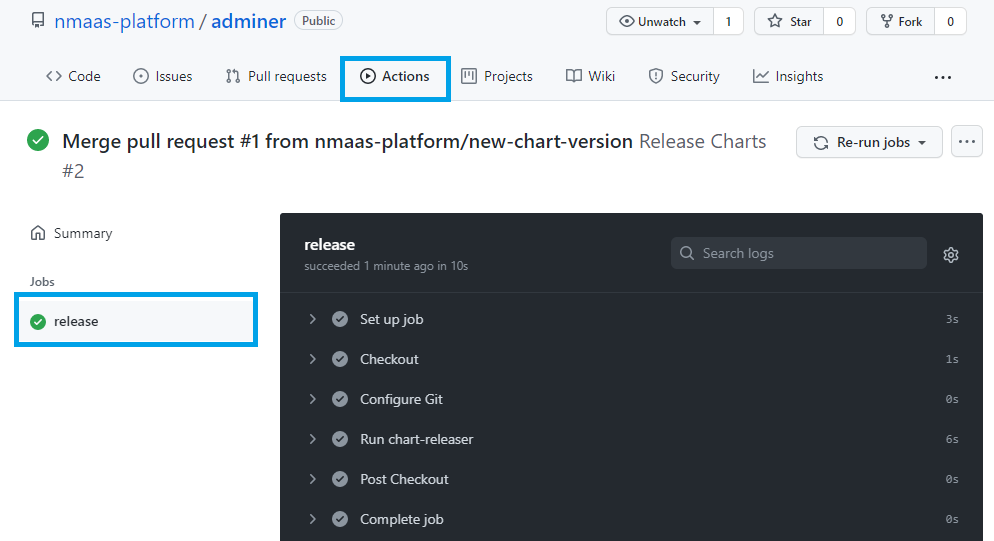
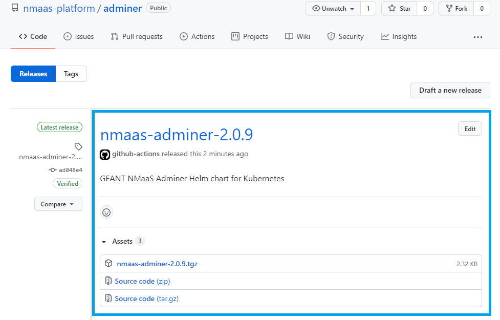
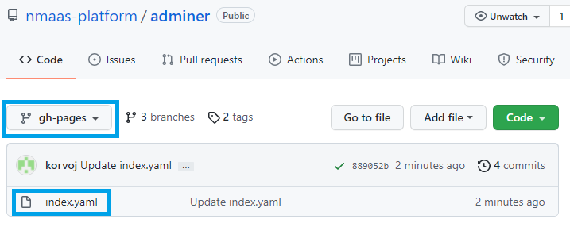

# Adding a new Application

Anyone can submit an application to be included to the nmaas catalog, thus making it available to all users of the production instance. Each application should have at least one official maintainer who will regularly pull changes from the upstream project and provide updated Docker images and Helm charts. The source code for each Helm chart should be hosted in a separate Git repository.

A brief guide on how a new chart repository can be set up using the GitHub platform is presented below.

Please note that we do not require the use of GitHub or mandate a specific code hosting service. Any platform that is publicly accessible would suffice.

!!! note "Process Explanation"
    Applying for an application to be added to the nmaas catalog is a two-step process. First, the chart needs to be created, and then a brief proposal submitted to the nmaas team via email. After reviewing the chart, the user who submitted it will be assigned a new role on the production instance of nmaas (https://vnoc.nmaas.eu) – <i><u>tool manager</u></i>, which allows uploading of new versions and parameter changes.

## Step 1: Create a new GitHub Repository

- Login or register a new account on GitHub and create a new public repository. Repositories can be created either as an individual user or as an organization.

<figure markdown>
  
  <figcaption>Creating a New GitHub Repository</figcaption>
</figure>

## Step 2: Configure GitHub Pages for Hosting the Helm Repository

GitHub has a free option for hosting static files for public repositories called GitHub Pages. This is a hugely popular tool for publicly hosting simple blogs or websites created using static site generators such as Hugo or Jekyll. However, in our case, this is also a perfect opportunity to host the index.yaml metadata file required for every Helm repository.

To enable GitHub Pages for your project, the following steps need to be performed:

- Clone the newly created repository locally and a dummy .gitignore file which can be used later.
  ```bash
  git clone git@github.com:USERNAME/REPOSITORY_NAME.git
  touch .gitignore
  git add .
  git commit -m "add .gitignore"
  git push --set-upstream origin master
  ```

!!! danger "Warning"
    Before pushing the changes to the remote and executing the git push command, make sure to correctly identify the name of the default Git branch. This varies from environment to environment, and in the case of GitHub, can be directly checked from the settings screen of the given repository (Settings → Branches).

- Create a new branch called `gh-pages`
  ```bash
  git checkout --orphan gh-pages
  git rm -rf .
  git commit -m "Initial commit" --allow-empty
  git push --set-upstream origin gh-pages
  ```

- Once the branch is created, GitHub Pages can be officially enabled from the Settings page of your repository

<figure markdown>
  
  <figcaption>Enabling GitHub Pages</figcaption>
</figure>

- If desirable, you can add any `index.html` file to the `gh-pages` branch, so that users are not presented with a 404 error when directly accessing the Helm repository root URL. Note that this has no effect on the functionality of the Helm repository itself.

## Step 3: Preparing the Chart

We are now ready to publish the source code for our chart. The GitHub Actions that we will configure in the next step mandate that our charts are placed in a charts directory within the repository.


- Switch to the master branch of the repository
  ```bash
  git checkout master
  ```

- Create the necessary directory tree
  ```bash
  mkdir charts
  cd charts
  ```

- Create a new chart or copy the source files of an existing chart
  ```bash
  helm create chart-name
  ```

## Step 4: Automatic Publishing of New Chart Versions

It would be tedious to manually package each new chart version, update the artifacts to GitHub, create a new release, and update the index.yaml file on the gh-pages brach which contains the Helm repository metadata. Instead, we can automate all of these tasks using GitHub actions. To do so, we will configure automatic linting of our charts as well as publishing.

- Switch to the master branch of your repository and create a new folder, `.github/workflows` which would contain the definition for our GitHub pipelines.
  ```bash
  git checkout master
  mkdir -p .github/workflows
  ```

- Create a new file called `linting.yaml` with the content available below. This job will execute whenever there is a new pull request and will check whether it conforms to the best Helm charts writing practices.
  ```yaml title=".github/workflows/linting.yaml"
  name: Helm Chart Linting
  
  on:
    pull_request:
      paths:
        - 'charts/**'
  
  jobs:
    lint-chart:
      runs-on: ubuntu-latest
      steps:
        - name: Checkout
          uses: actions/checkout@v2
          with:
            fetch-depth: 0
        
        - name: Set up Helm
          uses: azure/setup-helm@v1
          with:
            version: v3.4.0
  
        - uses: actions/setup-python@v2
          with:
            python-version: 3.7
  
        - name: Set up chart-testing
          uses: helm/chart-testing-action@v2.1.0
  
        - name: Run chart-testing (list-changed)
          id: list-changed
          run: |
            changed=$(ct list-changed)
            if [[ -n "$changed" ]]; then
              echo "::set-output name=changed::true"
            fi
  
        - name: Run chart-testing (lint)
          run: ct lint --debug
  ```

- Once a pull request has been merged to master we want to automatically release a new version of the chart. For this purpose, we create a new workflow by defining the file `release.yaml`.
  ```yaml title=".github/workflows/release.yaml"
  name: Release Charts
  
  on:
    push:
      branches:
        - master
      paths:
        - 'charts/**'
  
  jobs:
    release:
      runs-on: ubuntu-latest
      steps:
        - name: Checkout
          uses: actions/checkout@v2
          with:
            fetch-depth: 0
  
        - name: Configure Git
          run: |
            git config user.name "$GITHUB_ACTOR"
            git config user.email "$GITHUB_ACTOR@users.noreply.github.com"
  
        - name: Run chart-releaser
          uses: helm/chart-releaser-action@v1.2.1
          env:
            CR_TOKEN: "${{ secrets.GITHUB_TOKEN }}"
  ```


- Commit the changes to these new files
  ```
  git add .
  git commit -m "add helm automation"
  git push
  ```
  
## Step 5: Testing the Automations

We have prepared the source code of the Helm chart in Step 3 and set up the required GitHub actions in Step 4. We are now ready to test our automation tools.

- Create a new branch with an arbitrary name
  ```bash
  git checkout -b new-chart-version
  ```

- Open the `charts/my-chart/Chart.yaml` file and increment the version field of the chart
- Push the changes to GitHub
  ```bash
  git add .
  git commit -m "new chart version"
  git push --set-upstream origin new-chart-version
  ```

- Go to your repository on GitHub and open a new pull request from the Pull requests page. As source branch choose the newly created one – `new-chart-version`.

<figure markdown>
  
  <figcaption>Opening a New Pull Request</figcaption>
</figure>

<figure markdown>
  
  <figcaption>Choosing a Source Branch for the Pull Request</figcaption>
</figure>

<figure markdown>
  
  <figcaption>Comparing Changes Between the Branches</figcaption>
</figure>

- Once the pull request is created the lint workflow should be automatically triggered. You can check the status from Actions page on your GitHub repository.

<figure markdown>
  
  <figcaption>Check Status for the Lint Workflow</figcaption>
</figure>

- Should everything go well, we are ready to merge the changes to master. Choose Pull requests and select the previously created one. Choose the option to automatically merge its changes.

<figure markdown>
  
  <figcaption>Merge Pull Request</figcaption>
</figure>

- With the merging of the pull request, the second workflow that we defined should have automatically been triggered.

<figure markdown>
  
  <figcaption>Helm Chart Publishing Workflow</figcaption>
</figure>

- As a result of this workflow, a new Release should have also been made in our repository.

<figure markdown>
  
  <figcaption>Previewing the Repository Release</figcaption>
</figure>

<figure markdown>
  
  <figcaption>Release Details</figcaption>
</figure>

- If we switch to the `gh-pages` branch, we can see that there is a new file that has been automatically created – `index.yaml` which contains the necessary metadata for the Helm Repository.

<figure markdown>
  
  <figcaption>index.yaml Metadata</figcaption>
</figure>

## Step 6: Using the Helm Repository

We are now ready to use our Helm repository by simply adding it to our list with the Helm client.

```bash
helm repo add local-repo-name https://github-username.github.io/repository-name
helm repo update
helm install release-name local-repo-name/chart-name
```

You can find the generated link to your GitHub Pages website by navigating to Settings → Pages.

<figure markdown>
  
  <figcaption>Discovering the GitHub Pages URL</figcaption>
</figure>

## Step 7: Generating a README File with Default Values for the Chart

Each chart submitted for addition to the nmaas catalog must have a README file containing all of the parameters that can be altered during its deployment. Such a README file can either be created manually or automatically. Helm-docs is one such tool for automated generation of chart descriptions.

- Download the latest release of helm-docs from the official Releases page: https://github.com/norwoodj/helm-docs/releases

- Install it locally:
  ```bash
  sudo dpkg -i helm-docs_*
  ```

- Set the root of your Git repository as the working directory and execute the following command:
  ```
  helm-docs --output-file "../../README.md" --dry-run
  ```

- We need to specify the `--output-file` parameter so that the `README.md` file will be created in the root of our repository instead of directly where the chart is located (`charts/my_chart`).

- If the output is satisfactory, execute the same command, but now without the `--dry-run` parameter and push the changes either to a new branch or directly to `master`.
  ```bash
  helm-docs --output-file "../../README.md"
  git add .
  git commit -m "add readme.md"
  git push
  ```

## Conclusion

We have created an automated pipeline using GitHub Actions which would automatically check all new changes to our chart and if accepted will release a new version of it, ready to be installed in an existing Kubernetes cluster.

The workflow for releasing a new version of a chart is:

- creating a new branch and make the necessary changes, incrementing the version field in the `Chart.yaml` file.
- creating a new pull request to merge these changes to `master`. At this point the linting task will be executed.
- merge the changes to the `master` branch. At this point the release task will be executed.

If you want to see your chart added to the nmaas catalog please contact [nmaas-admin@lists.geant.org](mailto:nmaas-admin@lists.geant.org) with the following information:

- URL to the upstream source-code repository of the proposed application
- Brief description of its features
- URL to the Docker image backing the chart
- URL to the Helm repository
- A list of maintainers of the Helm repository
