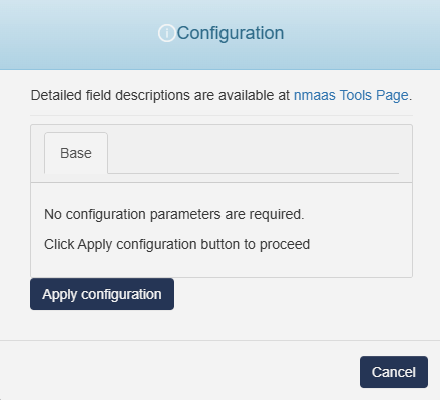

# Adminer 

{ align=right }

Adminer (formerly phpMinAdmin) is a full-featured database management tool written in PHP.

## Configuration Wizard

Configuration parameters to be provided by the user are explained in the subsections below.

