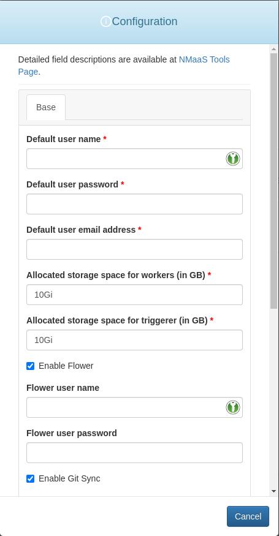
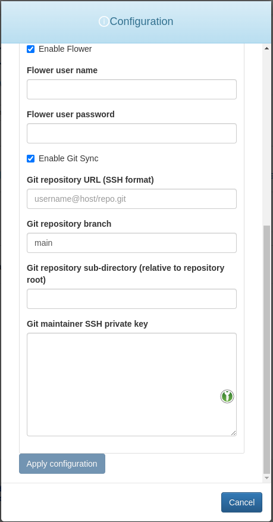

# Airflow

{ align=right width="100" }

Apache Airflow is an open-source platform used for orchestrating complex workflows and data pipelines. It enables users to schedule, monitor, and manage tasks, allowing for efficient automation and streamlined data processing.

## Configuration Wizard

The Airflow configuration wizard allows the deployment to be customized according to the user's needs.

<figure markdown>
{ width="350" }
<figcaption>Fig. 1: First set of configuration options for Apache Airflow</figcaption>
</figure>

<figure markdown>
{ width="350" }
<figcaption>Fig. 2: Second set of configuration options for Apache Airflow</figcaption>
</figure>

The customizable fields are:

- `Default user name` - username for the default Airflow account which is automatically created.
- `Default user password` - password for the default Airflow account which is automatically created.
- `Default user email address` - email address for the default Airflow account which is automatically created.
- `Allocated storage space for workers (in GB)` - volume size for the persistent volumes attached to the Airflow workers. 10Gi is a good starting point which can be increased in the future, if needed.
- `Allocated storage space for triggerer (in GB)` - volume size for the persistent volumes attached to Airflow triggerers. 10Gi should be more than enough in most cases.
- `Enable flower` - if ticked, the Flower web interface will be deployed, allowing users to manage the Airflow task queues.
- `Flower user name` - username for the default Flower account. Flower uses basic authentication by default.
- `Flower user password` - password for the default Flower account. Flower uses basic authentication by default.
- `Enable Git Sync` - if ticked, Airflow will automatically fetch the contents from the remote Git repository as specified in the `Git repository URL`. The Git sync occurs periodically.
- `Git repository URL (SSH format)` - the URL of the Git repository hosting the Airflow workflows and which is to be synced periodically. The expected format is shown as a placeholder value in the input field itself. Example: `git@github.com:nmaas-platform/airflow-demo.git`.
- `Git repsitory branch` - the Git repository branch to be periodically synced. The branch must already exist.
- `Git repository sub-directory (relative to repository root)` - the folder where the Airflow workflow definitions are placed within the Git repository.
- `Git maintainer SSH private key` - the SSH private key which has already been authorized with at least a read-only access to the Git repository specified in the `Git repository URL` field. Necessary as to ensure that the Git sync component will be able to clone the repository.

## Git Sync Information


The Git sync process utilized by the Apache Airflow Helm chart involves periodically pulling changes from a specified Git repository into the Airflow DAGs (Directed Acyclic Graphs) folder within the Airflow deployment. This enables users to manage and update their workflows directly in a version-controlled Git repository, ensuring consistency and accoutability in the development and deployment of data pipelines.

It is possible to use either a public or a private repository. In case a private repository is used, the necessary SSH keys must be configured both on the Airflow side and on the platform hosting the Git repository. It is recommended to use a brand new SSH key pair for each Airflow deployment, to ensure safety. A new SSH key pair can be created using:

```bash
ssh-keygen
```

After creating the SSH key pair, the public key should be added to the platform hosting the Git repository. For GitHub this can be done by navigating into the repository settings, and adding a new deploy key using the **Deploy keys** page. The corresponding private key should be pasted in the `Git maintainer SSH private key` in the default OpenSSH format.

Since Git doesn't allow cloning only of a specific subdirectory within a repository, the setting `Git repository sub-directory` doesn't restrict which folders are cloned. Instead, it simply forces Airflow to only look for DAGs source code in the specified directory. 

Assuming that the Git repository directory tree is as the one below and `airflow-demo` is the root folder of the repository, then specifying `dags` as the value of the `Git repository sub-directory` field will only register the `example-dag` DAG with Airflow, leaving `scratch.py` ignored. Please note that since the whole repository is cloned anyhow, config files can be placed at an arbitrary location, even outside the specified dags directory. 

```
airflow-demo/
├── dags
│   └── example-dag.py
└── scratch.py
```

Airflow clones the repository to `/opt/airflow/dags/repo` by default, which might be important in certain cases and when refering to absolute paths. The working directory during execution is `/opt/airflow`. However, it is best to not rely on using environment specific paths, and instead implement a platform agnostic approach, such as getting the full path to the Python file being currently executed and navigating from there:

```python
import os
dirname = os.path.dirname(__file__)
```