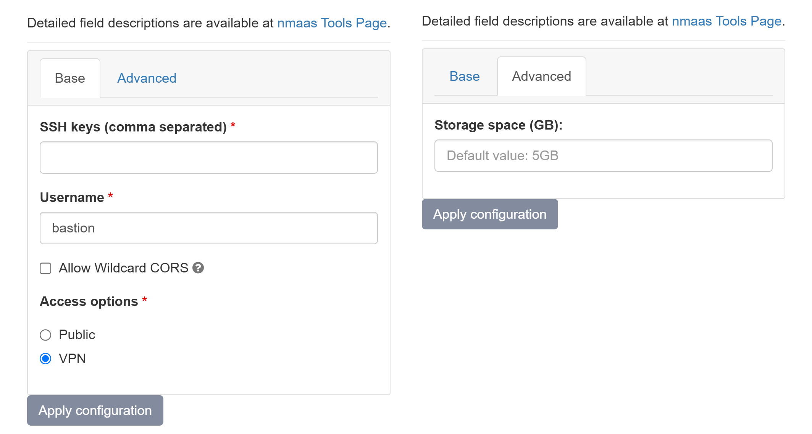

# Bastion Web Server

{ align=right }

Bastion Web Server is an Ubuntu-based bastion server deployed in a domain has VPN access to all the monitored devices. It is accessible through SSH. Additionally, a web server is available as well, and files uploaded to /var/www/html can be accessible via HTTP.

## Configuration Wizard

Configuration parameters to be provided by the user are explained in the subsections below.

### Base tab

- `SSH keys (comma separated)` - A list of SSH keys to be added on the Bastion at startup  
- `Username` - A username used to access the instance via SSH
    - `Allow Wildcard CORS` - refers to configuring the Cross-Origin Resource Sharing (CORS) policy in a way that permits requests from all origins
- `Access options` - An option for how the Bastion Web Server is accessible 
    - `Public` - user interface will be publicly avaliable via internet
    - `VPN` - user interface will be avaliable via internet only with provided VPN profile

### Advanced tab

- `Storage space (GB)` ***[Optional]*** - Amount of storage to be allocated to persist data generated by this Bastion Web Server instance (default value is displayed in the placeholder, in this case 1 Gigabyte), e.g. `1`, `2` or `3`.