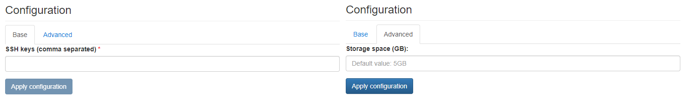

# Bastion

{ align=right width="100" }

Ubuntu-based bastion server deployed in a customer domain has VPN access to all the monitored devices.

## Configuration Wizard

Configuration parameters to be provided by the user are explained in the subsections below.

### Base tab

- `SSH keys (comma separated)` - A list of SSH keys to be added on the Bastion at startup

### Advanced tab

- `Storage space (GB)` ***[Optional]*** - Amount of storage to be allocated to persist data generated by this Bastion instance (default value is displayed in the placeholder, in this case 5 Gigabyte), e.g. `1`, `2` or `3`.