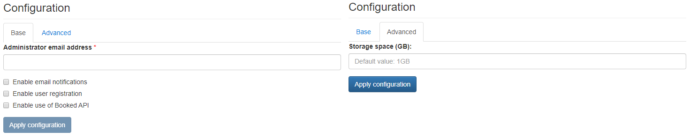

# Booked

{ align=right width="100" }

A web-based calendar and resource scheduling system that allows administered management of reservations on any number of resources.

## Assumptions

!!! note
    The default password after the initial deployment is `password`.

## Default Credentials

As stated in the [Base tab](#base-tab) section, the admin username is the administrator's email address that is specified during the deployment process directly from the NMaaS web interface. The default password is simply `password`. Users are strongly encouraged to change the default password of their admin accounts after the initial login.

## Configuration wizard

Configuration parameters to be provided by the user are explained in the subsections below.

### Base tab

- `Administrator email address` - An email address to be used during first login
- `Enable email notifications` ***[Optional]*** - Checkbox. If selected, email notification generated by Booked are enabled.
- `Enable user registration` ***[Optional]*** - Checkbox. If selected, new users are allowed to register.
- `Enable use of Booked API` ***[Optional]*** - Checkbox. If selected, the API is enabled.

### Advanced tab

- `Storage space (GB)` ***[Optional]*** - Amount of storage to be allocated to persist data generated by this Booked instance (default value is displayed in the placeholder, in this case 1 Gigabyte), e.g. `1`, `2` or `3`.