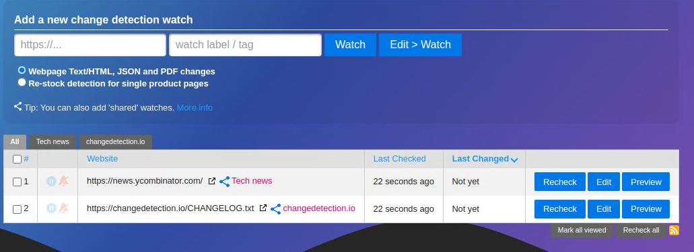
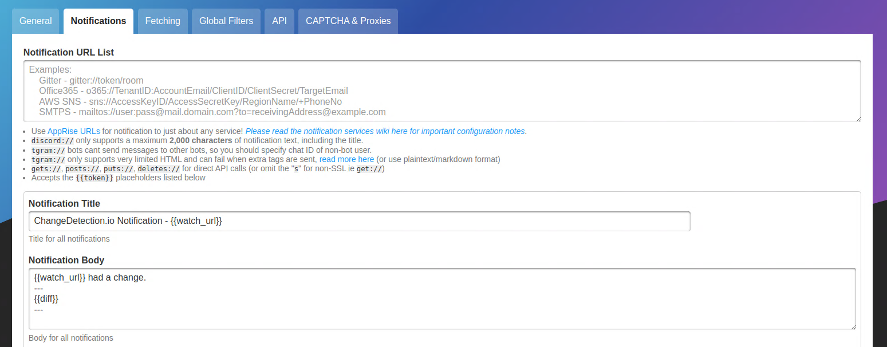

# Introduction

[ChangeDetection.io](https://github.com/dgtlmoon/changedetection.io) is an open-source tool for website change detection. It is capable of monitoring HTML and JSON files and can send various types of notifications when a change is detected.

Using XPath or CSS selectors it is also possible to only watch specific page elements. Interactive websites relying heavily on JavaScript can be crawled using a headless Chrome instance which is also deployed on nmaas together with the base application.

## Customizable Parameters

ChangeDetection.io does not have any parameters that need to be customized during the initial deployment on nmaas. 

All configuration is done from the built-in configuration manager accessible once the application is deployed.

## Examples

<figure markdown>
{ width="850" }
<figcaption>Fig. 1: ChangeDetection.io Home Screen</figcaption>
</figure>

<figure markdown>
{ width="850" }
<figcaption>Fig. 2: Configuring Notification Options</figcaption>
</figure>

<figure markdown>
{ width="850" }
<figcaption>Fig. 3: Configuring Fetching Mechanism</figcaption>
</figure>

<figure markdown>
{ width="850" }
<figcaption>Fig. 4: Previewing Changes Diff</figcaption>
</figure>

## Notifications

ChangeDetection.io has support for various notification providers, using the [Apprise library](https://github.com/caronc/apprise). Details about each supported notification provider are given on the [Apprise Wiki](https://github.com/caronc/apprise/wiki), as well as on the [ChangeDetection.io wiki](https://github.com/caronc/apprise/wiki) pages.

In terms of the managed nmaas production instance, users can leverage the built-in mail sender, using the following configuration:

```
mailto://nmaas.eu:587?smtp=nmaas-postfix.nmaas-system&from=changedetection.$domain-name@nmaas.eu&to=$dest-email
```

The parameters `$domain-name` and `$dest-name` are up to the user to replace with the specific values, as needed.

For example, for the domain name `nmaas-test` and an admin email of `contact@example.com`, the configuration would be:

```
mailto://nmaas.eu:587?smtp=nmaas-postfix.nmaas-system&from=changedetection.nmaas-test@nmaas.eu&to=contact@example.com
```

## Conclusion

For more information and a complete features list, consult the up-to-date [ChangeDetection.io Wiki](https://github.com/dgtlmoon/changedetection.io/wiki) on GitHub.