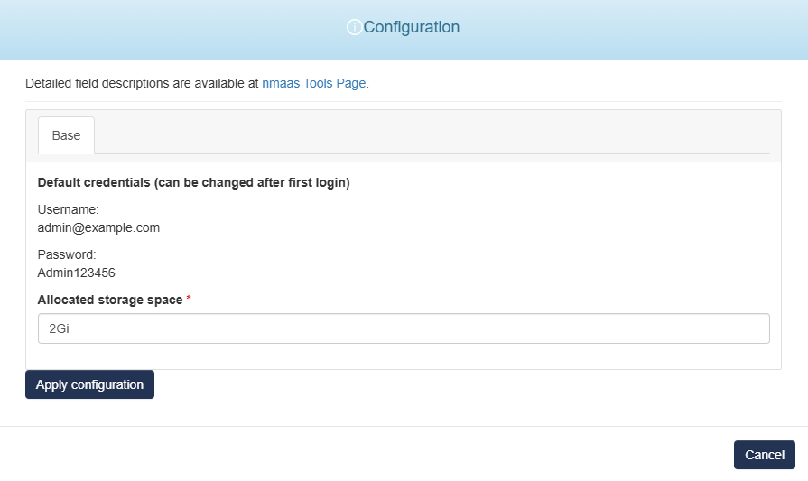

# CheckCle 

{ align=right width="150" }

CheckCle is a new open-source monitoring platform and can act as an alternative to UptimeRobot or Uptime Kuma. It supports HTTP, TCP, Ping, and DNS monitoring with support for many notification channels and custom notification templates. It also includes support for maintenance windows and status pages. CheckCle can also work in a distributed mode, where multiple monitoring agents are deployed across different infrastructures, to monitor the end-points from multiple locations at once and reduce false positives.

More details about CheckCle can be obtained from the [CheckCle GitHub repository](https://github.com/operacle/checkcle) as well as from [checkcle.io](https://checkcle.io/).

You can deploy your own CheckCle instance on [vnoc.nmaas.eu](https://vnoc.nmaas.eu).

## Configuration Wizard

Configuration parameters to be provided by the user are explained in the subsections below.

{ width="400"}

As CheckCle is still in early stages of development, it comes with a default username and password for the admin user.

Username: `admin@example.com`

Password: `Admin123456`

The default credentials can be changed after the initial login using the web interface. 

The nmaas deployment wizard does not expose any other configuration properties during deployment time, apart from the default storage size to allocate for the persistent volume.
