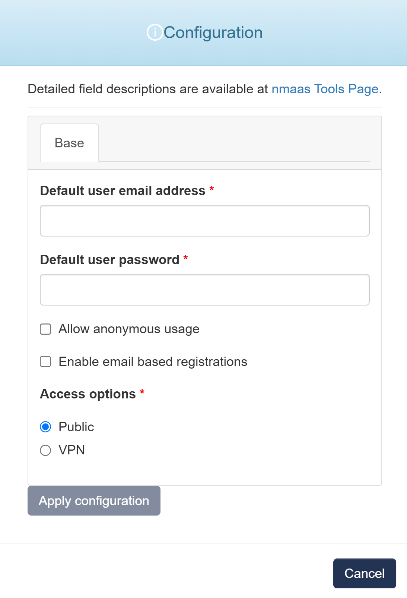

# CodiMD

{ align=right width="150" }

CodiMD lets you collaborate in real-time with markdown.

It is an open-source version of the popular HackMD software, letting you host and control your team's content with speed and ease.

## Configuration Wizard

Configuration parameters to be provided by the user are explained in the subsections below.

{ width="400"}

### Base tab

- `Default user email address` - Default user email address used to login to the instance
- `Default user password` - Default user password used to login to the instance
- `Allow anonymus usage` - Permit users to access and create notes without requiring an account or login credentials
- `Enable email based registration` - Allow new users to register for accounts by providing their email address and receiving a verification link or confirmation email
- `Access options` - An option for how the user interface of healthchecks is accessible 
    - `Public` - user interface will be publicly avaliable via internet
    - `VPN` - user interface will be avaliable via internet only with provided VPN profile