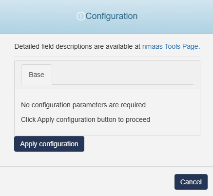

# CTFd 

{ align=right width="150" }

CTFd is a Capture The Flag framework focusing on ease of use and customizability. It comes with everything you need to run a CTF and it's easy to customize with plugins and themes.

## Configuration Wizard

Configuration parameters to be provided by the user are explained in the subsections below.

{ width="400"}