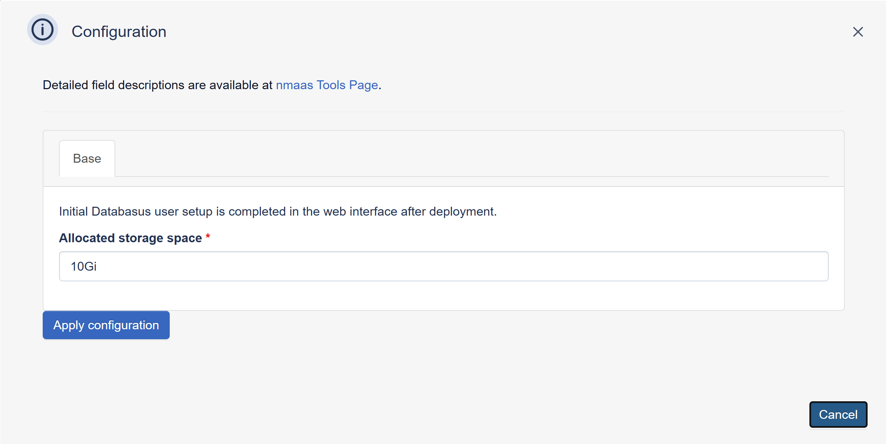

# Databasus

{ align=right }

Databasus is an open-source, self-hosted backup and management platform for PostgreSQL, MySQL, MariaDB and MongoDB.

It provides a web interface for scheduling backups, configuring retention policies, storing backups locally or in external targets such as S3, Google Drive, SFTP and NAS, and sending notifications to tools such as email, Slack, Discord and Telegram.

It is designed for teams that want a user-friendly way to manage database backups without relying on custom scripts.

## Configuration Wizard

Configuration parameters to be provided by the user are explained in the subsections below.

### Base tab

- `Allocated storage space (GB)` - Amount of storage to be allocated to persist data generated by this Databasus instance (default value is displayed in the placeholder, in this case 10 Gigabyte), e.g. `10`, `20` or `30`.