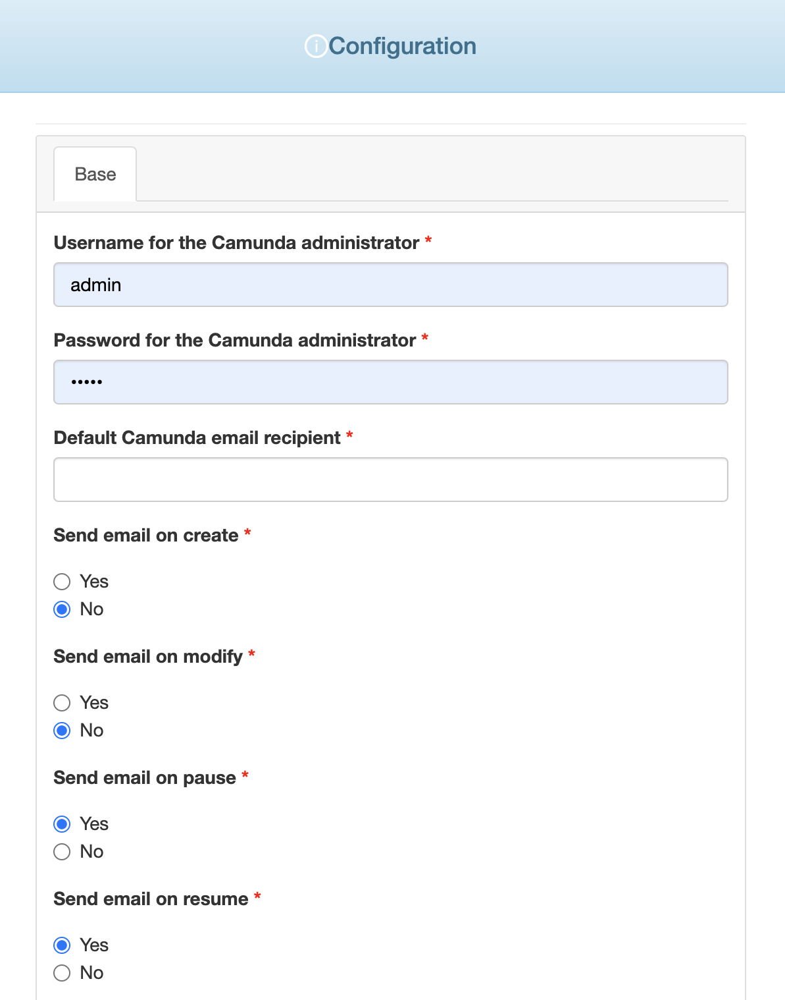
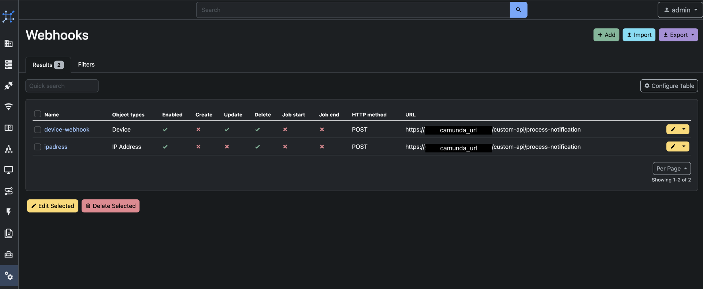

# GP4L Orchestrator (Camunda and Uptime Kuma)

{ align=right width="175"}

The GP4L Orchestrator is used to orchestrate the network management tools used to manage the GP4L network. These include 

- NetBox acting as a single source of truth, 
- Uptime Kuma used for network monitoring using ping probes, and
- Oxidized for automated network configuration backup.

Note that an Uptime Kuma instance will be created with the instantiation of the GP4L orchestrator. Separate NetBox and Oxidized instances should be first created so that they can be linked to the Camunda orchestrator using the configuration wizard.

## Configuration Wizard

Configuration parameters to be provided by the user are explained in the list below:

{ width="500" }
{ width="500" }

- `Username for the Camunda administrator` - Username that is used for accessing the Camunda web UI
- `Password for the Camunda administrator` - password related to the defined username
- `Default Camunda email recipient` - one or more comma separated emails to which the Camunda orchestration processes will send email notifications
- `Send email on create Y/N` - Should an email be sent every time a new monitoring probe is being created
- `Send email on modify Y/N` - Should an email be sent every time a monitoring probe is being reconfigured
- `Send email on pause Y/N` - Should an email be sent every time a monitoring probe is being paused
- `Send email on resume Y/N` - Should an email be sent every time a monitoring probe is being resumed
- `NetBox API URL` - the API URL for the NetBox instance that is being used as a single source of truth (don't forget the /api at the end of the URL)
- `NetBox API token` - the API token used for secure connection, this can be randomly generated
- `Username for the Uptime Kuma web server` - the username that is to be used to access the Uptime Kuma web UI, all Camunda created probes will be associated with this username only
- `Password for the Uptime Kuma web server` - password related to the defined username
- `Password for the Uptime Kuma API` - password used to authenticate to the Uptime Kuma API
- `Oxidized Git repository URL` - URL to the Git repository related to the Oxidized instance that is to be used
- `Email addresses to receive the generated repository access SSH public key` - once the Camunda orchestrator is setup and initialized it will generate a pair of ssh keys used to access the Oxidized Git repository. The public key of this pair will be sent to this email address and will then need to be copy pasted to the NMaaS user profile. (Note: check the junk folder)
- `The name to use for all Git commits created by Camunda` - name under which all Git changes will be made
- `The email to use for all Git commits created by Camunda` - email under which all Git changes will be made

### Finalizing Configuration

Once the GP4L orchestrator instance is up and running, before you are able to use the orchestration processes, you need to setup appropriate webhooks in the related NetBox instance.
The configuration that needs to be made is provided in the image below. Make sure that you replace the 'camunda_url' part with the actual URL of the instance of Camunda that has been created.

