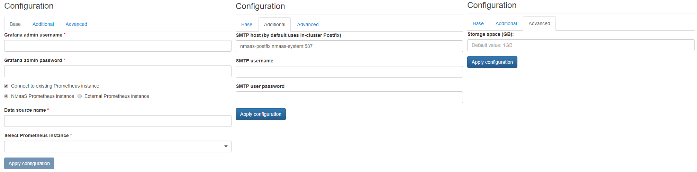

# Grafana

{ align=right }

Grafana is an open source, feature rich metrics dashboard and graph editor for Graphite, Elasticsearch, OpenTSDB, Prometheus and InfluxDB.

## Configuration Wizard

Configuration parameters to be provided by the user are explained in the subsections below.

### Base tab

- `Grafana admin username` - Username to be used to access the Grafana user interface
- `Grafana admin password` - Password to be used to access the Grafana user interface
- `Connect to existing Prometheus instance` ***[Optional]*** - If selected, additional fields are displayed allowing to provide information about a Prometheus instance that should be added as a default data source in Grafana 
- `NMaaS Prometheus instance` / `External Prometheus instance` - Switch between the type of Prometheus instance that should be used as the data source
- `Data source name` - The custom data source name that will be assigned to this Prometheus instance
- `Select Prometheus instance` *(if NMaaS Prometheus instance is selected)* - Pick list allowing to select an instance of Prometheus deployed and already running in the same domain as the Grafana being configured
- `Prometheus instance address` *(if External Prometheus instance is selected)* - URL of the standalone Prometheus instance to be used

### Additional tab

- `SMTP host` ***[Optional]*** - The hostname or IP (followed by optional port number) of the SMTP server to be used to send out email notifications. By default it is set to a Postfix instance running locally within the Kubernetes cluster and shared among all the services.
- `SMTP username` ***[Optional]*** - Username for authorization on the SMTP server (if required)
- `SMTP user password` ***[Optional]*** - Password for authorization on the SMTP server (if required)

### Advanced tab

- `Storage space (GB)` ***[Optional]*** - Amount of storage to be allocated to persist data generated by this Grafana instance (default value is displayed in the placeholder, in this case 1 Gigabyte), e.g. `1`, `2` or `3`.