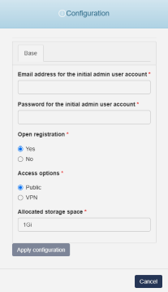

# Healthchecks

{ align=right width="125"}

Healthchecks is a cron job monitoring service.
It listens for HTTP requests and email messages ("pings") from your cron jobs and scheduled tasks ("checks"). When a ping does not arrive on time, Healthchecks sends out alerts.

## Configuration Wizard

Configuration parameters to be provided by the user are explained in the subsections below.

{ width="400"}

### Base tab

- `Email address for the initial admin user account` - Email to be used to initially access healthchecks user interface
- `Password for the initial admin user account ` - Password to be used to initially access healthchecks user interface
- `Open registration` - An option for `Register Now` button to be available on user interface of healthchecks
    - `Yes` - Button will be avaliable, and will allow for new users to be registered
    - `No` - Button will not be availible
- `Access options` - An option for how the user interface of healthchecks is accessible 
    - `Public` - user interface will be publicly avaliable via internet
    - `VPN` - user interface will be avaliable via internet only with provided VPN profile
- `Allocated storage space [Optional]` - Amount of storage to be allocated to persist data generated by this Healthchecks (default value is displayed in the placeholder, in this case 1 Gigabyte), e.g. `1`, `2` or `3`.
