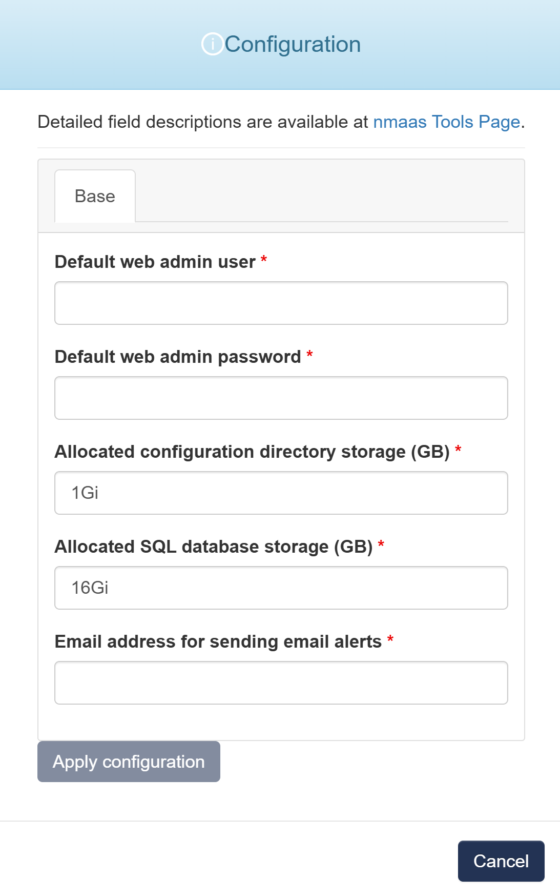

# Icinga2

{ align=right width="150" }

Icinga 2 is a monitoring system which checks the availability of your network resources, notifies users of outages, and generates performance data for reporting.

Scalable and extensible, Icinga can monitor large, complex environments across multiple locations.

Icinga 2 is the monitoring server and requires Icinga Web 2 on top in your Icinga Stack, which is already included as part of the nmaas deployment.

The configuration can be easily managed with either the Icinga Director, config management tools or plain text within the Icinga DSL.

## Configuration Wizard

Configuration parameters to be provided by the user are explained in the subsections below.

{ width="400"}

### Base tab

- `Default web admin user` - Username for the default administrator account used to log in to the Icinga Web 2 interface
- `Default web admin password` - Password for the default web admin user
- `Allocated configuration directory storage (GB)` - Amount of storage space allocated for storing Icinga2 configuration files and scripts
- `Allocated SQL database storage (GB)` - Storage space reserved for the SQL database that stores monitoring data and configuration details
- `Email address for sending email alerts` - email address used as the sender for email notifications and alerts