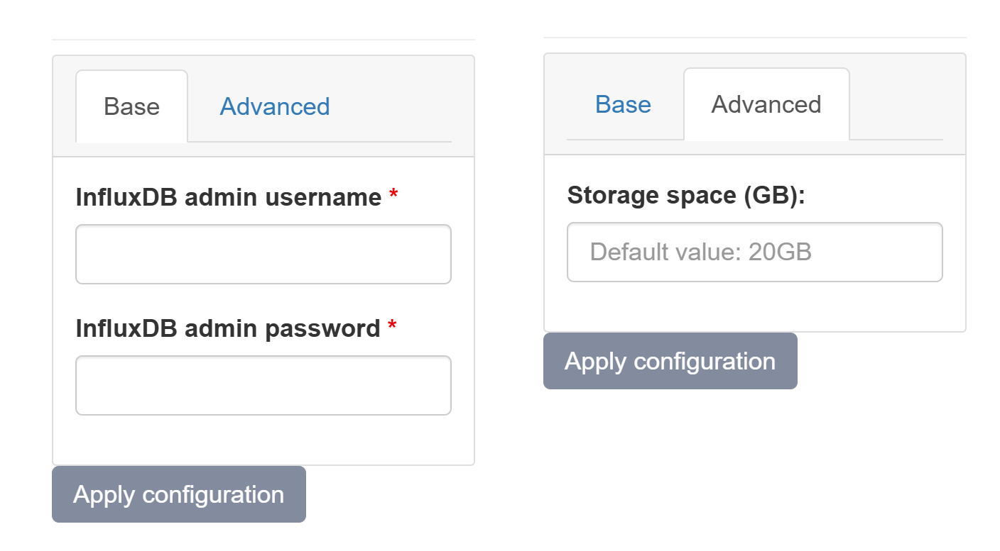

# InfluxDB

{ align=right width="150"}

InfluxDB is an open-source time series database (TSDB) developed by InfluxData.

## Configuration Wizard

Configuration parameters to be provided by the user are explained in the subsections below.

{ width="400"}

### Base tab

- `InfluxDB admin username` - Username for the administrator account used to log in to the InfluxDB instance
- `InfluxDB admin password` - Password for the administrator account

### Advanced tab

- `Storage space (GB) [Optional]` - Amount of storage to be allocated to persist data generated by this Inventory instance (default value is displayed in the placeholder, in this case 20 Gigabyte), e.g. 10, 20 or 30.