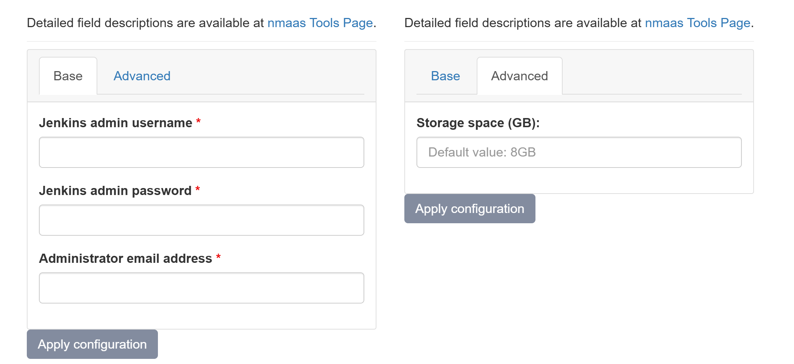

# Jenkins

{ align=right width="125"}

Jenkins is a self-contained, open source automation server which can be used to automate all sorts of tasks related to building, testing, and delivering or deploying software.

## Configuration Wizard

Configuration parameters to be provided by the user are explained in the subsections below.

### Base tab

- `Jenkins admin username` - Username for the administrator account used to log in to the Jenkins instance
- `Jenkins admin password` - Password for the administrator account
- `Administrator email address` - Email for the administrator account

### Advanced tab

- `Storage space (GB) [Optional]` - Amount of storage to be allocated to persist data generated by this Inventory instance (default value is displayed in the placeholder), e.g. 1, 2 or 3.