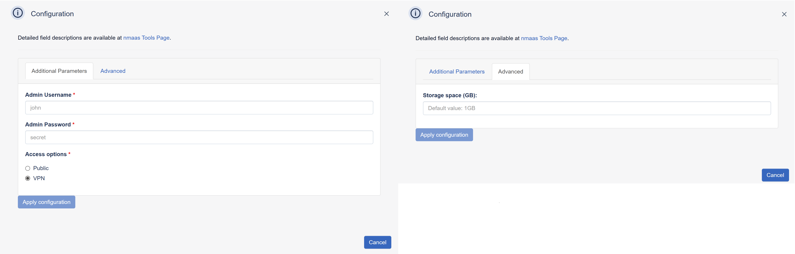

# Keycloak

{ align=right }

Add authentication to applications and secure services with minimum effort. No need to deal with storing users or authenticating users.

## Configuration Wizard

Configuration parameters to be provided by the user are explained in the subsections below.

### Additional tab

- `Admin Username` - Username for the administrator account used to log in to the Keycloak instance
- `Admin Password` - Password for the administrator account
- `Access options` - An option for how the user interface of healthchecks is accessible 
    - `Public` - user interface will be publicly avaliable via internet
    - `VPN` - user interface will be avaliable via internet only with provided VPN profile

### Advanced tab

- `Storage space (GB)` ***[Optional]*** - Amount of storage to be allocated to persist data generated by this Keycloak instance (default value is displayed in the placeholder, in this case 1 Gigabytes), e.g. `1`, `2` or `3`.
