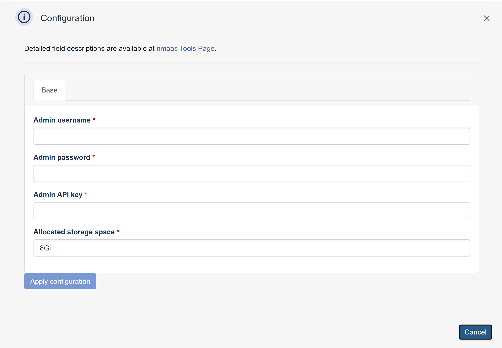

# Kuvasz

{ align=right }

Kuvasz is an open-source, self-hosted uptime and SSL monitoring service for websites and services.

It provides a modern web interface, status pages, a REST API, YAML-based configuration options, and integrations for notifications such as email, Discord, Slack, Telegram, and PagerDuty.

Kuvasz also supports Prometheus and OpenTelemetry metrics export, making it a strong fit for teams that want both monitoring and observability in a single platform.

## Configuration Wizard

Configuration parameters to be provided by the user are explained in the subsections below.

### Base tab

- `Admin Username` - Username for the administrator account used to log in to the Kuvasz instance
- `Admin Password` - Password for the administrator account
- `Admin API Key` - the API token used for secure connection, this can be randomly generated
- `Storage space (GB)` ***[Optional]*** - Amount of storage to be allocated to persist data generated by this Kuvasz instance (default value is displayed in the placeholder, in this case 8 Gigabytes), e.g. `10`, `20` or `30`.
