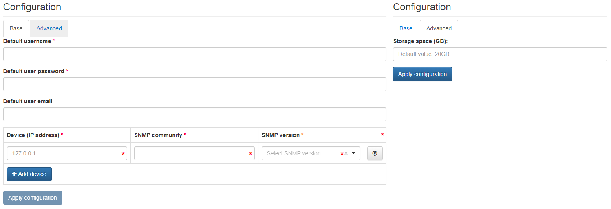

# LibreNMS

{ align=right }

LibreNMS is an auto-discovering PHP/MySQL/SNMP based network monitoring system which includes support for a wide range of network hardware and operating systems.

## Configuration Wizard

Configuration parameters to be provided by the user are divided into two tabs: *Base tab* and *Advanced tab*.

<figure markdown>
  
  <figcaption>nmaas LibreNMS Application Wizard</figcaption>
</figure>

### Base Tab

- `Default username` - Username to be used to access the LibreNMS user interface
- `Default user password` - Password to be used to access the LibreNMS user interface
- `Default user email` [Optional] - Email address of the user configured by default in the application
- `Device (IP address)` - IPv4 address of device to be monitored by this LibreNMS instance 
    - `SNMP community` - Community to be used by LibreNMS to pool data from the device to be monitored
    - `SNMP version` - Version of SNMP available on the device to be monitored

Multiple devices can be configured by using the Add device button.

### Advanced Tab

- `Storage space (GB)` [Optional] - Amount of storage to be allocated to persist data generated by this LibreNMS instance (default value is displayed in the placeholder, in this case `20` Gigabytes), e.g. `10`, `20` or `30`.