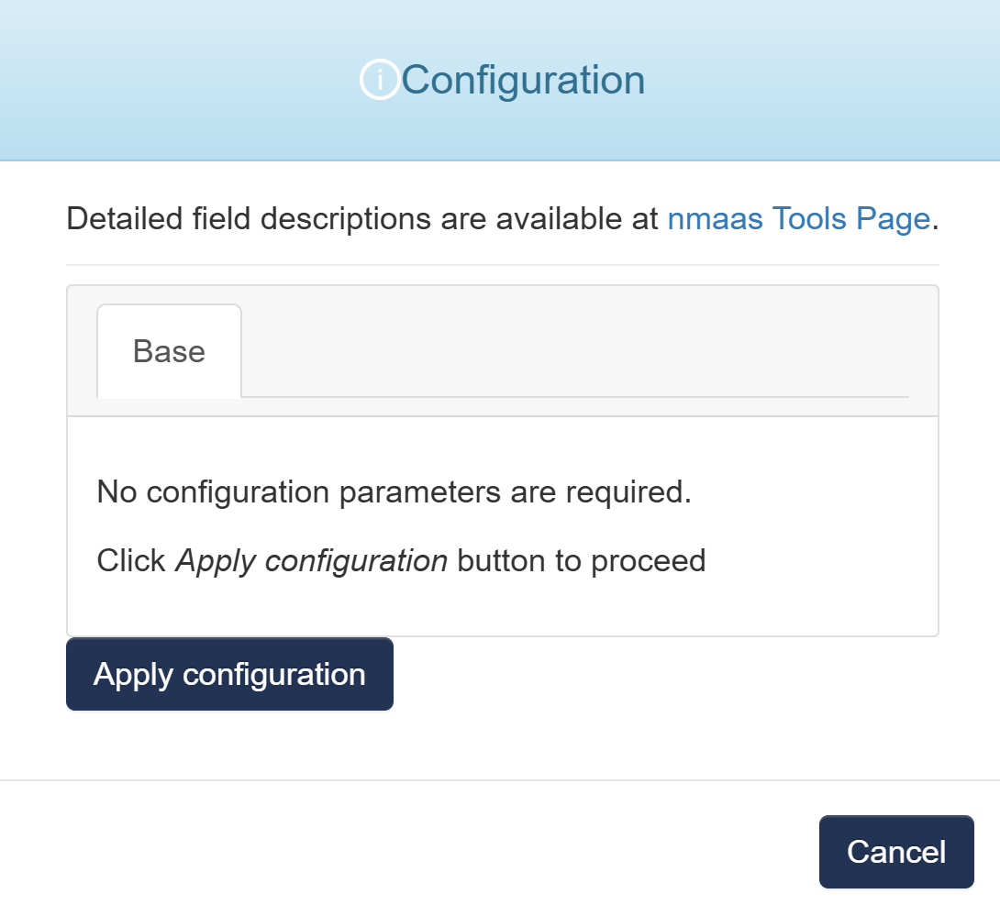

# Maat

{ align=right width="150" }

Maat is an application that stores the information about infrastructure resources and services and offers TMF Open APIs for standardised access. It can be used as a Single Source of Truth in the automation and orchestration platforms.

## Configuration Wizard

Configuration parameters to be provided by the user are explained in the subsections below.

{ width="400"}