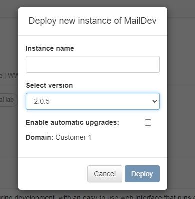
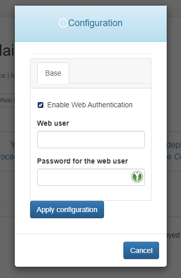
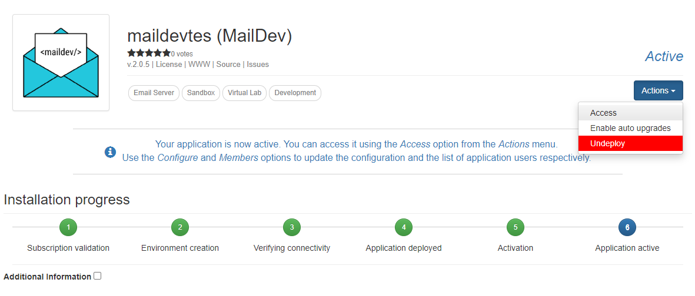
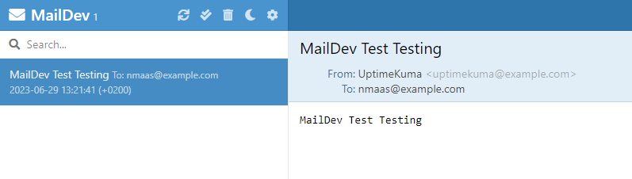

# MailDev

## Introduction

MailDev is a simple application that can be used during the development process to simulate an email server. The core idea is to be able to use MailDev as an SMTP server, without having to register for a commercial SMTP service.

MailDev provides a web interface where all "sent" emails can be previewed. MailDev itself does not send the emails to their final destination, instead just logs them so that they are visible on the web interface and discards them. This makes it possible to use MailDev for testing purposes, without having to worry about rate limits, deliverability, or spam.

## Deploying MailDev on NMaaS

The MailDev application on NMaaS is primarily aimed at users of the virtual lab use-case. For production applications instantiated on the managed instance of NMaaS, it is possible to use the NMaaS email server, and this is the case by default for most tools already in the catalog.

To deploy and configure MailDev on NMaaS, the following steps need to be performed:

- Subscribe to the application from the Application list.
- Navigate to the Subscriptions page and initiate the deployment of a new MailDev instnace, by entering the name and desired version.

<figure markdown>
{ width="350" }
<figcaption>Fig. 1: New MailDev Instance</figcaption>
</figure>

- Use the deployment wizard to further customize your new MailDev instance. The current version of the deployment wizard allows the set up of a basic HTTP authentication to the MailDev web interface. This might be useful if multiple users have access to your NMaaS domain.

<figure markdown>
{ width="350" }
<figcaption>Fig. 2: Configuring the new MailDev Instance</figcaption>
</figure>

- Finish the new instance configuration and wait for the deployment process to complete.

<figure markdown>
{ width="350" }
<figcaption>Fig. 3: Accessing the new MailDev Instance</figcaption>
</figure>

Once deployed, the MailDev web interface becomes available. At this point, any existing application which supports SMTP based notifications can be configured to use the MailDev SMTP implementation with the following settings:

- SMTP server address: (the correct hostname is shown in the access modes modal on NMaaS)
- SMTP server port: 1025
- SMTP Username: /
- SMTP Password: /
- Security: PLAIN

An example configuration is available below, as well as a screenshot showing a test message visible on the MailDev web interface.

<figure markdown>
{ width="350" }
<figcaption>Fig. 4: Configuration of a 3rd Party Application</figcaption>
</figure>

<figure markdown>
{ width="350" }
<figcaption>Fig. 5: Previewing Emails on MailDev</figcaption>
</figure>