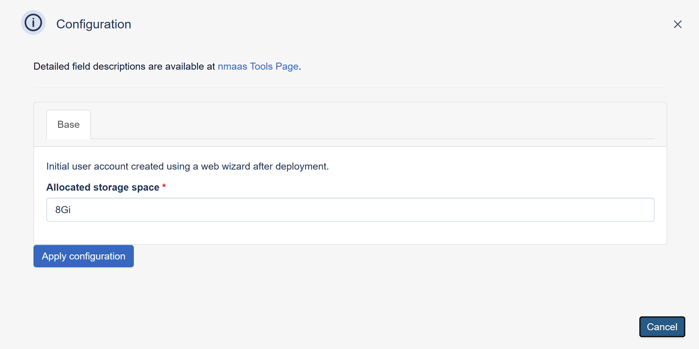

# Metabase

{ align=right }

Add authentication to applications and secure services with minimum effort. No need to deal with storing users or authenticating users.

## Configuration Wizard

Configuration parameters to be provided by the user are explained in the subsections below.

### Base tab

- `Allocated Storage space (GB)` ***[Optional]*** - Amount of storage to be allocated to persist data generated by this Metabase instance (default value is displayed in the placeholder, in this case 8 Gigabytes), e.g. `10`, `20` or `30`.
