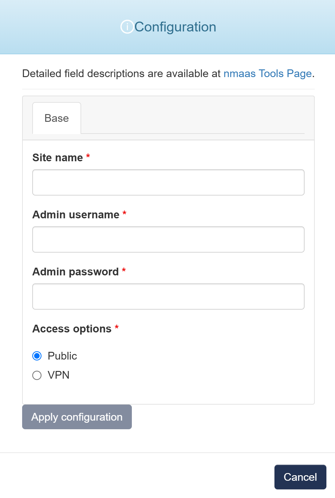

# Moodle

{ align=right width="100" }

Moodle is the World's Open Source Learning Platform, widely used around the world by countless universities, schools, companies, and all manner of organisations and individuals. Moodle is designed to allow educators, administrators and learners to create personalised learning environments with a single robust, secure and integrated system.

## Configuration Wizard

Configuration parameters to be provided by the user are explained in the subsections below.

{ width="400"}

### Base tab

- `Site name` - The name of the Moodle platform, which will appear on the site and in notifications
- `Admin username` - Primary administrator account username for managing the Moodle platform
- `Admin password` - Password for the administrator account
- `Access options` - An option for how the user interface of healthchecks is accessible 
    - `Public` - user interface will be publicly avaliable via internet
    - `VPN` - user interface will be avaliable via internet only with provided VPN profile