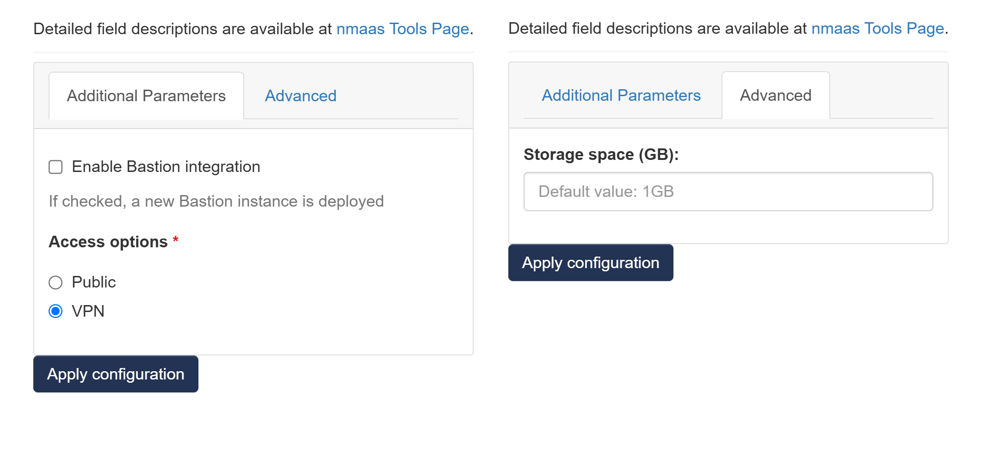

# N8n

{ align=right }

N8n is an extendable workflow automation tool. It allows you to add your own custom functions, logic and apps. n8n's node-based approach makes it highly versatile, enabling you to connect anything to everything.

## Configuration Wizard

Configuration parameters to be provided by the user are explained in the subsections below.

### Base tab

- `Enable Bastion integration` - This will deploy a new Bastion instance within user domain 
- `Bastion SSH keys` - SSH keys of users that will be able to access the Bastion instance 
- `Access options` - An option for how the N8n is accessible 
    - `Public` - user interface will be publicly avaliable via internet
    - `VPN` - user interface will be avaliable via internet only with provided VPN profile

### Advanced tab

- `Storage space (GB)` ***[Optional]*** - Amount of storage to be allocated to persist data generated by this N8n instance (default value is displayed in the placeholder, in this case 1 Gigabyte), e.g. `1`, `2` or `3`.