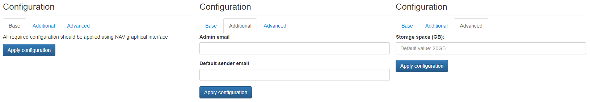

# NAV

Network Administration Visualized (NAV) is an advanced software suite to monitor large computer networks. It automatically discovers network topology, monitors network load and outages, and can send alerts on network events by e-mail and SMS.

## Configuration Wizard

Configuration parameters to be provided by the user are explained in the subsections below.

### Base Tab

No settings need to be customized in the `Base Tab`.

### Additional Tab

- `Admin email` ***[Optional]*** - Default NAV administrator email address
- `Default sender email` ***[Optional]*** - Default email address to be used as sender address for email notifications

Multiple devices can be configured by using the `Add device` button.

### Advanced Tab

- `Storage space (GB)` ***[Optional]*** - Amount of storage to be allocated to persist data generated by this NAV instance (default value is displayed in the placeholder, in this case 20 Gigabytes), e.g. `10`, `20` or `30`.