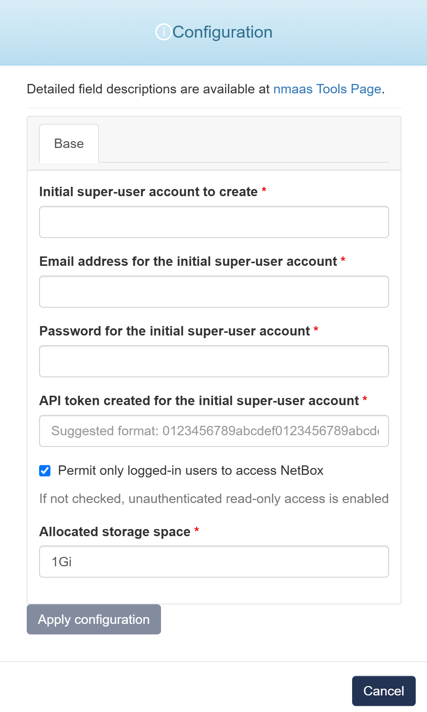

# Netbox

{ align=right width="200" }

NetBox is an infrastructure resource modeling (IRM) application designed to empower network automation.

Initially conceived by the network engineering team at DigitalOcean, NetBox was developed specifically to address the needs of network and infrastructure engineers.

It encompasses the following aspects of network management:

- IP address management (IPAM) - IP networks and addresses, VRFs, and VLANs
- Equipment racks - Organized by group and site
- Devices - Types of devices and where they are installed
- Connections - Network, console, and power connections among devices
- Virtualization - Virtual machines and clusters
- Data circuits - Long-haul communications circuits and providers

## Configuration Wizard

Configuration parameters to be provided by the user are explained in the subsections below.

{ width="400"}

### Base tab

- `Initial super-user account to create` - Username for the initial superuser account, which will have full administrative privileges in NetBox
- `Email address for the initial super-user account` - Email address associated with the superuser account 
- `Password address for the initial super-user account` - Password for the superuser account 
- `API token created for the initial super-user account` -  Generate an API token for the superuser account
- `Permit only logged-in users to access NetBox` -  Configure NetBox to restrict access, allowing only authenticated and logged-in users to view or interact with the platform
- `Allocated storage space [Optional]` - Amount of storage to be allocated to persist data generated by this Healthchecks (default value is displayed in the placeholder, in this case 1 Gigabyte), e.g. `1`, `2` or `3`.