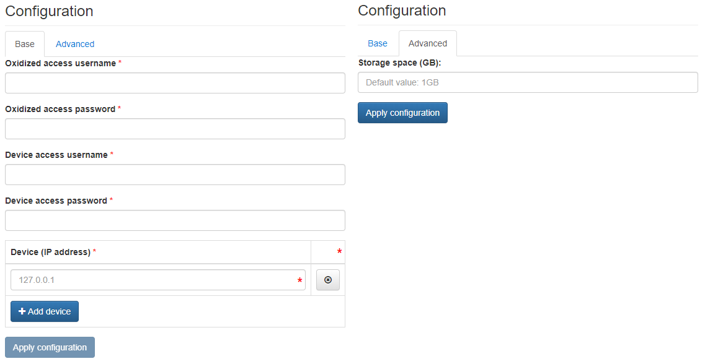

# Oxidized

Oxidized is a simple open-source device configuration backup tool exposing a web-based GUI.

## Configuration Wizard

Configuration parameters to be provided by the user are explained in the subsections below.

### Base Tab

- `Oxidized access username` - Username to be used to access the Oxidized user interface (HTTP basic auth)
- `Oxidized access password` - Password to be used to access the Oxidized user interface (HTTP basic auth)
- `Device access username` - Username to be used by Oxidized to connect to the monitored device with SSH (to be configured on the device)
- `Device access password` - Password to be used by Oxidized to connect to the monitored device with SSH (to be configured on the device)
- `Device (IP address)` - List of IPv4 addresses of devices to be monitored by this Oxidized instance

Multiple devices can be configured by using the `Add device` button.

### Advanced Tab

- `Storage space (GB)` ***[Optional]*** - Amount of storage to be allocated to persist data generated by this Oxidized instance (default value is displayed in the placeholder, in this case 1 Gigabyte), e.g. `1`, `2` or `3`.

### Configuration Update

Oxidized allows for updating tools configuration during runtime. User should follow the steps described on the [NMaaS Tool Configuration Process](../general-app-deployment.md#nmaas-tool-configuration-process) page.

Inside the repository two files are being created by default, namely `config` and `router.db`, and are placed in the `base` directory.

If a new device model needs to be specified the dedicated model description files should be placed in the `model` directory.