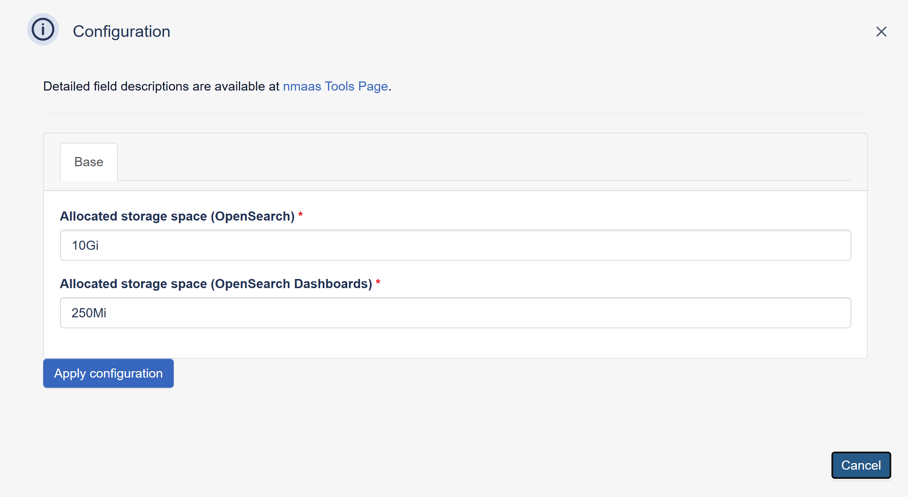

# perfSONAR Archive

{ align=right }

perfSONAR Archive is the perfSONAR measurement archive based on OpenSearch and Logstash.

It stores time-series results generated by perfSONAR measurement hosts, including throughput, latency, packet loss, and traceroute data.

The archive can run centrally and receive measurements from multiple perfSONAR hosts, which helps reduce load on measurement nodes and keeps results in one place for long-term retention and analysis.

It is a good fit when you want to separate measurement and storage roles, operate a shared archive for several sites, or integrate archived data with dashboards and external analysis workflows.

## Configuration Wizard

Configuration parameters to be provided by the user are explained in the subsections below.

### Base tab

- `Allocated Storage space (OpenSearch)` ***[Optional]*** - Amount of storage to be allocated to persist data generated by this prefSONAR Archive instance (default value is displayed in the placeholder, in this case 10 Gigabytes), e.g. `10`, `20` or `30`.
- `Allocated Storage space (OpenSearch Dashboards)` ***[Optional]*** - Amount of storage to be allocated to persist data generated by dashboards for this prefSONAR Archive instance (default value is displayed in the placeholder, in this case 250 Megabytes), e.g. `250`, `500` or `2000`.
