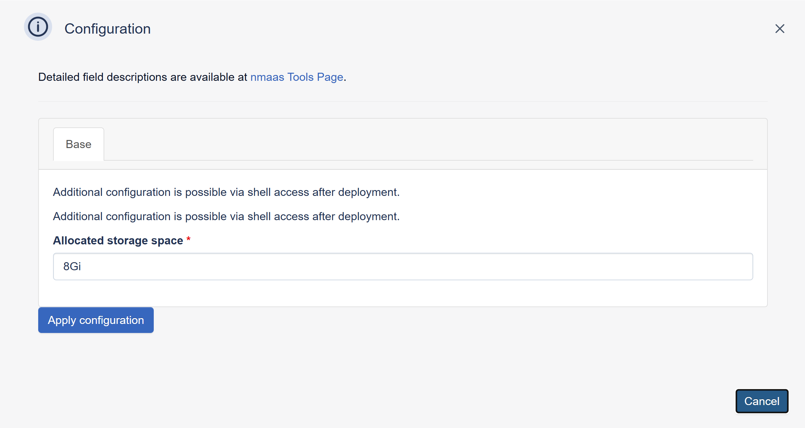

# perfSONAR Testpoint

{ align=right }

perfSONAR is the performance Service-Oriented Network monitoring ARchitecture, a network measurement toolkit designed to provide federated coverage of paths and help to establish end-to-end usage expectations.

## Configuration Wizard

Configuration parameters to be provided by the user are explained in the subsections below.

### Base tab

- `Allocated Storage space (GB)` ***[Optional]*** - Amount of storage to be allocated to persist data generated by this prefSONAR Testpoint instance (default value is displayed in the placeholder, in this case 8 Gigabytes), e.g. `10`, `20` or `30`.
