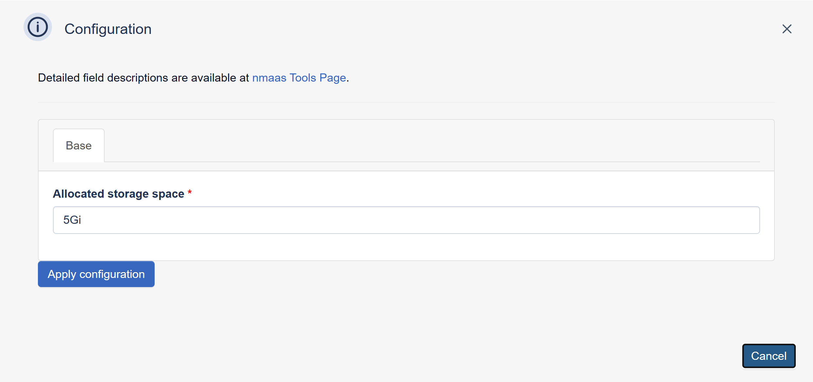

# Pgbackweb

{ align=right }

PG Back Web is a user-friendly PostgreSQL backup tool that automates database backups through an intuitive web interface, offering features like scheduled backups, monitoring, multi-version support, and flexible storage options.

## Configuration Wizard

Configuration parameters to be provided by the user are explained in the subsections below.

### Base tab

- `Allocated Storage space (GB)` ***[Optional]*** - Amount of storage to be allocated to persist data generated by this Pgbackweb instance (default value is displayed in the placeholder, in this case 5 Gigabytes), e.g. `10`, `20` or `30`.
