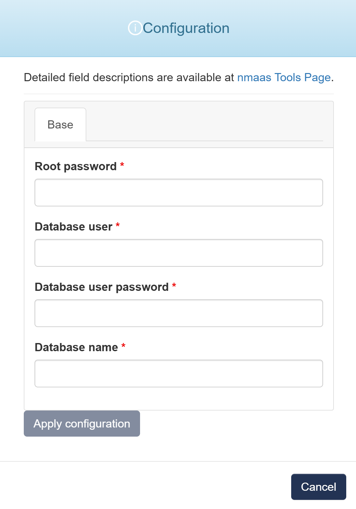

# PostgreSQL

{ align=right width="125"}

PostgreSQL (Postgres) is an open source object-relational database known for reliability and data integrity. ACID-compliant, it supports foreign keys, joins, views, triggers and stored procedures.

## Configuration Wizard

Configuration parameters to be provided by the user are explained in the subsections below.

### Base tab

- `Root password` - A password for the PostgreSQL superuser (postgres) to enable administrative access
- `Database user` - New user in PostgreSQL who can access and manage specific databases
- `Database user password` - Secure password for the new database user for authentication purposes
- `Database name` - New database with a unique name, which the new user will manage
