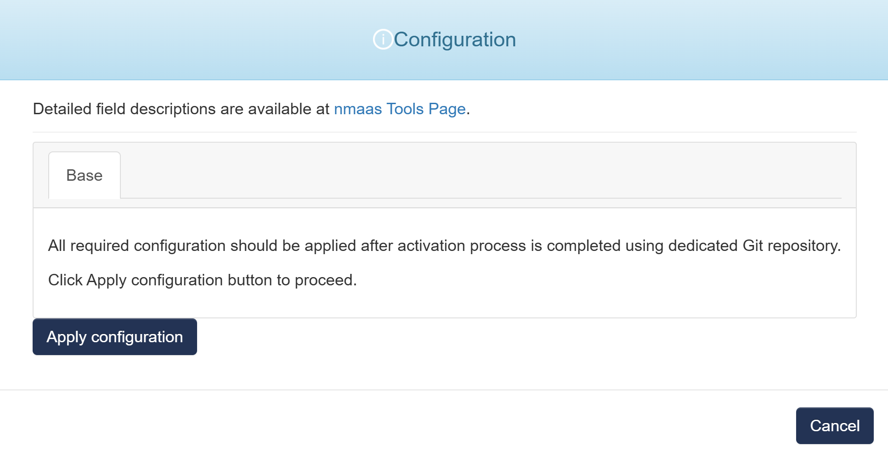

# Prometheus Blackbox Exporter 

{ align=right width="150"}

Prometheus-Blackbox-Exporter allows blackbox probing of endpoints over HTTP, HTTPS, DNS, TCP, ICMP and gRPC.

## Configuration Wizard

Configuration parameters to be provided by the user are explained in the subsections below.

{ width="400"}
