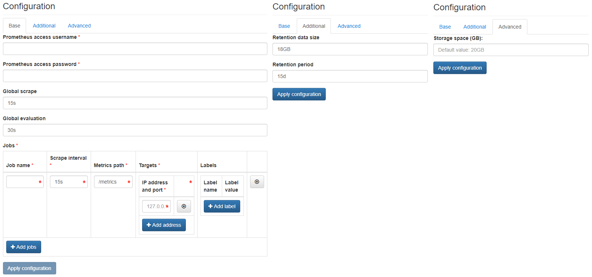

# Prometheus

{ align=right }

Prometheus is an open-source systems monitoring and alerting toolkit.

## Configuration Wizard

Configuration parameters to be provided by the user are explained in the subsections below.

### Base tab

- `Prometheus access username` - Username to be used to access the Prometheus user interface (HTTP basic auth)
- `Prometheus access password` - Password to be used to access the Prometheus user interface (HTTP basic auth)
- `Global scrape` ***[Optional]*** - How frequently to scrape targets by default
- `Global evaluation` ***[Optional]*** - How frequently to evaluate rules
- `Job name` - The job name assigned to scraped metrics by default
- `Scrape internal` - How frequently to scrape targets from this job
- `Metrics path` - The HTTP resource path on which to fetch metrics from targets
- `Targets / IP address and port` - The targets specified by the static config (multiple allowed)
- `Labels / Label name & Label value` ***[Optional]*** - Labels assigned to all metrics scraped from the targets (multiple allowed)

Multiple jobs can be configured by using the Add job button.

Target is a valid string consisting of a hostname or IP followed by an optional port number.

For detailed description of the above parameters please refer to Prometheus online documentation.

### Additional tab

- `Retention data size` ***[Optional]*** - The size of storage space up to which the monitoring data should be retained (default value is displayed in the placeholder, in this case 18 Gigabytes), e.g. `18GB`, `25GB` or `30GB`.
- `Retention period` ***[Optional]*** - The time period for which the monitoring data should be retained (default value is displayed in the placeholder, in this case 15 days), e.g. `15d`, `25d` or `35d`.

The value of `Retention data size` should be kept lower than the value of [requested Storage space](./prometheus.md#advanced-tab).

### Advanced tab

- `Storage space (GB)` ***[Optional]*** - Amount of storage to be allocated to persist data generated by this Prometheus instance (default value is displayed in the placeholder, in this case 20 Gigabytes), e.g. `10`, `20` or `30`.

Prometheus allows for updating the configuration of an already running instance. A configuration update wizard is launched by the Update button available on the application instance details page.