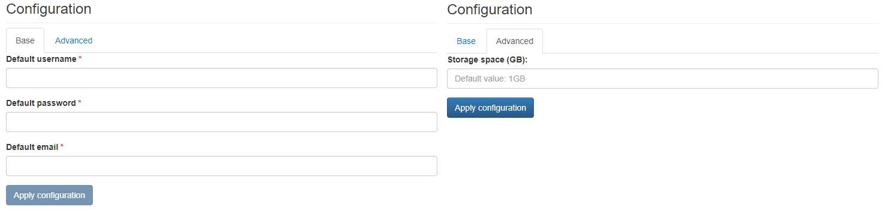

# pSConfig Web Admin

{ align=right width="150"}

pSConfig Web Admin is a web-based UI for perfSONAR administrators to define and publish MeshConfig/pSConfig meshes.

## Configuration Wizard

Configuration parameters to be provided by the user are explained in the subsections below.

### Base Tab

- `Default username` - Username to be used to access the PWA user interface
- `Default password` - Password to be used to access the PWA user interface
- `Default email` - Email address of the user configured by default in the application

### Advanced Tab

- `Storage space (GB)` ***[Optional]*** - Amount of storage to be allocated to persist data generated by this PWA instance (default value is displayed in the placeholder, in this case 1 Gigabyte), e.g. `1`, `2` or `3`.