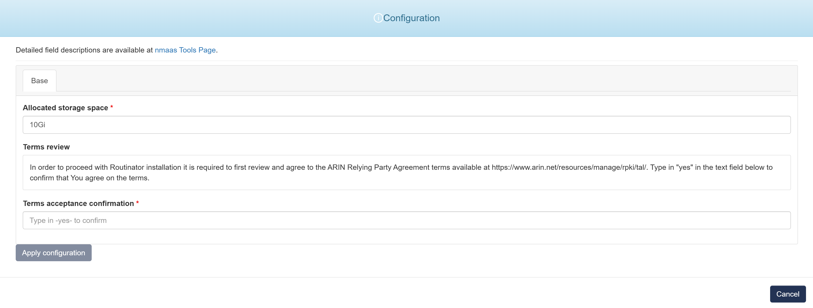

# Routinator

{ align=right width="150" }

Routinator is a full-featured software package that can perform RPKI validation as a one-time operation and produce the result in formats such as CSV, JSON and RPSL, or run as a service that periodically downloads and verifies RPKI data.

Routinator offers an RTR server allowing routers supporting Origin Validation (port 3323) to connect to it to fetch verified RPKI data.

The built-in HTTP server offers a user interface and endpoints for the various file formats, as well as logging, status and Prometheus monitoring.

## Configuration Wizard

Configuration parameters to be provided by the user are explained in the subsections below.

{ width="400"}

### Base tab

- `Allocated storage space [Optional]` - Amount of storage to be allocated to persist data generated by this Healthchecks (default value is displayed in the placeholder, in this case 1 Gigabyte), e.g. `1`, `2` or `3`.
- `Terms review` - In order to proceed with Routinator installation it is required to first review and agree to the ARIN Relying Party Agreement terms available at https://www.arin.net/resources/manage/rpki/tal/. Type in "yes" in the text field below to confirm that You agree on the terms.
- `Terms acceptance confirmation` - Type `-yes-` to confirm. 