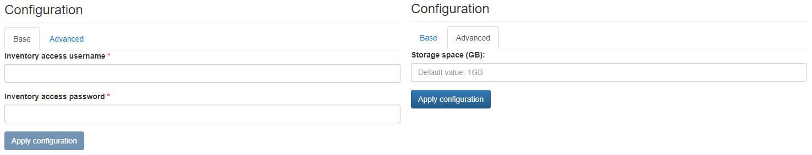

# SPA Inventory

{ align=right width="150" }

Oxidized is a simple open-source device configuration backup tool exposing a web-based GUI.

## Configuration Wizard

Configuration parameters to be provided by the user are explained in the subsections below.

### Base Tab

- `Inventory access username` - Username to be used to access the Inventory user interface and REST API
- `Inventory access password` - Password to be used to access the Inventory user interface and REST API

### Advanced tab

- `Storage space (GB)` ***[Optional]*** - Amount of storage to be allocated to persist data generated by this Inventory instance (default value is displayed in the placeholder, in this case 1 Gigabyte), e.g. `1`, `2` or `3`.