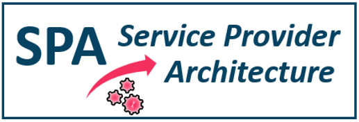

# SPA

{ align=right width="200" }

**SPA for the E-Line service**

The Service Provider Architecture (SPA) is a service management digital platform providing the general processes and components necessary to manage the CSP services via a user-friendly web graphical user interface (Self-Service Portal).

The platform in nmaas has been prepared to manage E-Line service (L2 end-to-end connectivity) implemented by the OpenNSA application with a test default configuration and virtual simplified network topology. Users can familiarize with the SPA without the need of setting up the platform from the scratch.

Just log in to the portal and start creating new circuits in a simple network to see how it works.

The built-in credentials for particular services are given in the table below.

| Service Name | User            | Password        |
|--------------|-----------------|-----------------|
| Inventory    | `inventory`     | `inventory`     |
| OTRS         | `serviceadmin`  | `serviceadmin`  |
| Portal       | `admin`         | `admin123`      |
| SuiteCRM     | `root`          | `root123`       |

More info: [https://wiki.geant.org/display/NETDEV/SPA](https://wiki.geant.org/display/NETDEV/SPA)