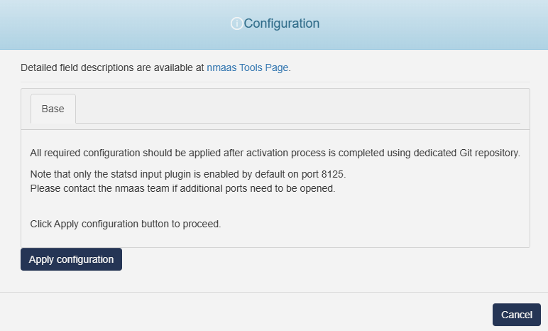

# Telegraf

{ align=right width="150"}

Telegraf is an agent for collecting, processing, aggregating, and writing metrics. Based on a plugin system to enable developers in the community to easily add support for additional metric collection.

## Configuration Wizard

Configuration parameters to be provided by the user are explained in the subsections below.

{width="400"}
