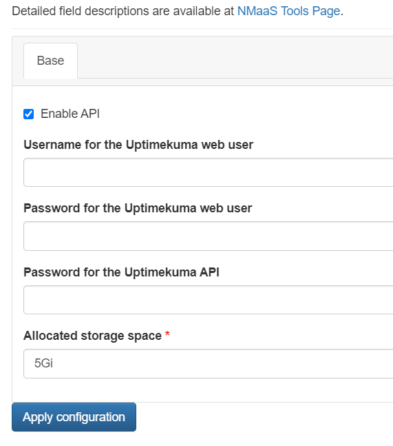
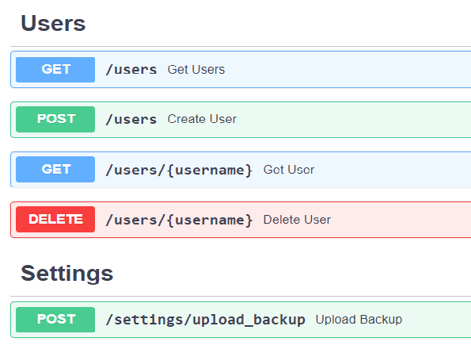
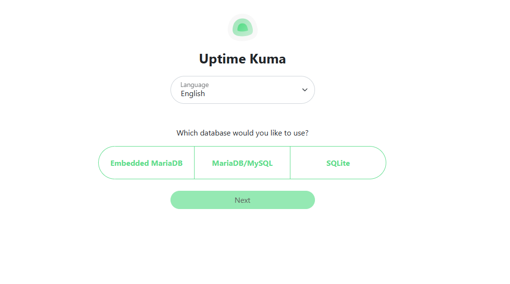
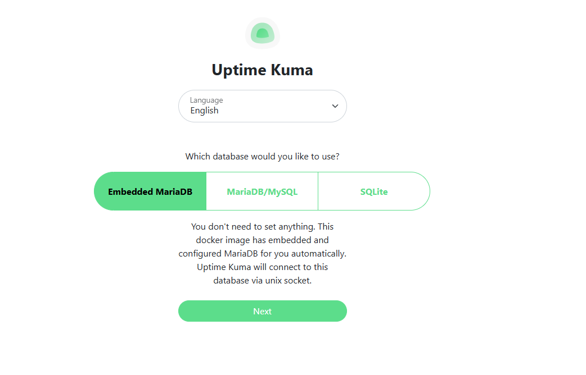

# Uptime Kuma

## Introduction 

[Uptime Kuma](https://github.com/louislam/uptime-kuma) is a service monitoring application which can:

- monitor the uptime of web applications
- monitor DNS changes
- monitor response times by issuing periodic pings (ICMP requests)
- monitor SSL certificate expiry 
- monitor availability of a TCP port
- monitor for presence of a particular keyword on a web page
- various other application specific monitors for PostgreSQL, MariaDB, MongoDB, etc...
- design and create status pages

## Uptime Kuma on nmaas

Uptime Kuma on nmaas is fully supported in two flavors:

- standalone flavor, identical with the upstream release, without any modifications.
- extended flavor which also supports API access using a [third-party API extension](https://github.com/MedAziz11/Uptime-Kuma-Web-API).

Refer to the sections below for more details regarding deployment options for the two flavors.

### Deploiying the Standalone Version of Uptime Kuma

As with any other application available in the nmaas catalog, the deployment process for the standalone version is:

1. Subscribe your domain to the Uptime Kuma application from the `Applications` page.
2. Deploy a new instance of Uptime Kuma, providing a unique name for it.
3. Configure the application using the application configuration wizard. In the case of the standalone version, the user deploying the application is only requested to specify the required storage, with `5Gi` being the default value.
4. Wait for the deployment to be completed and directly access the newly deployed instance.
5. Upon first access, you will be asked to create the initial Uptime Kuma account. Keep in mind that multi-user support is still in its infancy in Uptime Kuma, so monitors created by one user cannot be accessed by other users.

### Deploying Uptime Kuma together with an API Server

nmaas also offers an extended flavor of Uptime Kuma, one that comes collocated with the open-source API server implementation by [MedAziz11/Uptime-Kuma-Web-API](https://github.com/MedAziz11/Uptime-Kuma-Web-API). The deployment process for this flavor, differs somewhat from the standalone version, taking into account the additional features. Please note that the external Uptime Kuma API server is only available with Uptime Kuma versions `1.21.3` and `1.23.11` on [vnoc.nmaas.eu](https://vnoc.nmaas.eu)  The deployment steps are:

1. Subscribe your domain to the Uptime Kuma application from the `Applications` page.
2. Deploy a new instance of Uptime Kuma, providing a unique name for it.
3. Configure the application using the application deployment wizard. Make sure to check the `Enable API` checkbox.

<figure markdown>
  { width="350" }
  <figcaption>Fig. 1: Uptime Kuma Deployment Wizard</figcaption>
</figure>

4. Enter the username and password for the default Uptime Kuma user. nmaas will automatically initialize a new user with the specified credentials, and the first run page will be skipped once the application is deployed. The user will be able to directly login.
5. Enter the password for the API user. The API user is different from the Uptime Kuma user. The default username for the API user is `admin`. This username cannot be changed at the moment. 
6. Finish the deployment process and access the Uptime Kuma web interface and the API's OpenAPI documentation.

<figure markdown>
  { width="450" }
  <figcaption>Fig. 2: Uptime Kuma Access Methods</figcaption>
</figure>

<figure markdown>
  { width="450" }
  <figcaption>Fig. 3: Uptime Kuma OpenAPI Explorer</figcaption>
</figure>

!!! warning
    The accounts for the Uptime Kuma web interface and the API are different. During deployment, the username and password for the Uptime Kuma web interface can be specified, along with the password for the API.

    **The default username for the API is always `admin`.**

!!! danger
    Changing the user's password from the Uptime Kuma web interface after the application has been deployed will make the API addon nonfunctional. Contact the nmaas team in case a password change is necessary.

### Uptime Kuma 2

Uptime Kuma 2 is the newest major version of the popular monitoring tool. It comes with many performance improvements, including an option to use a MariaDB database for persisting the monitor data, instead of the previously used SQLite.

Uptime Kuma 2 is supported starting with version 2.0.1 on nmaas. When deploying a new Uptime Kuma 2 instance on nmaas, we recommend using the embedded MariaDB database which offers greatly increased performance, as well as ease of deployment. 

To deploy an Uptime Kuma 2 instance, follow these steps:

- Subscribe to the Uptime Kuma application if you have not already.
- Follow the deployment wizard to deploy a new instance of Uptime Kuma, making sure to selecting a version as part of the 2.x.x series of releases.
- Once the application is deployed, access the Uptime Kuma web interface. You will be greeted by a welcome page, asking you to select the preferred database (Fig. 4).

<figure markdown>
  { width="450" }
  <figcaption>Fig. 4: Uptime Kuma Preferred Database Selection</figcaption>
</figure>

- Choose `Embedded MariaDB` and conitnue to the next screen (Fig. 5).

<figure markdown>
  { width="450" }
  <figcaption>Fig. 5: Uptime Kuma Embedded MariaDB Usage</figcaption>
</figure>

- After the database has been prepopulated with initial data, you will be redirected to the account creation screen, where you can create your first account. 

#### Upgrading from Uptime Kuma 1.x.x

Automatic upgrades from Uptime Kuma version 1 to Uptime Kuma version 2 are disabled on purpose. Users are recommeded to start with a brand new deployment of Uptime Kuma 2 and choose the option to use the embedded database during setup, as described above.

In cases where losing the historical monitor data is not acceptable, contact the nmaas team to arrange for a manual upgrade from an Uptime Kuma version 1 instance to version 2.
